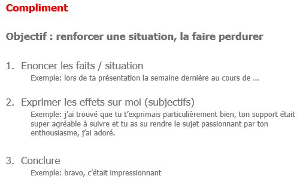
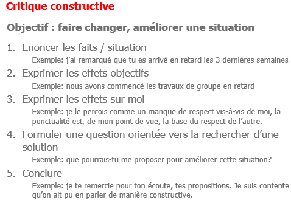
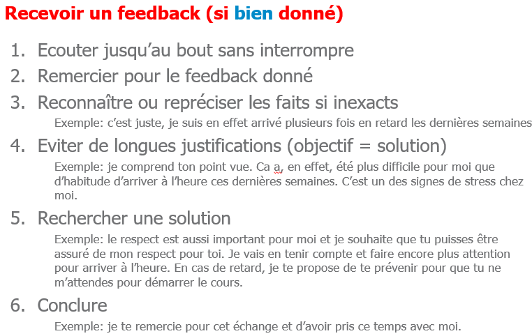
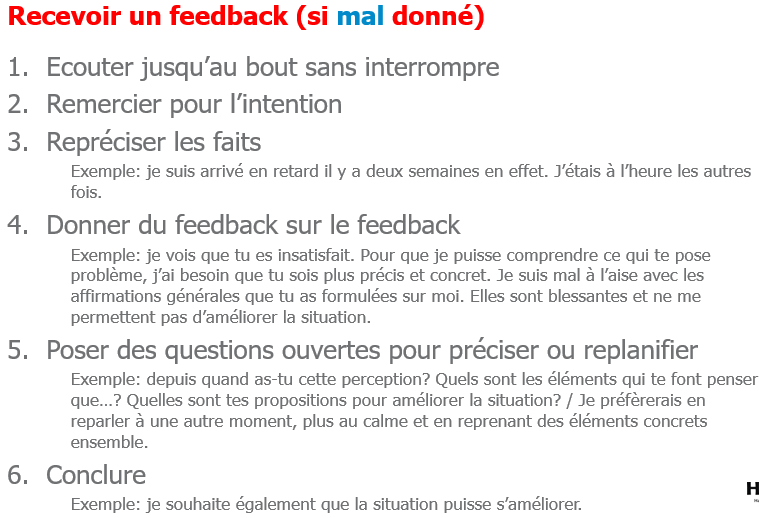

> 📖 Présentation `Feedback`

Les feedbacks sont des "cadeaux" quand ils sont constructif, bien donnés

# Feedback vs Critique

| Critique                                      | Feedback                                                         |
| --------------------------------------------- | ---------------------------------------------------------------- |
| Commencent par un "tu", qui est plus agréssif | Commencent par un "je", qui est plus un ressenti, son impression |
| général                                       | spécifique                                                       |
| accusatoire, on recherche le coupable         | généreuse, on cherche à comprendre, trouver des solutions        |
| position dominante                            | position d'égalité                                               |
| on est centré sur son propre intérêt          | on est centré sur la relation                                    |

# Règles pour donner un feedback
Donner clairement avec une préparation suffisante

Le donner directement à la personne concernée, pas par un tiers

Rapidement (ne pas laisser trainer)

dissocier les feedbacks individuels des feedbacks collectifs
- De manière individuelle (les entreprise sont un mauvais lieu pour un feedback, on donne pas un feedback devant tout le monde)

##  Donner un compliment

## Donner une critique constructive

Si on commence directement par le repproche, la personne ciblée va moins écouté, va se sentir agressé et se défendre

# Recevoir un feedback

pourquoi c'est compliqué d'en recevoir un : notre égo, on va chercher à se justifier

## S'il est bien donné

## S'il est mal donné
