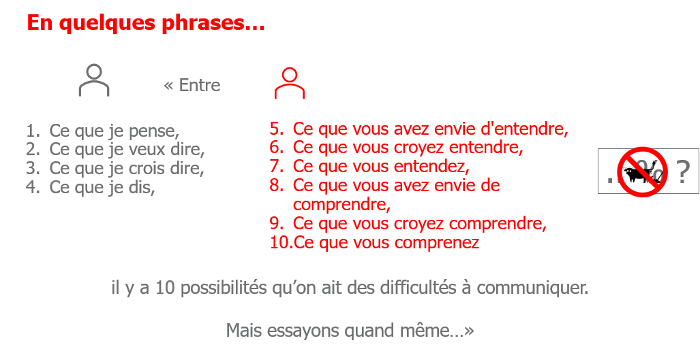

> 📖 Présentation `Cours 1`

# Communication interpersonnelle

Pourquoi se former à la communication interpersonnelle 

Pour mieux comminiquer avec les autres, et ainsi mieux travailler en équipe

## les 3 V
Verbal
Paraverbal == vocal
Non verbal == visuel

Les pourcentages dépendent souvant des sources / personnes; mais en général le visuel+vocal est **1.5-2\*** plus important que le verbal

------------------------------
------------------------------

## Canaux

Canaux synchrones
- face à face   (**3V**)
- Appel conférence (3V)
- Appel téléphonique (2V)

Canaux Asynchrones
- Email (1V)
- lettre (1V)
- chats (1V)
- messages vocaux (2V)

critères de choix :
 - Objectifs
 - Confidentialité

----

# Comunication interpersonnelle

- Inévitable, irréversible, unique et éphémère
  - On se présente en short et tong à un entretien d'embauche dans une banque : l'idée est figée dans la tête du recruteur
- pas toujours souhaitable
- Dimension relationnelle plus ou moins personnelle

