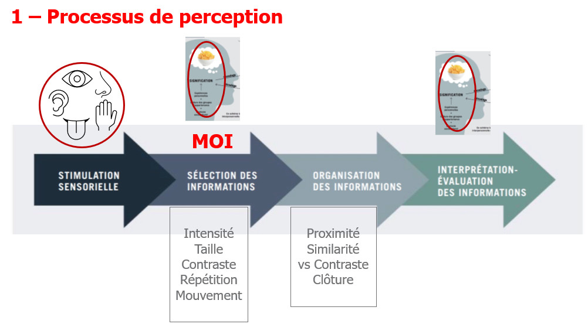
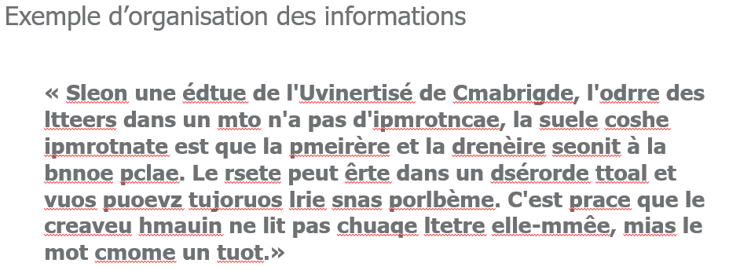
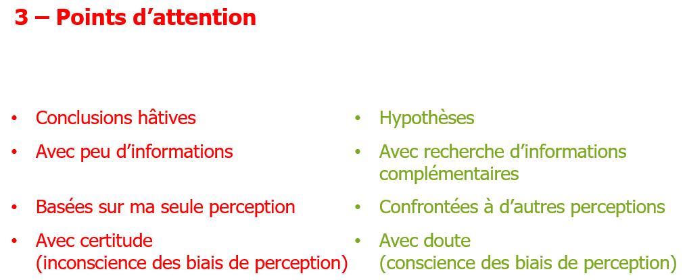

> 📖 Présentation `Cours 2 : Dysfonctionnement`

# Ordre de Discussion 

1er objectif négatif -> tout sera perçu négatif
1er objectif positif -> tout sera perçu positif

- "Nous n'avons pas réussi à faire ceci, mais nous avons réussi à faire cela" --> perception : c'est dommage
- "Nous avons fait ceci, mais pas celà" --> perception : ok cool, tempis pour l'autre

----

