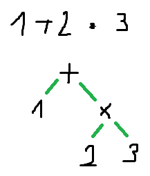
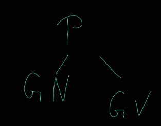
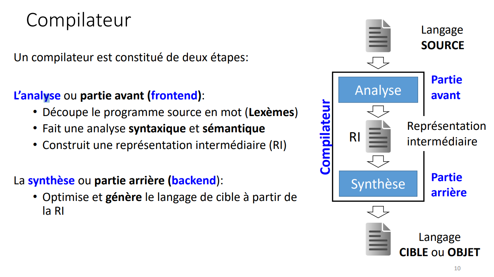
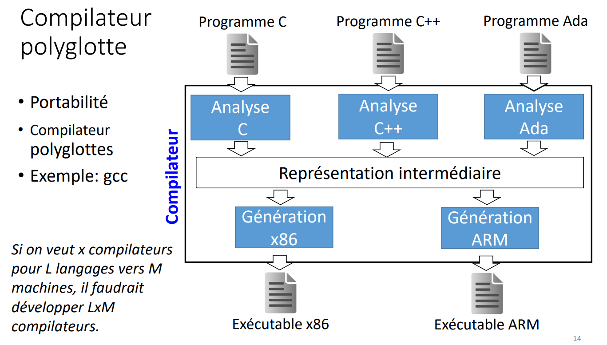
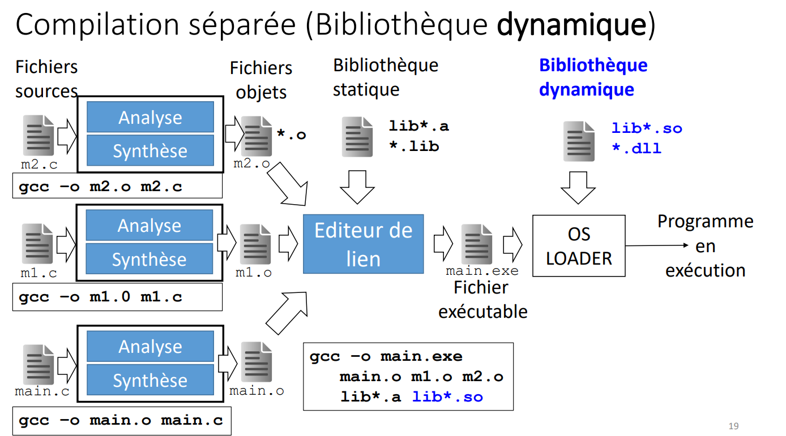
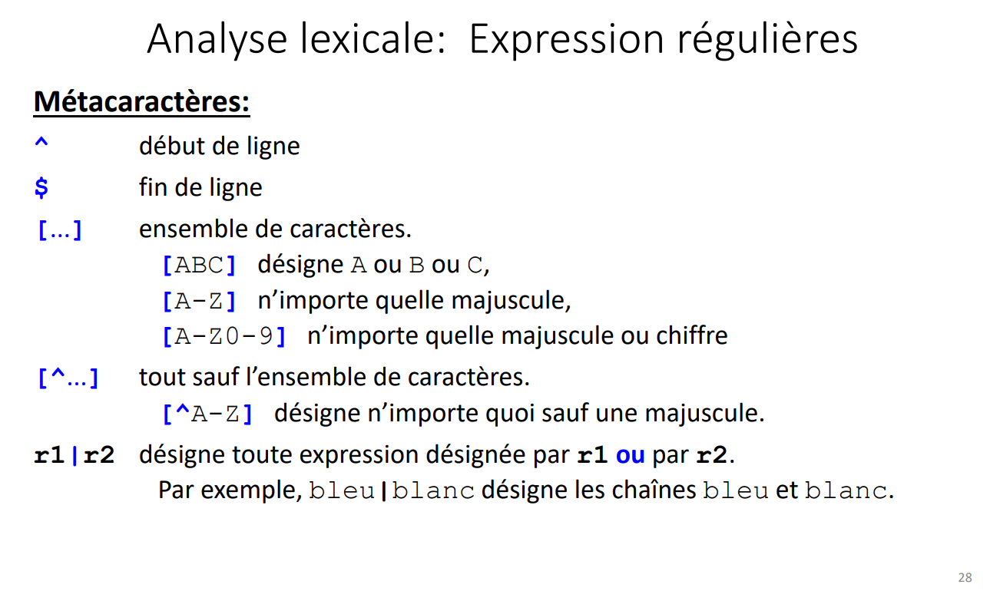
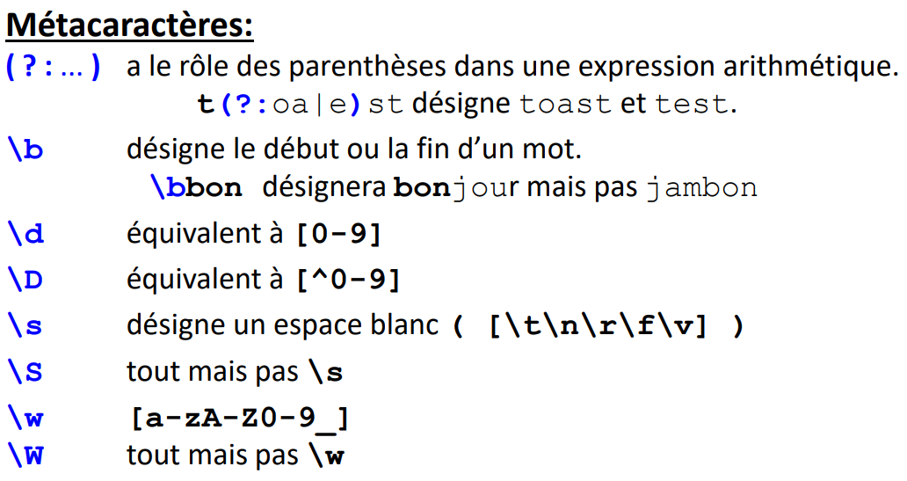

> 📖 Présentation `3250.1 0-Introduction aux compilateurs`

Lecture d'un calcul

Parcours en profondeur pour faire une pile, quand on a un opérateur, on dépile les 2 dernier nombres
> Pile après chaque états : 
> 1
> 123
> 123*
> 16
> 16+
> 7

Lexeur : Traduit la donnée `ici le calcul` en un arbre
--> diagramme d'état

Exemple en français :
Phrase (P) -> GN > GV

`le chat` : GN
`mange` : GB

Partie scémentique : vérifie que l'ordre des données est correct
- `Le souris mange la chat` ne joue pas (le/là)
- `La souris mange le chat` ne joue pas (logique)
- `Le chat mange la souris` OK

----

Transpiler : compilateur d'une langage de haut niveau vers un autre

Le linker est très important ! On l'oubli souvent

----
> 📖 Présentation `3250.1 1-Analyse Lexicale`

# REGEX

## Liste 
- .  n'importe quel caractère
- ^ début de ligne
- $ fin de ligne
- * répétition 0-n
- + 1-n
- ? 0-1
- {} répétion [spécifié] fois
- [] ensemble de caractères
- \ echapement
- | ou
- () groupe

[0-9] == \d
[^0-9] == \D
[0-9a-zA-Z] == \w
[^0-9a-zA-Z] == \W

## exemples

-----------
------------
------------

# Types de grammaires

Grammaire de type 3 et 2 : Arbres
Grammaire de type 1 et 0 : Graphes

Nous on fait du type 2

## grammaire type 3 
- automate d'état fini
- regex (lexical) (exemple lire une plaque de voiture)

> non-terminal -> terminal non-terminal
non-terminal -> terminal

## grammaire type 2
- automate d'état à pile
- (syntaxique) (permet exemple de faire des opérations
>non-terminal -> répétitions de terminal non-terminal
non-terminal -> terminal

## grammaire type 1
- automates linéaires bornés (on a des curseurs)
> terminaux plusieurs non-terminaux teminaux -> ...

## grammaire type 0
- machine de turing
- Lire des infos sur la bande, faire des opérations, écrire, etc.