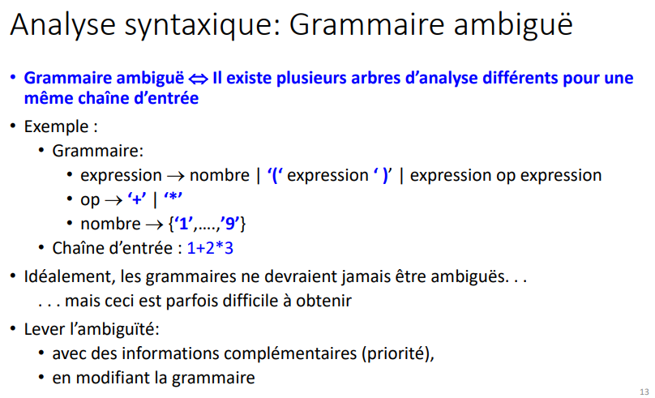
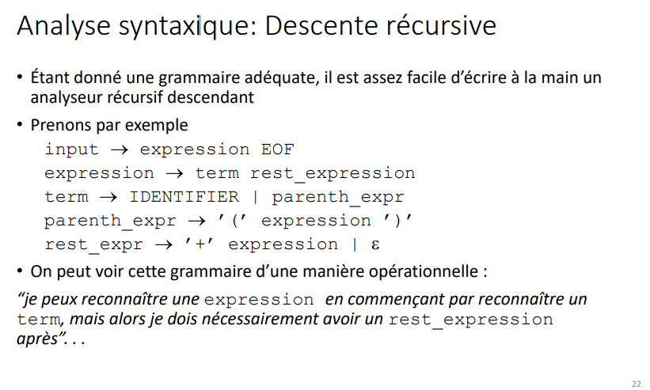
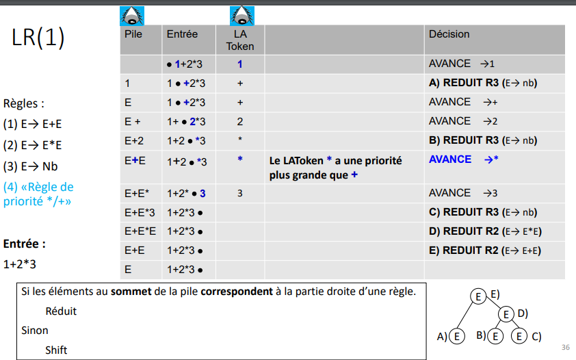

> <span style="font-size: 1.5em">📖</span> <span style="color: yellow; font-size: 1.3em;">Présentation [2 - Analyse syntaxique](https://cyberlearn.hes-so.ch/mod/resource/view.php?id=1849355)</span>



## Analyse déscendante 

Ce qui donne :
```py
def input()
    return expression() and TOKEN("EOF")

def expression()
    return term() and rest_expression()

def term()
    return TOKEN("ID") or parenth_expression()

def parenth_expression()
    return TOKEN("(") and expression() and TOKEN(")")

def rest_expression()
    return [ TOKEN("+") and expression() ] or TOKEN("EPSILON")
    # epsilon == caractère vide == True
```
<!-- #region NOTE BLOCK --> 
<div style="margin: 20px auto; padding: 10px; background-color: #ffd48a; border-left: 5px solid #8a5700;color: black; font-size: 2em">
<span> 📑 </span>Note<br>
<span style="font-size: 0.75em">
Exemples pages 26-27
</span></div>

<!-- #endregion NOTE BLOCK -->


## Types d'analyseurs (slides 28+)
- LL : ne peut pas être récursif (analyse déscendante)
  - 1er L : Lecture de gauche à droite des TOKEN; 2eme L : l'arbre se construit plutôt à gauche
- LR : récursion possible (analyse ascendante)
  - Look ahead : on regarde le prochain TOKEN avant de mettre dans la pile pour savoir si on doit faire une réduction ou pas

<!-- #region drawnote -->

<span style="color: #46b7ae; font-style: italic; font-size: 0.85rem">// Les type LR peuvent remplacé des LL, mais pas l'inverse</span> 

<svg id="svg" xmlns="http://www.w3.org/2000/svg" viewbox="124.09300231933594,-3.9670066833496094,135.13401794433594,135.13401794433594" style="height:135.13401794433594"><circle cx="192.46" cy="62.8" fill="none" stroke="#6190e8" stroke-width="2" r="32.110434441159455" d="M 160.34956555884054 62.8 a 32.110434441159455 32.110434441159455 0 1 0 64.22086888231891 0a 32.110434441159455 32.110434441159455 0 1 0 -64.22086888231891 0 Z"></circle><circle cx="191.66" cy="63.6" fill="none" stroke="#6190e8" stroke-width="2" r="57.5670044383065" d="M 134.0929955616935 63.6 a 57.5670044383065 57.5670044383065 0 1 0 115.134008876613 0a 57.5670044383065 57.5670044383065 0 1 0 -115.134008876613 0 Z"></circle><path d="M 182.06,54 L 182.06,54.6 L 182.06,56.2 L 182.06,57 L 182.06,59.4 L 182.06,61.8 L 182.06,63.4 L 182.06,65 L 182.06,65.8 L 182.06,66.6 L 182.06,67.4 L 182.06,68.2 L 182.06,69 L 182.06,70.6 L 182.86,70.6 L 183.66,70.6 L 184.46,70.6 L 185.26,70.6 L 186.86,70.6 L 187.66,70.6 L 189.26,71.4" fill="none" stroke="#6190e8" stroke-width="2"></path><path d="M 193.26,59.6 L 193.26,61 L 193.26,62.6 L 193.26,64.2 L 193.26,65.8 L 193.26,66.6 L 194.06,68.2 L 194.06,69.8 L 194.86,70.6 L 194.86,71.4 L 194.86,72.2 L 195.66,72.2 L 197.26,72.2 L 198.06,72.2 L 198.86,72.2 L 200.46,72.2 L 202.06,72.2 L 202.86,72.2" fill="none" stroke="#6190e8" stroke-width="2"></path><path d="M 194.86,15.6 L 194.86,16.2 L 194.86,17 L 194.86,19.4 L 194.86,21 L 194.86,22.6 L 194.86,23.4 L 194.86,24.2 L 194.86,25 L 195.66,25 L 196.46,25 L 196.46,25.8 L 197.26,25.8 L 198.06,25.8 L 198.86,25.8 L 200.46,25.8 L 200.46,26.6" fill="none" stroke="#6190e8" stroke-width="2"></path><path d="M 208.46,29.2 L 208.46,28.2 L 208.46,27.4 L 208.46,26.6 L 208.46,25.8 L 208.46,25 L 208.46,24.2 L 208.46,23.4 L 208.46,22.6 L 209.26,22.6 L 209.26,21.8 L 210.06,21.8 L 210.86,21.8 L 211.66,21 L 212.46,21 L 213.26,21 L 214.86,21 L 215.66,21 L 216.46,21 L 216.46,21.8 L 216.46,22.6 L 216.46,23.4 L 216.46,24.2 L 216.46,25 L 216.46,25.8 L 216.46,26.6 L 215.66,26.6 L 214.86,26.6 L 214.06,26.6 L 213.26,26.6 L 212.46,26.6 L 211.66,26.6 L 212.46,27.4 L 213.26,27.4 L 213.26,28.2 L 214.86,29 L 215.66,29 L 216.46,29.8 L 217.26,30.6 L 217.26,31.4 L 218.86,32.2 L 218.86,33 L 219.66,33 L 219.66,33.8 L 220.46,33.8 L 220.46,34.6" fill="none" stroke="#6190e8" stroke-width="2"></path></svg>  
<!-- #endregion -->

## Analyse ascendant (Shift and reduce)
Shift and reduce (analyse ascendant), qui est un "LR"

**Exemple de fonctionnement de shift and reduce :**

```
Texte analysé : 1 + 2

Règles : 
    P -> E OP E
    E -> NB
    OP -> + | -
    NB -> 0 | 1 | ... | 9

Déroulé :
pile    1
traduit pile : 1 == NB
arbre       NB
           /
           1

pile    NB
traduit pile : NB == E
arbre       E
           /
          NB
         /
         1

Pile    E
traduit pile : E == plus rien
caractère suivant
pile    E +
traduit pile : + == OP
arbre       E       OP
           /       /
          NB       +
         /
         1

etc.


```
<span style="color: #46b7ae; font-style: italic; font-size: 0.85rem">// On ne regarde pas que le dernier élément de la pile, mais tous les dernier éléments qui satisont une règle.
Exemple si nous avons la règle "R = E OP E", et la pile est "E OP E" alors les 3 éléments sont traduit en "R" 
Alors que "A OP E" on regarderait le "E, OP" et on voit qu'on a rien avec "A" donc on ne va pas plus loins
</span> 



----
----
----

# 06-10-2022

Les tokens sont les feuilles (éléments terminaux)
Les règles sont les branches (éléments non terminaux)

<!-- #region drawnote -->
<svg id="svg" xmlns="http://www.w3.org/2000/svg" viewbox="143.25999450683594,4.600000381469727,172.8000030517578,216.79998779296875" style="height:216.79998779296875"><path d="M 256.46,71.2 L 254.86,70.6 L 254.06,69.8 L 252.46,69 L 251.66,69 L 250.06,68.2 L 249.26,68.2 L 246.86,67.4 L 245.26,67.4 L 243.66,67.4 L 242.06,67.4 L 241.26,67.4 L 236.46,70.6 L 227.66,74.6 L 225.26,75.4 L 221.26,78.6 L 212.46,83.4 L 212.46,85 L 209.26,89 L 207.66,90.6 L 206.06,95.4 L 205.26,98.6 L 204.46,101.8 L 204.46,104.2 L 205.26,108.2 L 206.86,109.8 L 210.86,115.4 L 212.46,116.2 L 215.66,118.6 L 216.46,119.4 L 219.66,121 L 222.06,121.8 L 222.86,121.8 L 226.06,122.6 L 229.26,122.6 L 234.86,122.6 L 239.66,122.6 L 242.06,122.6 L 245.26,122.6 L 247.66,122.6 L 249.26,121.8 L 252.46,121.8 L 254.86,120.2 L 255.66,119.4 L 257.26,118.6 L 258.86,117 L 259.66,115.4 L 261.26,113.8 L 261.26,113 L 263.66,109.8 L 263.66,108.2 L 265.26,105 L 265.26,104.2 L 265.26,103.4 L 266.86,99.4 L 266.86,96.2 L 266.86,95.4 L 266.86,93 L 266.86,91.4 L 266.86,89 L 266.86,87.4 L 266.86,86.6 L 266.86,85.8 L 266.06,84.2 L 265.26,84.2 L 264.46,82.6 L 263.66,82.6 L 262.06,81 L 261.26,80.2 L 260.46,80.2 L 258.86,80.2 L 258.06,80.2 L 252.46,79.4 L 251.66,79.4 L 250.86,78.6 L 248.46,78.6" fill="none" stroke="#6190e8" stroke-width="2"></path><path d="M 217.26,122.4 L 216.46,122.6 L 214.86,122.6 L 213.26,123.4 L 212.46,124.2 L 206.06,131.4 L 204.46,133.8 L 197.26,141.8 L 194.86,144.2 L 186.86,153 L 182.86,156.2 L 175.66,161.8 L 173.26,164.2 L 170.06,166.6 L 169.26,167.4" fill="none" stroke="#6190e8" stroke-width="2"></path><path d="M 226.86,126.4 L 226.86,127.4 L 227.66,129 L 228.46,133 L 229.26,141.8 L 230.06,145 L 230.86,154.6 L 231.66,158.6 L 231.66,164.2 L 231.66,167.4 L 231.66,168.2" fill="none" stroke="#6190e8" stroke-width="2"></path><path d="M 245.26,124.8 L 245.26,125.8 L 246.06,126.6 L 246.86,128.2 L 247.66,131.4 L 250.86,139.4 L 251.66,140.2 L 255.66,146.6 L 258.06,152.2 L 260.46,157 L 261.26,159.4 L 263.66,163.4 L 263.66,165 L 265.26,167.4 L 266.06,169.8 L 267.66,171.4 L 268.46,173 L 268.46,173.8" fill="none" stroke="#6190e8" stroke-width="2"></path><path d="M 238.06,24.8 L 238.06,25.8 L 238.06,26.6 L 238.06,27.4 L 238.06,28.2 L 238.06,29 L 238.06,30.6 L 238.06,33.8 L 238.06,37.8 L 238.06,41 L 238.06,41.8 L 238.06,42.6 L 238.06,43.4 L 238.06,45.8 L 238.06,46.6 L 238.06,47.4 L 238.06,48.2 L 238.06,49.8 L 238.06,50.6 L 238.06,51.4 L 238.06,52.2 L 238.06,53 L 238.06,53.8 L 238.86,54.6 L 238.86,55.4 L 238.86,56.2 L 238.86,57 L 238.86,57.8 L 238.86,60.2 L 239.66,61 L 239.66,61.8 L 239.66,62.6 L 239.66,63.4 L 239.66,64.2 L 239.66,65 L 239.66,65.8 L 239.66,66.6 L 239.66,67.4 L 239.66,68.2 L 239.66,69 L 239.66,69.8 L 239.66,70.6 L 239.66,71.4 L 239.66,72.2 L 239.66,73" fill="none" stroke="#6190e8" stroke-width="2"></path><path d="M 264.46,23.2 L 265.26,24.2 L 265.26,25 L 266.06,26.6 L 266.06,29 L 266.06,32.2 L 266.06,34.6 L 266.06,36.2 L 266.06,35.4 L 266.06,33 L 266.86,31.4 L 266.86,29.8 L 267.66,26.6 L 268.46,21.8 L 268.46,18.6 L 269.26,16.2 L 269.26,15.4 L 270.06,14.6 L 270.86,14.6 L 272.46,15.4 L 274.06,16.2 L 275.66,17 L 277.26,19.4 L 278.06,21 L 278.86,22.6 L 278.86,23.4 L 278.86,24.2 L 278.86,25 L 278.06,25.8 L 277.26,25.8 L 275.66,25.8 L 274.06,26.6 L 273.26,26.6 L 272.46,26.6 L 271.66,26.6 L 270.86,26.6 L 270.06,26.6 L 269.26,26.6 L 268.46,26.6" fill="none" stroke="#6190e8" stroke-width="2"></path><path d="M 297.26,19.2 L 297.26,18.6 L 297.26,17.8 L 296.46,17.8 L 295.66,17 L 294.86,17 L 294.06,17 L 293.26,17 L 291.66,17 L 289.26,20.2 L 288.46,21.8 L 287.66,24.2 L 286.86,26.6 L 286.86,28.2 L 286.86,29 L 286.86,31.4 L 286.86,32.2 L 286.86,33 L 286.86,33.8 L 286.86,34.6 L 287.66,34.6 L 288.46,35.4 L 289.26,35.4 L 290.06,35.4 L 290.86,35.4 L 292.46,35.4 L 293.26,35.4 L 294.06,35.4 L 294.06,34.6 L 294.86,33.8 L 294.86,33 L 294.86,31.4 L 294.86,30.6 L 294.86,29.8 L 294.86,29 L 294.06,29 L 293.26,29 L 292.46,29 L 291.66,29 L 293.26,29 L 295.66,29 L 296.46,29 L 297.26,29.8 L 298.06,29.8 L 298.06,30.6 L 298.06,31.4 L 298.06,32.2 L 298.06,33 L 298.06,33.8 L 298.06,35.4 L 298.06,36.2 L 298.06,37.8 L 298.06,38.6 L 298.06,39.4 L 298.06,40.2 L 298.06,41" fill="none" stroke="#6190e8" stroke-width="2"></path><path d="M 153.26,184 L 154.06,184.2 L 154.86,184.2 L 155.66,184.2 L 158.06,184.2 L 162.86,184.2 L 167.66,184.2 L 171.66,183.4 L 172.46,183.4 L 173.26,183.4 L 174.06,183.4 L 174.86,183.4 L 175.66,183.4" fill="none" stroke="#6190e8" stroke-width="2"></path><path d="M 163.66,183.2 L 163.66,184.2 L 163.66,185 L 163.66,186.6 L 163.66,189 L 163.66,191.4 L 163.66,195.4 L 162.86,197.8 L 162.86,199.4 L 162.86,201.8 L 162.86,202.6 L 162.86,203.4 L 162.86,204.2" fill="none" stroke="#6190e8" stroke-width="2"></path><path d="M 215.66,181.6 L 216.46,181.8 L 217.26,181.8 L 218.06,181.8 L 218.86,181.8 L 221.26,181.8 L 222.86,181.8 L 223.66,181.8 L 225.26,181.8 L 226.06,181.8 L 228.46,181.8 L 229.26,181.8 L 230.06,181.8 L 230.86,181.8 L 232.46,181.8 L 233.26,181.8 L 234.06,181.8 L 234.86,181.8 L 234.86,181 L 235.66,181" fill="none" stroke="#6190e8" stroke-width="2"></path><path d="M 227.66,181.6 L 227.66,182.6 L 227.66,183.4 L 227.66,184.2 L 227.66,185.8 L 227.66,187.4 L 227.66,188.2 L 227.66,192.2 L 226.86,197 L 226.86,197.8 L 226.86,201.8 L 226.86,204.2" fill="none" stroke="#6190e8" stroke-width="2"></path><path d="M 231.66,198.4 L 232.46,198.6 L 232.46,197.8 L 233.26,197.8 L 233.26,197 L 234.06,197 L 234.86,197 L 235.66,197 L 235.66,197.8 L 235.66,199.4 L 234.86,200.2 L 234.06,200.2 L 233.26,201 L 232.46,201.8 L 231.66,201.8 L 231.66,202.6 L 231.66,203.4 L 231.66,205 L 231.66,205.8 L 232.46,205.8 L 233.26,205.8 L 234.06,205.8 L 234.86,205.8 L 236.46,205.8 L 237.26,205.8 L 239.66,205.8 L 240.46,205.8 L 241.26,205.8" fill="none" stroke="#6190e8" stroke-width="2"></path><path d="M 270.86,182.4 L 271.66,182.6 L 272.46,182.6 L 273.26,182.6 L 278.06,182.6 L 282.86,182.6 L 289.26,182.6 L 292.46,183.4 L 297.26,184.2 L 298.06,184.2 L 299.66,184.2 L 300.46,184.2 L 301.26,184.2" fill="none" stroke="#6190e8" stroke-width="2"></path><path d="M 286.86,184 L 286.86,185 L 286.86,186.6 L 286.86,189.8 L 286.86,197.8 L 286.86,201 L 286.86,206.6 L 286.86,207.4" fill="none" stroke="#6190e8" stroke-width="2"></path><path d="M 294.06,200 L 294.86,200.2 L 295.66,200.2 L 297.26,200.2 L 299.66,200.2 L 301.26,200.2 L 302.06,200.2 L 302.86,200.2 L 302.86,201 L 302.86,201.8 L 302.86,202.6 L 302.86,203.4 L 302.86,204.2 L 302.06,204.2 L 301.26,204.2 L 300.46,204.2 L 300.46,205 L 302.06,205.8 L 302.86,206.6 L 303.66,207.4 L 305.26,208.2 L 305.26,209.8 L 306.06,209.8 L 306.06,210.6 L 306.06,211.4 L 304.46,211.4 L 303.66,211.4 L 302.06,211.4 L 299.66,211.4 L 296.46,211.4 L 293.26,211.4" fill="none" stroke="#6190e8" stroke-width="2"></path></svg>  
<!-- #endregion -->

PG (partie gauche) = partie droite
exemple : EXPR = EXPR2 + NBR
- ou EXPR, EXPR2, et NBR sont des règles/Tokens
  

