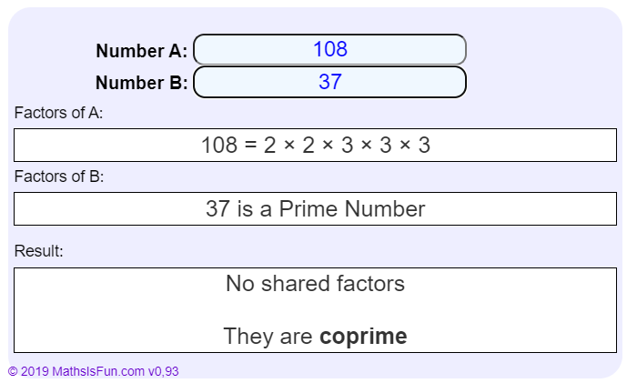
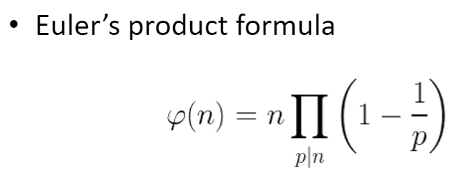
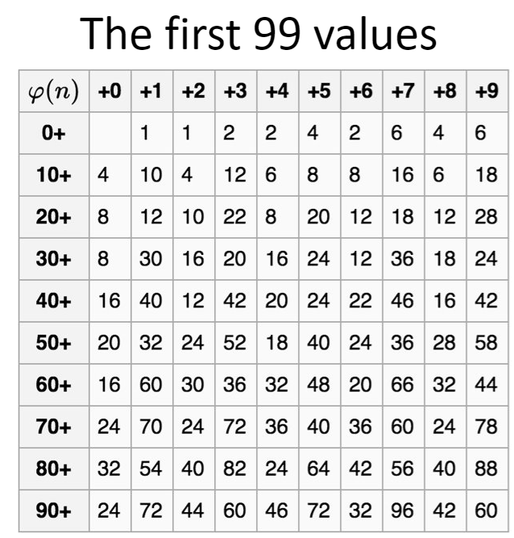

P = Nombre premier

> 📖 Présentation `3. Prime Numbers and ​Algebraic Structures​`

Nombre "co-premier" : leurs diviseurs communs est uniquement 1
exemple : 8 et 15 ont comme diviseurs :  1, 2, 4, 8 et 1, 3, 5, 15

https://www.mathsisfun.com/numbers/coprime-calculator.html

---

Fonction d'euleur $\varphi(n)$ : 

<!-- #endregion TODO BLOCK -->

https://www.dcode.fr/euler-totient

Permet de trouver tous les nombres copremier de P
https://www.mathsisfun.com/numbers/coprime-calculator.html

$\varphi(P) = p-1$
$\varphi(P1 * P2) = \varphi(P1) * \varphi(P2)$

Exemple :
- n = 5 | $\varphi(5) = 4$ | {1, 2, 3, 4}
- n = 11 | $\varphi(11) = 10$ | {1, 2, 3, 4, 5, 6, 7, 8, 9, 10}
- n = 4 | $\varphi(4) = 2$ | {1, 3}
- n = 10 | $\varphi(10) = 4$ | {1, 3, 7, 9}

$\varphi(12) \ne \varphi(3) * \varphi(4)$ // car 4 n'est pas un nombre premier 

Si on généralise, on obtient cette formule :

$\varphi(8) = 8 * (1-\frac{1}{2}) = 4$
$\varphi(36) = 2^2 * 3^2  * (1-\frac{1}{2}) * (1-\frac{1}{3}) = 12$
$\varphi(12) = 12* (1-\frac{1}{2}) * (1-\frac{1}{3}) = 4$

----
$a^{\varphi(n)} \% n = 1$
- $3^{\varphi(11)} \% 11 = 1$ <=> $3^{10} \% 11 = 1$

Si n est premier, alors on peut simplifier en $a^{p-1} \% p = 1$

----

$a^D \% n = a^{D * \varphi(n)} \% n$
$D = k * \varphi(n) + b$ <=> $b = D \% \varphi(n)$
- $3^{1202}\%11 = 3^{1202 \% \varphi(11)} \% 11 = 3^{1202 \% 10} \% 11 = 3^{2} \% 11 = 9$

