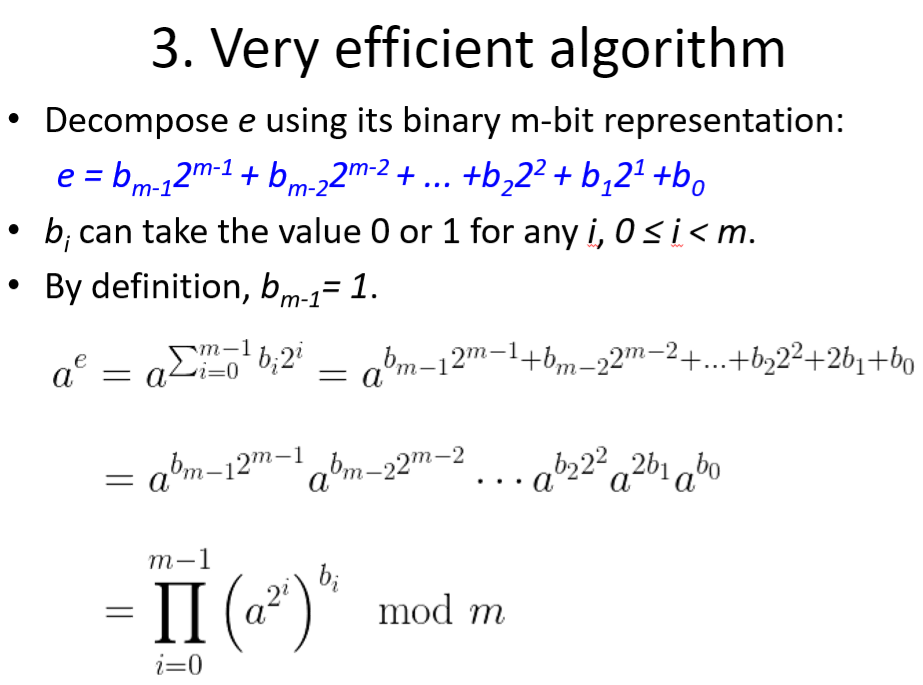

> 📖 Présentation `Algebric Structures`

// P == Nombre premier 

$GF(P) = {0,1,2,..., P-1}$ // c'est un modulo 
toutes les valeurs entres 1 et P-1 sont obtenable par la partie multiplicative du groupe :
- GF(7) = { // On choisi un nombre entre 2 et p, ici on a choisi 3 
  - $3^1 \% 7 = 3$
  - $3^2 \% 7 = 2$ 
  - $3^3 \% 7 = 6$ // (2 * 3) % 7 = 6 // on prend la valeur précédente, et on multiplie par 3 
  - $3^4 \% 7 = 4$ // (6 * 3) % 7 = 6 
  - $3^5 \% 7 = 5$ // (4 * 3) % 7 = 5 
  - $3^6 \% 7 = 1$
  - On obtient tous les nombres sauf le 0
- }

Pour $GF(N)$, c'est un peu plus compliqué :
- plus de complément dans l'exercice 1 du devoirs de la semaine 5

# Identité de Bézout
gcd(a,b) = d
ax + by = d
==> Si et uniquement si le GCD == 1, alors : 
ax + by = 1
ax % b = 1
-> x est la multiplicative inverse de a modulo b
-->> $x = a^{-1} \% b$
$x \% b = a^{-1} \% b$

---
$k^{p-1} * k \% p = 1 * k$
-->
$k^{p} \% p = k$
$k^{p-1} \% p = 1$

$k^{p-2} \% p = k^{-1} \% p$

---

Astuce pour calculer sans faire la puissance : 
$5^{75} \% 2017$

On sait que le résultat ne dépassera pas 2016
on décompose l'exposant dans la forme d'euler :

# Nombre de racine primitives

$\varphi(\varphi(n)) \rightarrow \varphi(\varphi(p)) = \varphi(p-1)$ 
