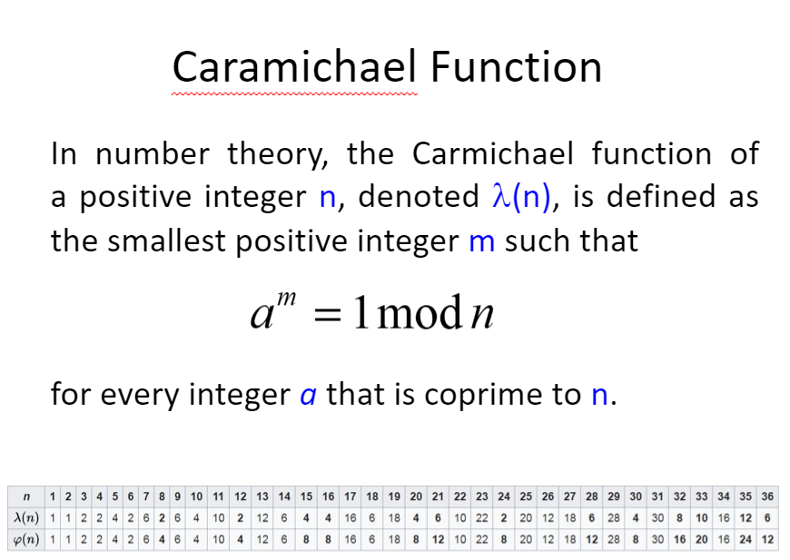
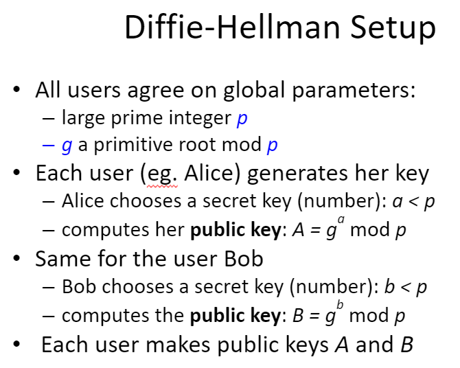
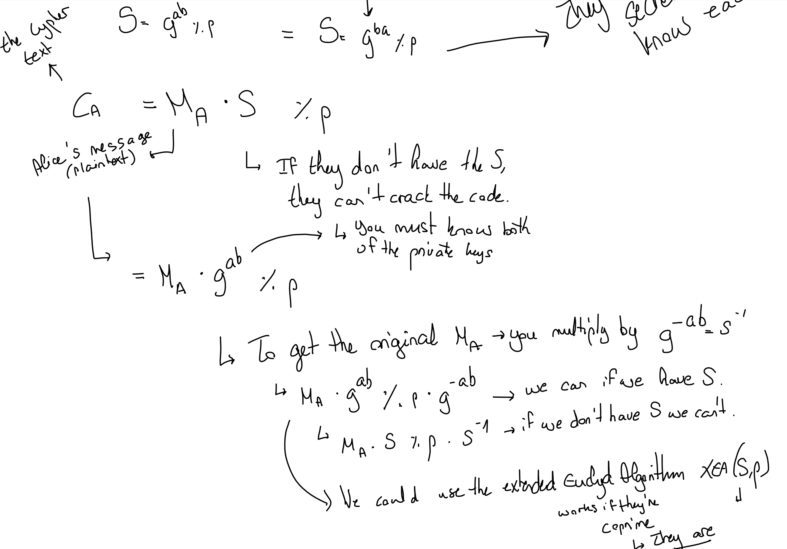

> 📖 Présentation `4. Public Key Cryptography - diffie-Hellmann`

- Cryptographie asymétrique
  - pas de problème de partage de clé
    - La public est partagée à tous
    - la privée est gardée secrète
  - Signer un message avec la clé privée
  - Vérifier la signature avec la clé publique
  - **Confidentialité** // Le plus important 
- Cryptographie symétrique
  - 1 seule clé de cryptage
  - Partage de la clé entre les membres

# Fonction de Caramichael

== **Ordre de k**, mentionné le HW de la semaine 5

# Diffie-Hellmann

| key     | Alice                                                                                          | Bob                                                                                            |
| ------- | ---------------------------------------------------------------------------------------------- | ---------------------------------------------------------------------------------------------- |
| private | a                                                                                              | b                                                                                              |
| public  | $A = g^a \% p$                                                                                 | $B = g^b \% p$                                                                                 |
| linked  | $S = B^a \% p = (g^b)^a \%p$ $= g^{ab} \% p$ | $S = A^b \% p = (g^a)^b \%p$ $= g^{ab} \% p$ |

Avec la clé publique, il n'est pas possible de trouvé la privée (exposant), à cause de la multitude de possibilités d'obtenir le même résultat.

Quand les clés publiques sont liées, partagés, les clés deviennent les mêmes

## Cryptage/Décryptage

> 📍 numéro de slides `43-50` (explication des étapes)

<!-- #region TODO BLOCK --> 

 📝 TODO 

intégrer les notes de Sarah pour cette partie au lieu d'une simple image de ses notes.

// Cependant, elle est super bien !! :D 

<!-- #endregion TODO BLOCK -->

$C_A * A^{p-1-b} = M_A * g^{ab} * (g^a)^{p-1-b} = M_A * g^{ab} * g^{-ab} * g^{a*(p-1)} \% p = M_A * 1 * (g^{p-1})^a = M_A$	