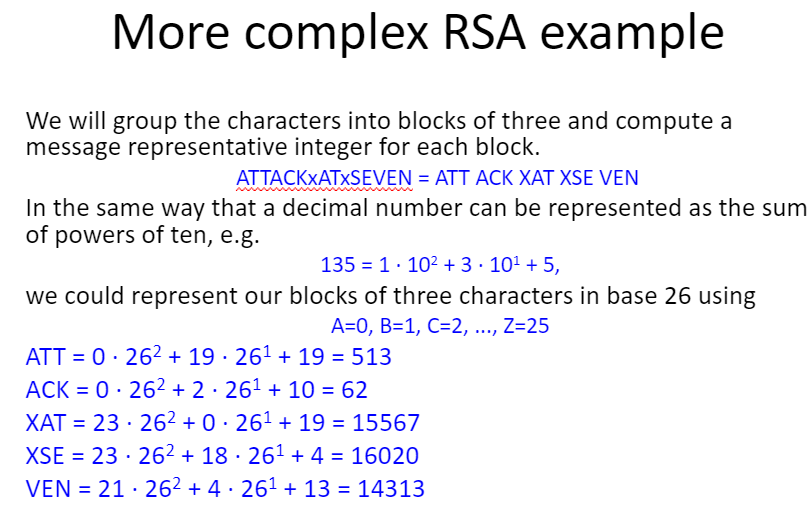
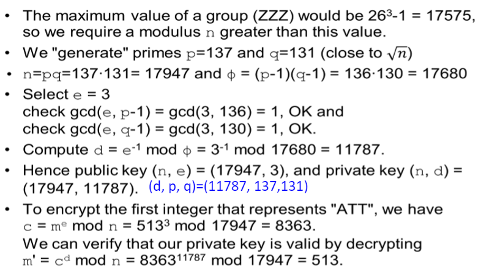
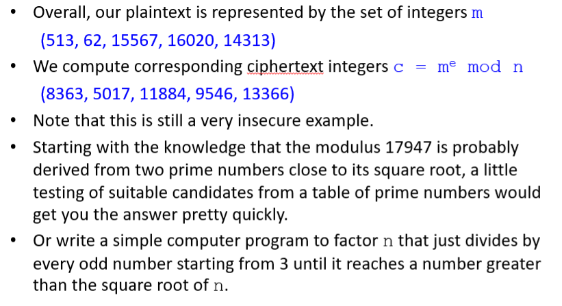

> <span style="font-size: 1.5em">📖</span> <span style="color: orange; font-size: 1.3em;">Présentation `Chapitre 7 - RSA et ElGamal`</span>

RSA : Rivest; Shamir; Adleman <span style="color: #46b7ae; font-style: italic; font-size: 0.85rem">// 3 personnes</span> 

> KR = Key pRivate
> KU = Key pUblic

# RSA

## Initialisation de RSA
1. Bob choisis 2 nombre premier `p` et `q`
2. il calcule le produit : `N = p * q`
3. Calcul le $\varphi(N)$ = (p-1)(q-1) <span style="color: #46b7ae; font-style: italic; font-size: 0.85rem">// Nombre de nombre premier coprime < N</span>
4. il choisi un nombre `e` tel que `1 < e < \varphi(N)` et `e` et `N` **sont coprime** (PGCD(e, \varphi(N)) = 1) <span style="color: #46b7ae; font-style: italic; font-size: 0.85rem">// dernier critère **TRES** important</span> 
5. Calcul de `d` = $ e^{-1} \% \varphi(N)$ <span style="color: #46b7ae; font-style: italic; font-size: 0.85rem">// Inverse modulaire de e, si le critère 4 n'est pas respecté, l'inverse n'est pas possible</span> 
6. Calcul des clés : `KR = (p, q, d)` et `KU = (e, N)`
7. Garde la clé privée et publie la clé publique

pourquoi `d` est bien sécurisé : car pour calculer $\varphi(n)$, il est nécessaire d'avoir `p` et `q`

la condition de coprimité est importante pour l'inverse modulaire (propriété de Bezout) :
- $ex + \varphi(n)y = gcd(e, \varphi(n) \rArr d = e^{-1} \% \varphi(n) = x \% \varphi(n)$

## Dé-Cryptage

`M` = message en claire, avec `1 < M < N`
`C` = message chiffré (Cypher text)
`D` = message déchiffré

1. Alice crypte : $C = M^e \% N$
2. Alice envoie le message crypté `C`
3. Bob décrypte : $D = C^d \% N$
   - $D = (M^{ed} \% N)$
   - $e*d \% \varphi(n) = 1$ <span style="color: #46b7ae; font-style: italic; font-size: 0.85rem">// identité de bézouth</span> 
   - $e*d = 1 + k\varphi(n)$ <span style="color: #46b7ae; font-style: italic; font-size: 0.85rem">// $k$ est un entier, définition du modulo</span>
   - Alors : $D = (M^{1 + k\varphi(n)} \% N)^k * M \% N = M \% N$	
   - simplification possible grâce à : $M^{\varphi(n)} \% N$ = 1 <span style="color: #46b7ae; font-style: italic; font-size: 0.85rem">// Théorème d'euleur</span>
   - $M^{ed} \% N = M^{ed*\varphi(n)}$ % N = M

### excecice

p = 17
q = 11
e = 3
M = 99

N = p * q = 187
phi(N) = 160 : `e` est valide
$C = 99^3 \% 187 = 143$
$d = 3^{-1} \% 160 = 107$
- vérification : $107 * 3 = 321 \rArr 321 \% 160 = 1$
- ```python
  # python : 
  pow(3, -1, 160) # 107
  ```
$D = 143^{107} \% 187 = 99$

## Exemples
- 
    - utilisation de la base 26
    - on décompose tous les 3 caractères

explications des valeurs possibles : 
- abc = $a*26^2 + b*26^1 + c$
- plus grand message : **zzz** = $z*26^2 + z*26^1 + z$ =  aaaa -1 = $ 26^3 - 1$ = 17575
- Z + 1 = BA <span style="color: #46b7ae; font-style: italic; font-size: 0.85rem">// en base 16 : F + 1 = 10 (F == 0F $\rArr$ F + 1 = 10)</span>
<span style="color: #46b7ae; font-style: italic; font-size: 0.85rem">// en base 26 : A = 0 et B = 1 (Z == AZ $\rArr$ Z + 1 = BZ)</span> 

N sera donc > 17575



- On crypte chaque bloc de 3 caractères


# El Gamal
<!-- #region NOTE BLOCK --> 
<div style="margin: 20px auto; padding: 10px; background-color: #ffd48a; border-left: 5px solid #8a5700;color: black; font-size: 2em">
<span> 📑 </span>Note<br>
<span style="font-size: 0.75em">
Slides 27+, on les a juste survolé en 5 min
</span></div>

<!-- #endregion NOTE BLOCK -->
