> 📖 Présentation `8. Digital Signatures and ​Large Prime Numbers Generation​`

DSA : Digital Signature Algorithm

Basé sur 3 actions :
- **Authentification** : S'assurer que c'est la bonne personne qui est connectée
- **Intégrité** : S'assurer que le message n'a pas été modifié
- "**non-repudiation**" : S'assurer que la personne qui a envoyé le message ne pourra pas le nier (exemple la poste, on signe la réception du colis)

# Génération de la clé
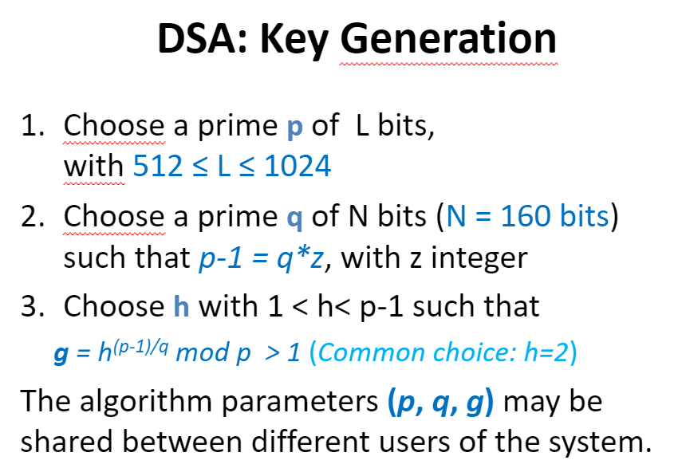

## Par clé utilisateur
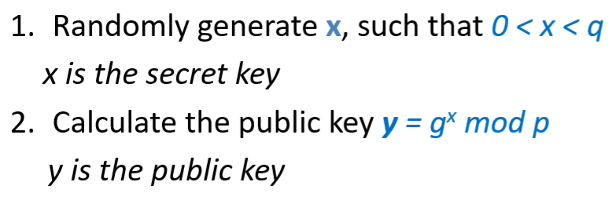

## Clé effémère (signature du document)
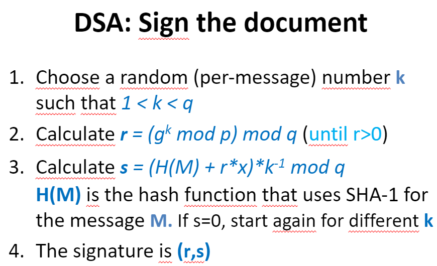

# Vérification du document signé

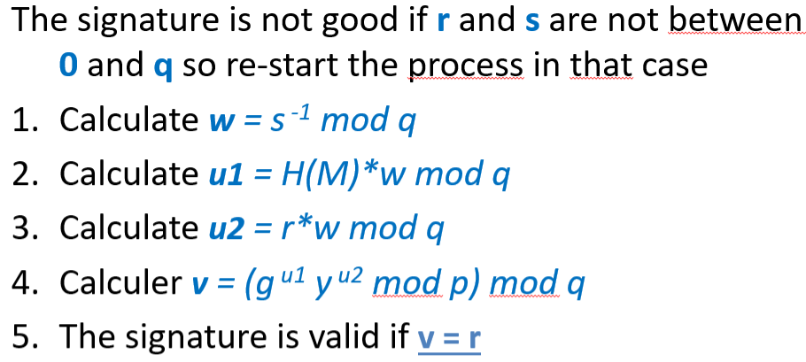

> Bob reçoit le document signé par Alice
> $S^{-1}$ est calculé avec Bézout
> Mais on peut aussi calculer w de cette manière : $w = S^{q-2} \% q = S^{-1} \% q$
> y : Clé public de Alice

Si on fait le cryptage et après on signe, on vérifie directement que le hash correspond

Si on signe puis on crypte, on décrypte et on vérifie le hash

# Exemples

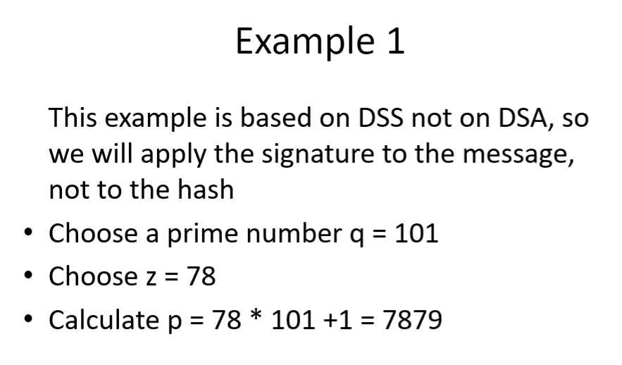
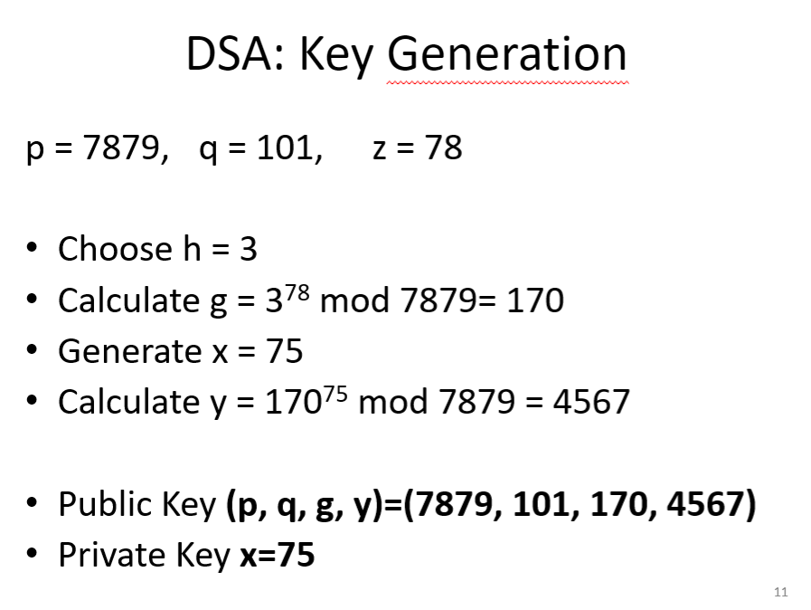
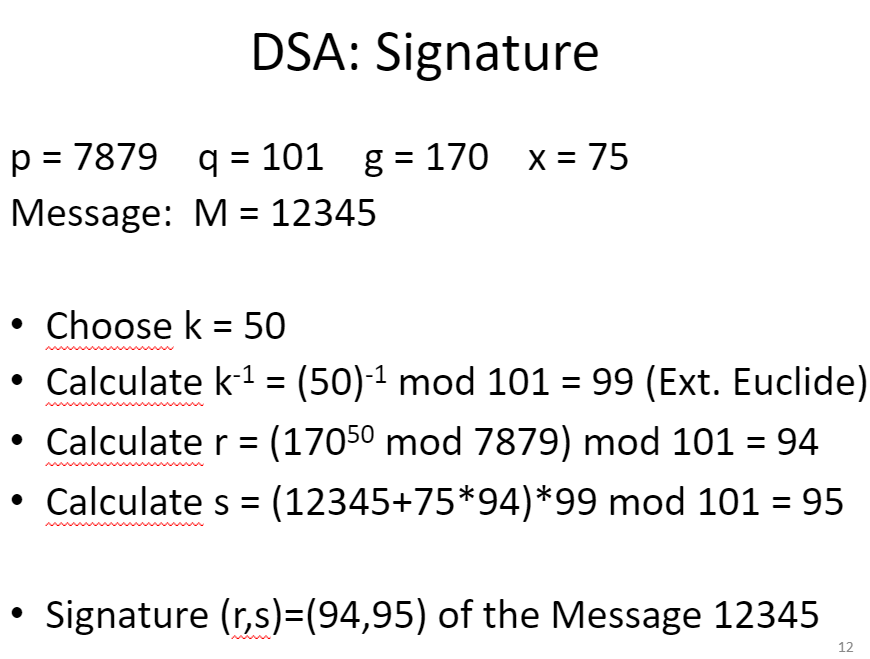
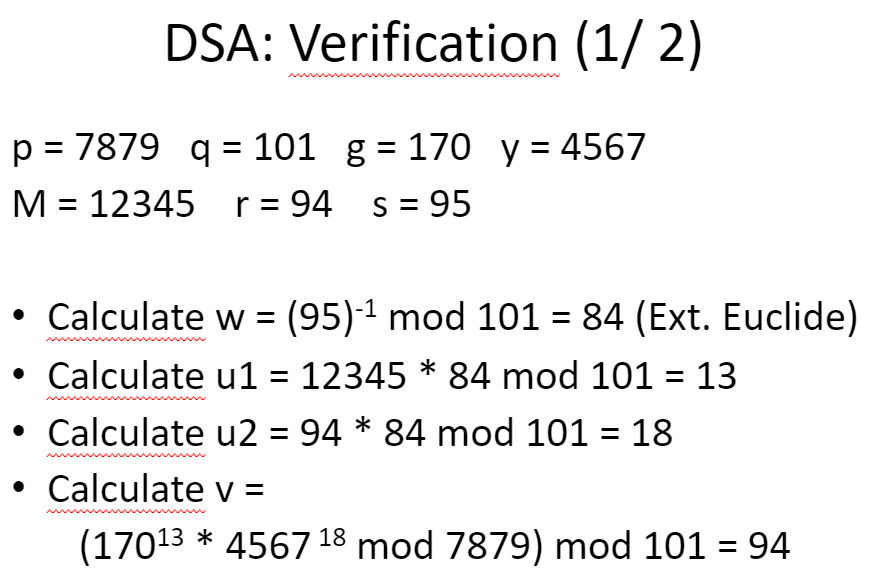

-----
-----
-----

# ElGamal signature

## Opérations
1. key generation (which creates the key pair)​
1. key distribution​
1. signing, and ​
1. signature verification.

## Key generation
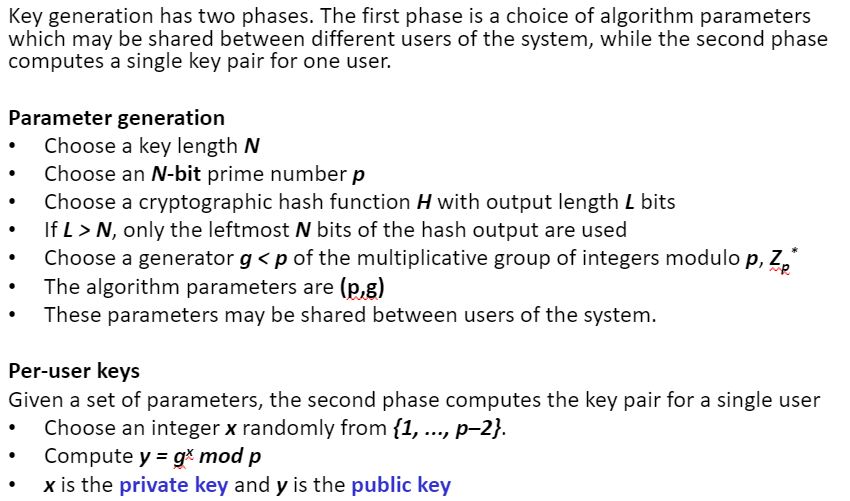

## Key distribution
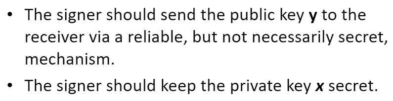

## Signing
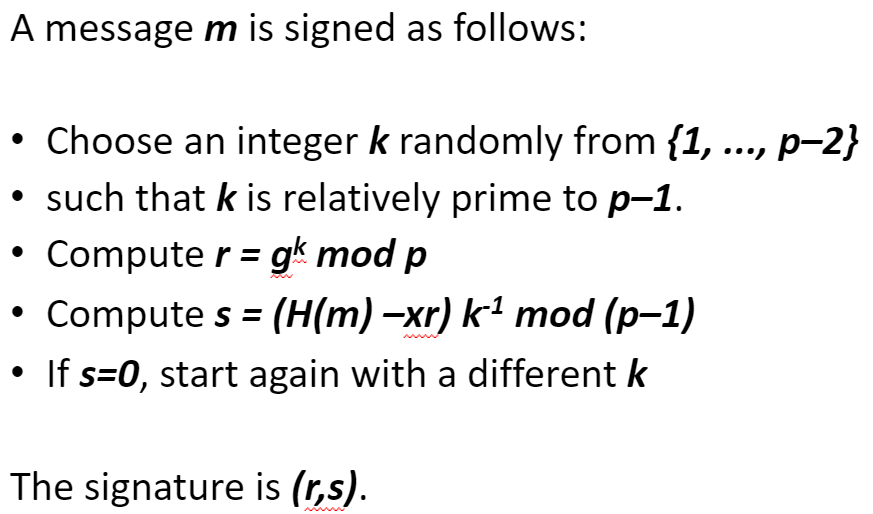

## Verification
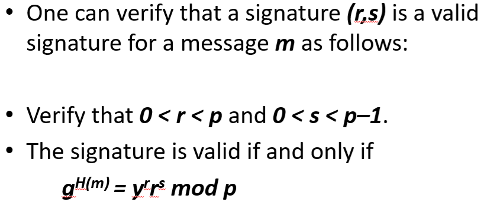

## Correction
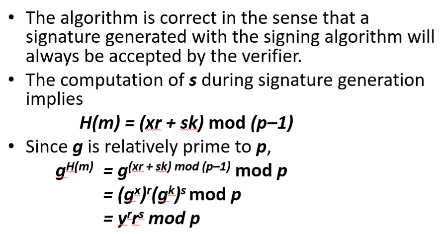

------
------
------

**Génération de très grands nombres premiers**
> Slides 29+

Avant : avec le crible d'Erathosthène
- Problème : complexité en mémoire et en temps

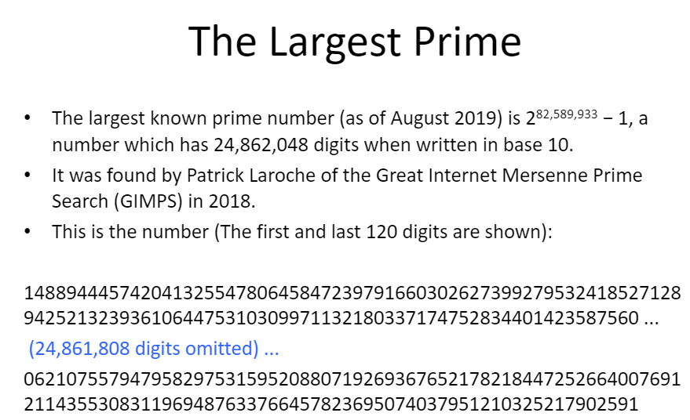
> pour rappel, $2^k - 1$ : la représentation binaire c'est que des 1

# Test de fermat

Probablement premier si respecte cette formule : $a^{n-1} \% n =1$ 

> a < n

Il faut appliquer sur pleins de valeurs `a` et `n` différents
Si le résultat est différent de 1, c'est **pas** un nombre premier !

La probabilité que le nombre est premier augmente chaque fois que le résultat est 1.
> $P = 1 - 2^{-k}$
> k : nombre de test
