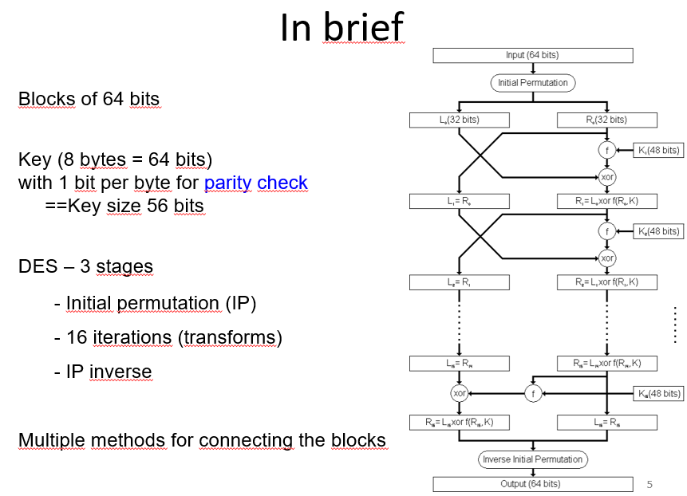
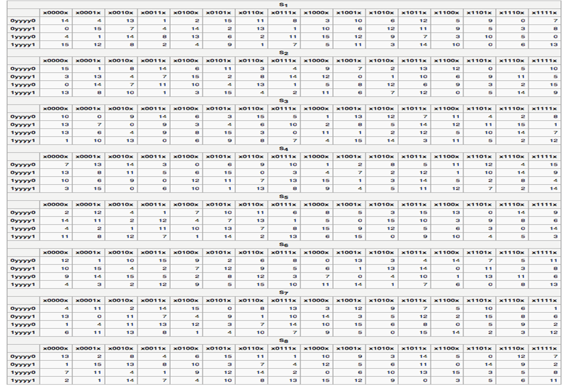
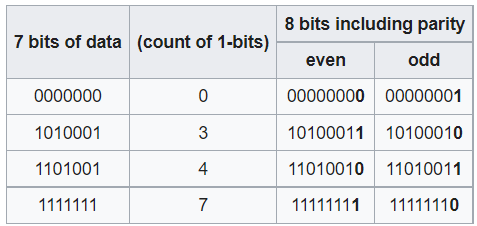
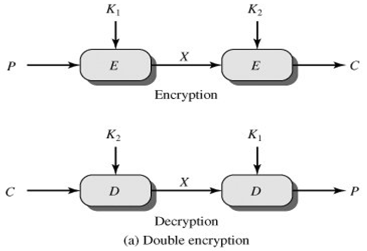
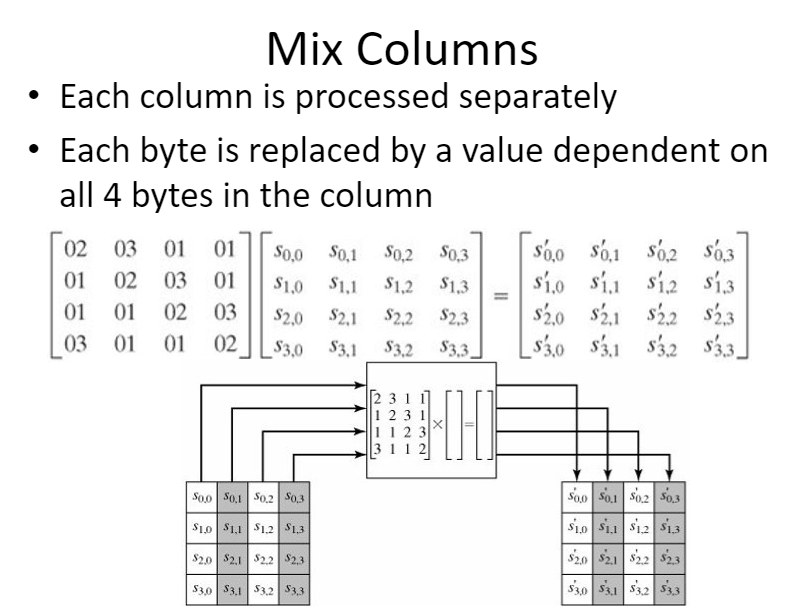
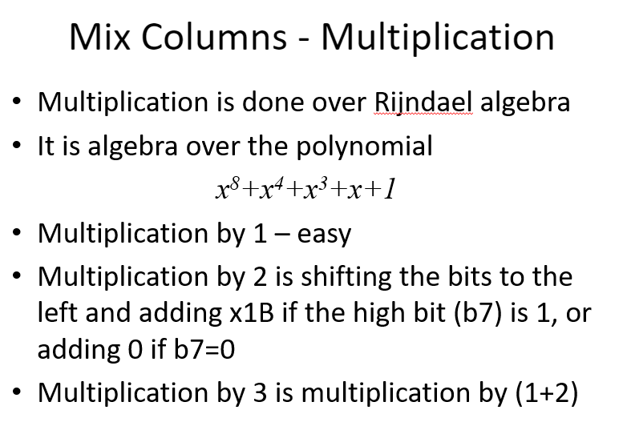
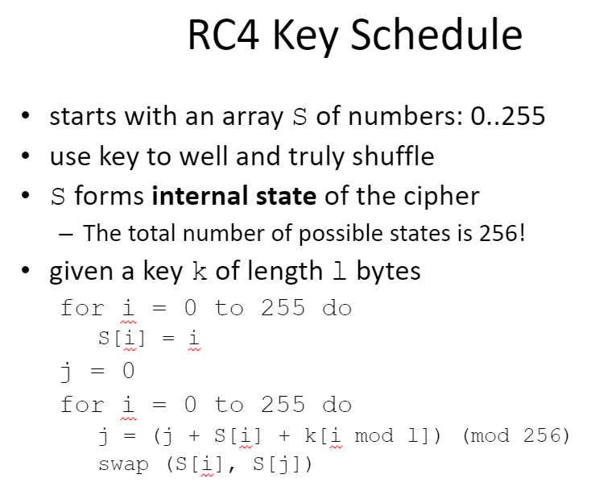

> 📖 Présentation `09 Symmetric Encryption`

# Ciphers
- Blocks cipher
  - pour le stockage
- Stream cipher
  - Pour le realtime

Le stream cipher est plus simple à implémenter

# Data Encryption Standard (DES)

Message de 64 bits + Clé de 64 bits
==> Cipher de 64 bits
// La clé fait 56 bits, à la quel on rajoute 8 bits de parité (1 tous les 7 bits) = 64 bits

16 étapes d'encryption

## S-Boxes (Substitution Boxes)
101110  => 
- 10 => 2   => Ligne 2
- 0111 => 7 => Colonne 7
- ==> la valeur est donc **1** (cf le tableau)

## Parity Check
Détection d'erreur

## Pourquoi pas le double DES ?
- Mieux que simple
- Mais plus faible, a cause du `meet-in-the-middle attack`

En regardant la clé `X` obtenue dans un sens, il est possible de trouver l'algorithme quand on récupère la clé `X` dans l'autre sens

------
------
> Slides 114+

- C'est pas une multiplication matricielle. mais une multiplication de cellules
  - (s00' = 02 * s00)

- On travail avec des bits : modulo 2
  - Raccourci pour faire une multiplication par 3 : (2 + 1) * sxy
  - Multiplication par 2 ==> décalage des bits à gauches selon l'algèbre modulo (juste après)

- `x^8 + x^4 + x^3 + x + 1` = `100011011
- 7*x^8 = x^8
- 8*x^8 = 0

# Stream Ciphers
- Facile à implémenter
- Sécurité forte, car beaucoup d'entropie (choses aléatoires entre tous les streams)
- Utiliser pour
  - Chiffrement
  - Génération de nombres aléatoires
- La clé n'est utilisée qu'une seule fois

## RC4
