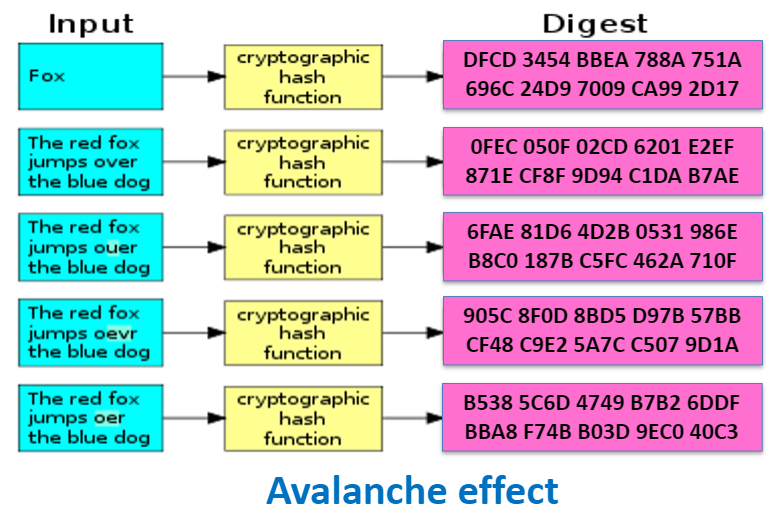

Hash =/= Hash Cryptographique

- Hash
  - Similaire un peu à un NPA (plusieurs personnes peuvent avoir le même)

! Même un message "vide" aura un hash de taille L

# Propriétés

- Déterministique : chaque fois que l'on calcule le hash d'un message, on obtient le même résultat
- On ne peut pas retrouver le message à partir du hash
- Un petit changement dans le message entraine un grand changement dans le hash
- Pas possible de trouver un message qui a un hash donné
  

Un hash on le test un `Pangram` (phrase qui contient toutes les lettres de l'alphabet). 
- Anglais : The quick brown fox jumps over the lazy dog
- Français : Le vif zéphyr jubile sur les kumquats
- Français : Portez ce vieux whisky au juge blond qui fume