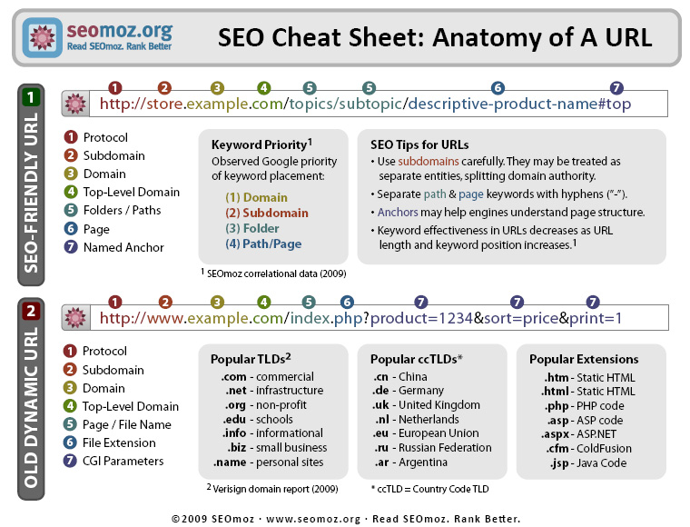
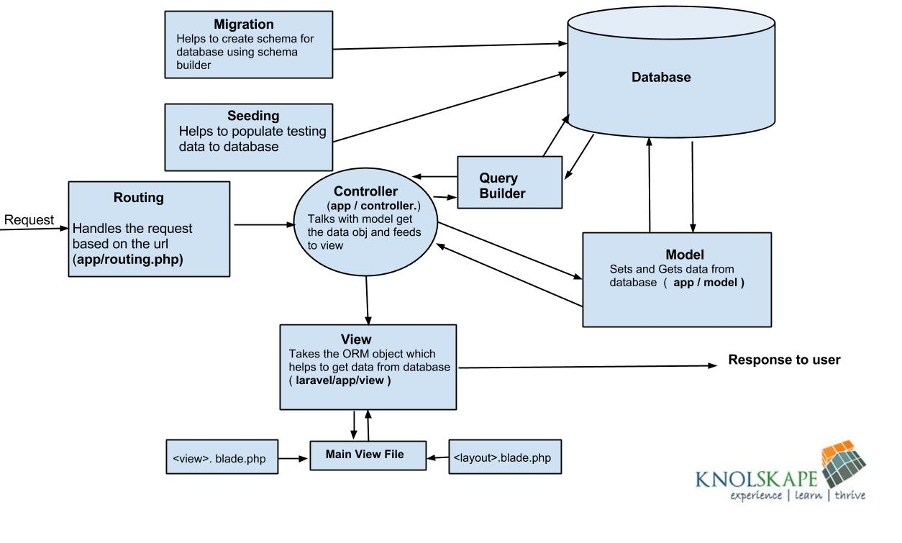

> 📖 Présentation [PHP intro framework](https://github.com/HE-Arc/slides-devweb/blob/master/src/02-php-intro-framework.md)

# Framework

> "Application à trou" pour la base
> on y ajoute le code pour les interactions

- Fonctionnalités similaires pour de nombreuses applis
- Composants de haut-niveau réutilisables (faible couplage)
- Règles de codage et d’architecture
- Code sûr et efficace
- Facilite les tests et la gestion de projets complexes
- Utilisation de Design Patterns dès que possible
- Comportement par défaut
  // En Qt, on ne va pas recréé la fenêtre, on modifie que ce qui est nécessaire 
- Extensible
- **Principe d’inversion de contrôle**
  - parfois désigné comme un design pattern
  - Contrôle du flux de l'application
    - en console, c'est nous qui décidons de l'ordre d'interaction
	alors que en graphique, il y a l'inversion de contrôle : c'est le framework qui appel les fonctions nécessaires
	
Un framework n'est pas une librairie

1er réflexe : regarder si qqc dans le framework existe déjà (ou une extension) plutôt que de coder directement soi-même

# Micro-framework
on ne prend pas tout le framework, mais seulement les bibliothèques dont on a besoin.
Exemple : python web :
- Django : framework complet
- Flask : micro-framework

## Couplage fort/faible
Fort : peu réutilisable dans d'autres apps sans adapté
Faible : facilement réutilisable

# Design Patterns
## ORM
Object Relational Mapping
Permet de communiquer avec un base de données (pas forcément relationnelle, exemple "NoSQL")

## MVC
- Modele : ORM qui fournis l'oaccès aux données; logique métier
- Vue : template des pages à générer
- Controlleur : orchestration, transfert des infos

## Front controller
métaphore : guichet : on s'adresse à 1 personne, et il nous demande aux autres personnes pour obtenir les infos avant de nous les retransmettre

en WEB : analyse de l'URL, et redirige dans les bonnes méthodes et bon paramètres

## UI Patterns
position du logo, de la navbar, 
visuel du chemin actuel (`section > partie > page`)

# Conventions

/var/www
- Ne surtout pas mettre le code dans ce dossier !!
  Seulement le index.php et les fichiers publics (nommé **assets**) : css, js, images, etc.

/code/app/ctrl
- On placera notre code dans ce dossier
- Pour éviter que du code soit injecté et executé contre son gré

# Bonnes pratiques
You Ain't Gonna Need It (YAGNI) : ne coder que ce qui est nécessaire pour cette itération

Heavy Model, Light Controller : avoir des controlleur très rapide à utiliser/tester, toute la logique dans le modèle

# URL
- URL : Uniform Resource **Locator**
  - Fait toujours référence à un fichier physique, et on connais son emplacement physique
    - exemple.com/abc/def.php
  la page def.php ce trouve dans le dossier abc sur le site exemple.com
URI : Uniform Resource **Identifier**
  - Fait référence à un fichier virtuel, et on ne connais pas son emplacement physique
- URI : Uniform Resource **Identifier**
  - exemple.com/abc/def
  on accède à l'ID `def`, on sait pas plus
  - souvant appelée "pretty URL"

# Autres services

I18N : Internationalisation
Génération de code : scaffolding : génération de code à partir d'un modèle
- on créé la base de donnée, et il va automatiquement créé le CRUD pour la totalité des tables

# Exemple architecture Laravel

Routing géré par le **Front controller**
Faute : la vue est renvoyé par le controlleur puis le controlleur renvoie à l'utilisateur, et non pas directement la vue à l'utilisateur
<!-- #region IMPORTANT BLOCK --> 

❗❗Important 

Cette faute est une question d'exam ;D

<!-- #endregion IMPORTANT BLOCK -->

Le Query Builder est plutôt à utiliser dans le modèle (et non pas dans le controlleur)
<!-- #region IMPORTANT BLOCK --> 

❗❗Important 

Mettre le querry builder dans le controller fera perdre des points dans le projet !

<!-- #endregion IMPORTANT BLOCK -->

Laravel peut être un framework de type "full-stack" ou "glue"
- Fullstack : utilisation de tout le schéma
- Glue : utilisation que de certains points (exemple que l'ORM)

# PHP-FIG

Ensemble de bonne pratique/convention PHP.

Laravel repescte les PSR2.

<!-- #region IMPORTANT BLOCK --> 

❗❗Important 

Les respecter aussi pour le projet

<!-- #endregion IMPORTANT BLOCK -->

Pour vérifier le respect des bonne pratique, on peut utiliser des Linter pour le faire automatiquement : 
Linter : vérifie la syntaxe du code et ouvre une issue en cas de problème

# Sécurité des templates

- Principe du moindre privilège (Principle of Least Privilege)
  - Ne donner au développeur/utilisateur que les privilèges nécessaires à son travail
  - Un graphiste ne devrais pas avoir accès au code

Injection SQL
