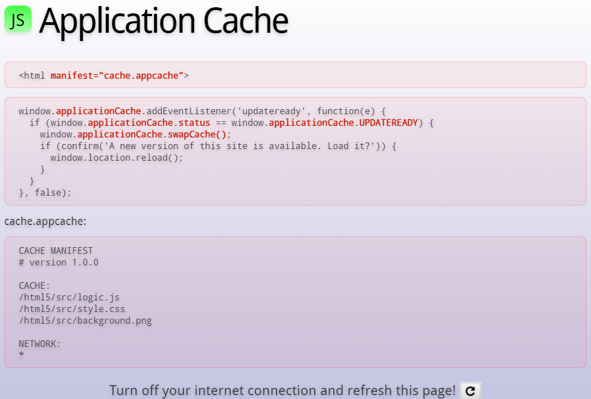
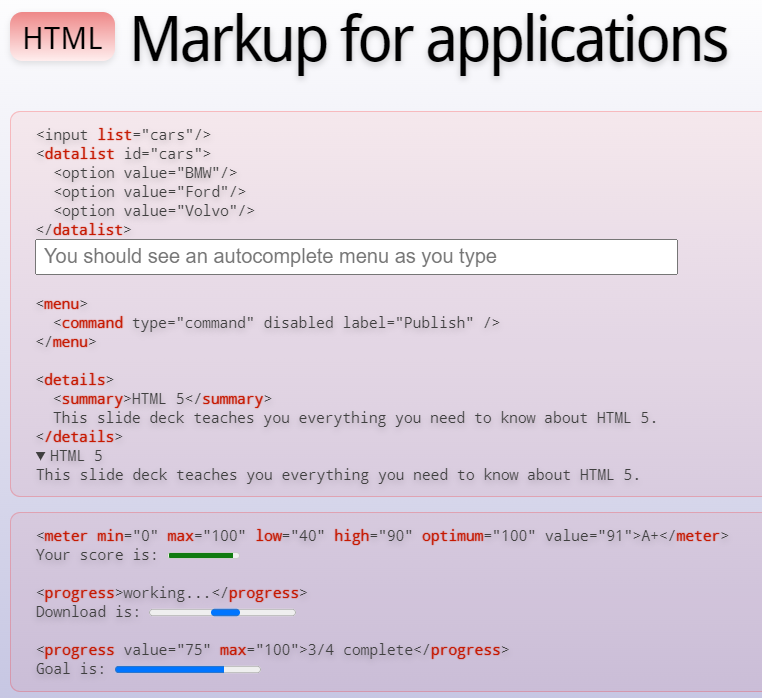
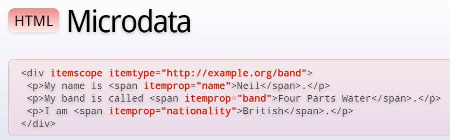
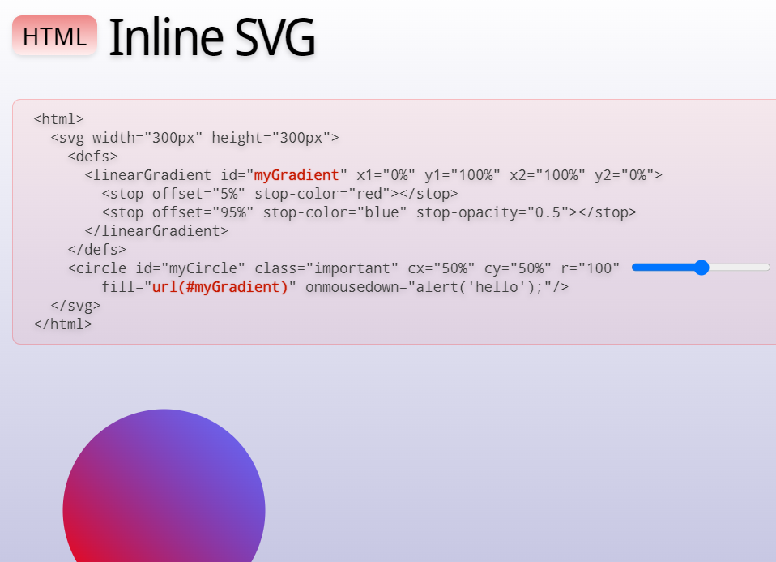
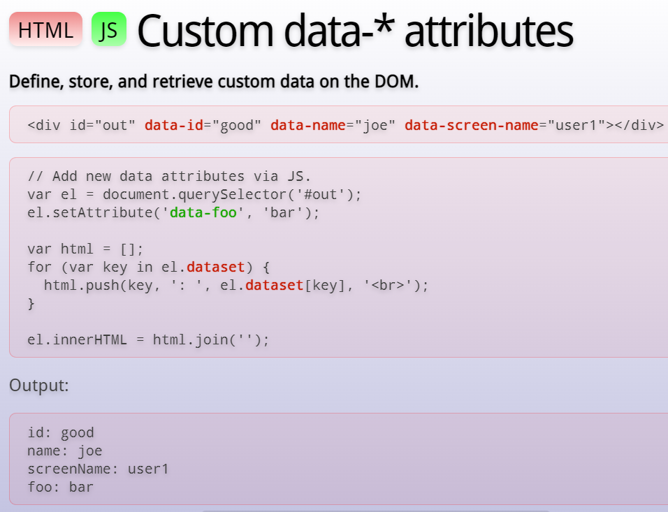
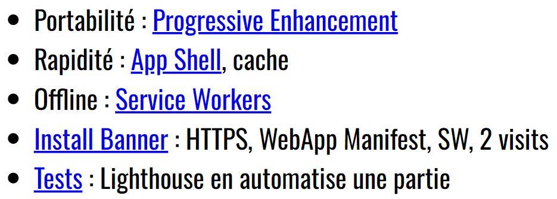

> 📖 Présentation [HTML5 (CSS3 JS)](https://he-arc.github.io/slides-devweb/04-html5.html)

# Préembule

HTML permet de structuré des éléments avec des balises
- **Elements** : le tout (balise ouvrante, contneu, balise fermante), ex `<a href="http...">cible</a>`
- **balises** : ouvrante : `<a>` et fermante `</a>`

Nouveauté HTML 5 :
- contenu/balise scémantique (à quoi elle servent)
  - \<main>; \<section>; \<nav>; etc
- Démocratisation de JS : API **JS**
  - Accès aux périphériques (caméra, micro, etc)
  - Avant HTML5, on faisait des applications web native
  - Pour savoir si un téléphone est en mode portrait ou paysage -> JS
- Présentation : **CSS3**

-->> Ce cours est le combo de : **HTML5, CSS3, JS**

# Nouveautés d'HTML 5
[Slides GOOGLE de HTML5](https://web.archive.org/web/20150525080904/http://slides.html5rocks.com/#landing-slide)

Les **workers** : permet de faire des tâches en arrière plan/parallèle (ex : téléchargement de fichier, etc)

**WebSocket** : permet de communiquer avec un serveur en temps réel (ex : chat, etc)

- permet de récupéré les valeurs possibles (`itemprop`) depuis une URL externe (`itemtype`)
- **remplacée par `Data *`**

**ARIA** : permet de définir des rôles pour les éléments HTML (ex : `role="button"`), pour les lecteurs d'écran

- Intégration native du **SVG** : permet de dessiner des formes vectorielles directement dans le HTML
- Oh what, stylé : [SVG Animation](http://web.archive.org/web/20150525080904/http://slides.html5rocks.com/#svg-example-slide)

Intégration du **HSL/HSV**
- Hue : teinte (0-360°)
- Saturation : quantité de couleur (gris-coloré) (0-1)
- Luminance/Value : quantité de lumière (noir-blanc) (0-1)

**JQuery**
- Ajax
- Selecteurs amélioré
- En 2022, beaucoup de fonctionnalité de JQuery sont intégrées dans le JS natif
  - La raison d'encore l'utiliser est le souhait de faire des sites compatibles avec de vieux navigateurs

- On ose ajouter autant d'attribut personnalisés, tant qu'ils commencent par `data-`
- Il est ensuite possible de facilement récupérer ces attributs avec JS / POST et GET
- Google recommande d'utiliser JSON pour l'envoie, la méthode est la même mais en plus facile à parser

# PWA : Progressive Web Apps
application web qui se comporte comme une application native

Comment en faire : https://he-arc.github.io/slides-devweb/04-html5.html#4.0

Progressive Enhancement : On ne vise pas un objectif complet, mais on se concentre sur les fonctionnalités essentielles lors de l'itératopn 1, puis on ajoute des fonctionnalités/design au fur et à mesure.

AppShell : chargement d'une image/css minimaliste pour donner l'impression de vitesse à l'utilisateur
- Exemple Youtube au démarrage : 

Service Worker : ce qu'on va garder en local pour que l'application soit utilisable même sans connexion internet

Install Banner : permet de "télécharger" le site sur l'écran d'accueil du téléphone de l'utilisateur
