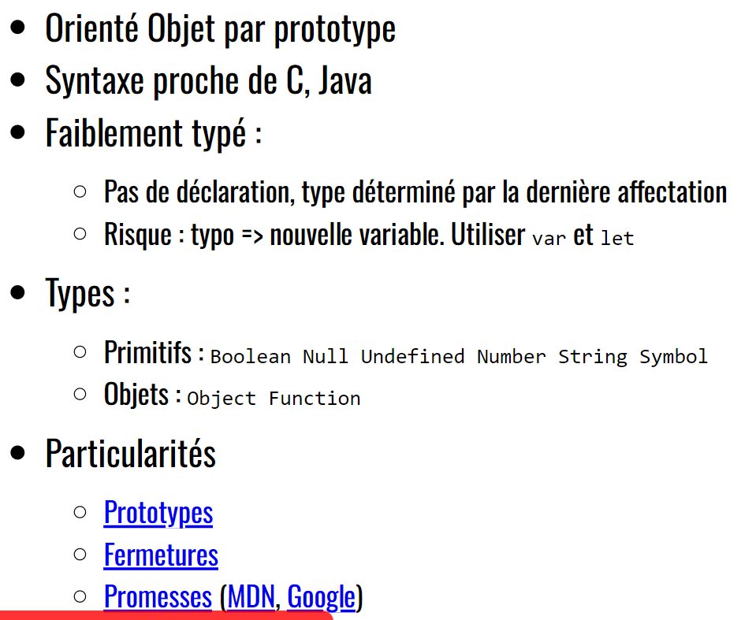
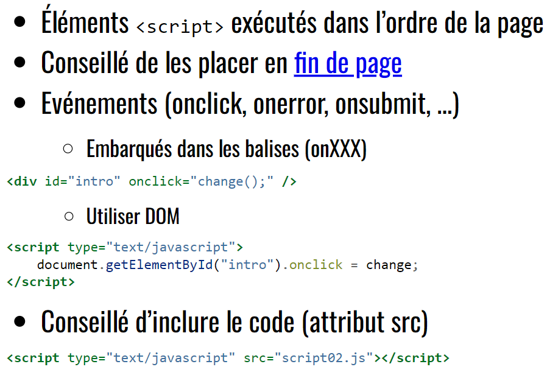
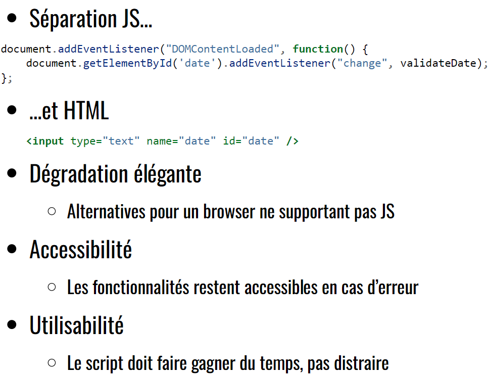
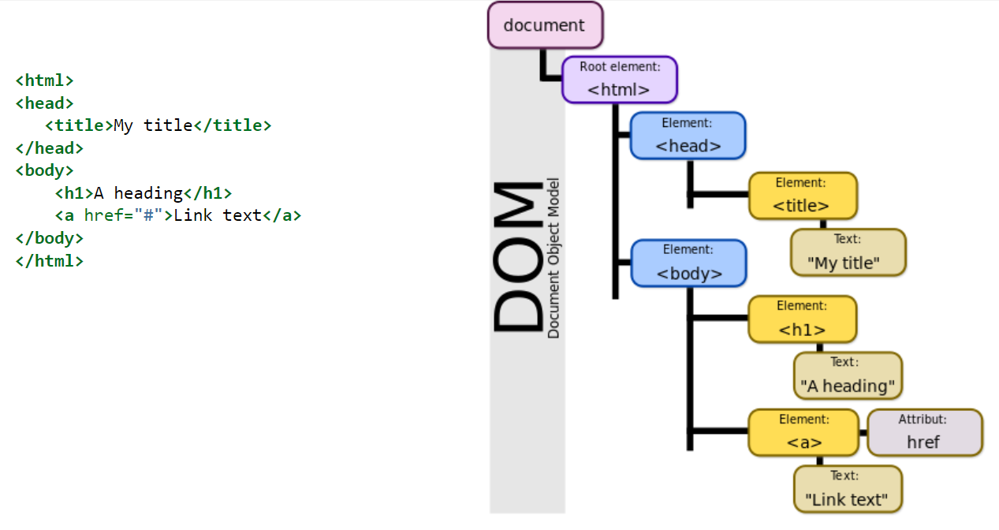

> 📖 Présentation [JavaScript & DOM](https://he-arc.github.io/slides-devweb/05-JSandDOM.html)

JS :
- Front-End / Interactivité du site
- Back-end : NodeJS (moteur d'execution de JS)
- Application Desktop :
  - Electron : Navigateur limité qui permet d'exécuter une WebApp
- Embarqué : Espruino
- Robotique : Node Bots; CylonJS

DOM : Document Object Model
- Stratégie pour parsé du XML
- Stratégie utilisée par les navigateurs pour parsé du HTML

On peut récupérer des éléments du DOM avec JS

Bookmarklets : fait d'ajouter dans les favoris un bout de code JS, qui peut intéragir avec le DOM de la page courante

Gestionnaire de dépendances JS : `npm` (Node Package Manager)

Interfaces pour scripter le navigateur
- Requêtes HTTP : Fetch API, Xml HTTP Request
  - De nos jour, on utilise plus directement XHR, mais Fetch avec des `promises`, qui font appel à XHR

# Caractéristiques de JS

Utiliser `const` et `let` // et non pas `var` 

POP : **Programmation Orientée Prototype**
- quand on modifie une propriété d'un objet, en réalité on créé un nouvel objet se basant les propriétés de l'ancien

**Femetures**
possibilité d'accéder à des variables en dehors de leur portée

**Promesse**
Mécanisme pour faire de la programmation asynchrone

# JS dans HTML

Il est conseillé de découplé le JS du HTML (fichiers séparés, utilisation du DOM pour lié les éléments)

Conseillé de mettre le JS dans la balise ``
- Car le contenu JS est executé dans l'ordre où il est écrit dans le fichier HTML, et comme JS est utilisé pour manipuler le DOM, il pourrait être charger avant la fin du chargement de l'HTML

# Unobtrusive JS

Principe de rendre le JS comme un "utilitaire" pour le site, et non poser des contraintes sur le site

En fait partie la séparation du JS du HTML

Dégradation élégante/accessibilité : si le JS est désactivé, le site doit quand même être utilisable.
- Exemple s'il y a de l'AJAX pour update, mais qu'il ne fonctionne pas, le site devrais proposer un **`fallback`** (alternative), comme recharger complètement la page

# Objets JS
2 objets principaux : `window` et `document`
- `window` : contient les informations de l'onglet
- `document` : contient l'ensemble de la page chargée

## DOM

Les éléments d'une balise sont stockés dans des noeuds enfants, si c'est du texte, le noeud sera de type texte