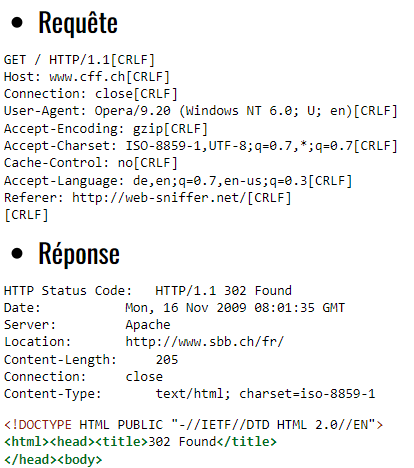
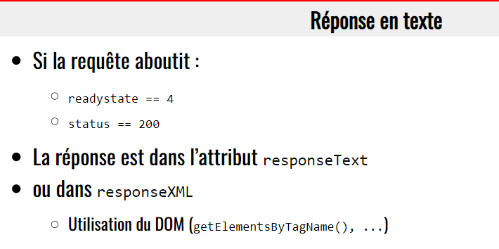
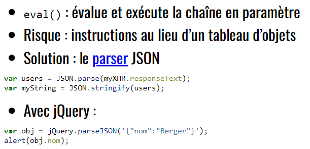

> 📖 Présentation [Chapitre 6 : HTTP et Ajax](https://he-arc.github.io/slides-devweb/06-HTTPandAJAX.html)

# HTTP
HyperText Transfer Protocol

Inventé en Suisse, au CERN

Protocole de niveau 7
- de type texte
- non connecté : aucune info sur le client
- Cycle de vie : échange requête/réponse

Contenu :
- Texte
- Binaire (depuis HTTP2)
> Encodage du binaires en texte : Base64 (prend 50% de place en plus qu'un binaire pure)

Entêtes aussi bien dans les requêtes que dans les réponses

Verbes HTTP principaux :
- GET
- POST
- PUT/PATCH
- DELETE
- HEAD

Requête : Verbe + URI

Que sépare l'entête du corps : une ligne vide (2 retour à la ligne)

## Entête de requête
- Host : Obligatoire (car on héberge plusieurs adresse sur un même serveur)
  - Permet d'atteindre le bon service
- Referer : Adresse de la page qui a fait la requête (si on tape dans l'URL, valeur vide)
- User-Agent : Navigateur utilisé

## Entête de réponse
- Content-Type : Type de contenu (JSON, image, etc)
  - Pour que le navigateur sache comment traiter/parser le contenu
  - Syntaxe MIME : image/jpeg, text/html, application/json, etc
- Set-Cookie : Conteneur
  - Qui a accès : limité au domaine qui les a créé
- Location : Redirection

## Codes de réponses
- 1xx : Information
- 2xx : Succès
- 3xx : Redirection
  - 301 : Moved Permanently
  - 302 : Found
  - Exemple : 301 : abc.ch -> abc.com
- 4xx : Erreur client
- 5xx : Erreur serveur
  - Provoqué par un fichier qui fait planter le serveur avant le renvoie de la vue
  - Bonne pratique : si on voie une erreur 500, regarder les logs Laravel

## Verbes
Verbe | Description
--- | ---
GET | Demander une ressource
POST | Création d’une ressource
PUT | Remplacement total d’une ressource
PATCH | Remplacement partiel d’une ressource
DELETE | Suppression d’une ressource
HEAD | Demande l’entête de la réponse, sans la ressource
> Put/Patch  : Non lié à la BDD (exemple ID/autre), mais plutôt au contenu modifié (exemple une donnée blob : `put` on remplace tout, `patch` on récupère que les données modifiées, et on les mets à jour).
> En soit, le patch consiste à un pré-traitement sur les données, alors que `put` ne fait que remplacer les données demandées.

Autres verbes : TRACE, OPTIONS, CONNECT

> Put : réécrit tout les attributs (même s'il ne changent pas)
> Patch : réécrit seulement les attributs qui ont changé

Sûres : ne modifie pas l'état du serveur
Idempotentes : Le système change d'état la première fois, puis reste dans le nouvel état les fois suivantes
> Un verbe sûre est idempotent, mais pas l'inverse

> Attention à conserver que des actions "sûres" dans celles spécifiées.
> Car par exemple les bots de Google vont essayer tous les liens GET du site, et donc executer l'action.
> Si par exemple l'action GET permet de vider la table des utilisateurs, l'action sera executée --> problème

## Exemple d'échange

requête GET : les arguments sont dans l'URL
requête POST : les arguments viennent dans le corps de la requête

---
---

XHR : XML Http Request

# JSON

Pourquoi JSON est populaire
- JS Object Notation
- Car c'est litérallement un objet JS, donc déjà sérialisé

**Sérialiser/désérialiser :**
  
- Eval :
  - Interprète une chaîne de caractère comme du code JS
  - Ne pas utiliser pour importer un objet JSON, car permet d'executer n'importe quel code JS
- Parse :
  - Convertir un texte en objet JS
Stringify :
  - Convertir un objet JS en texte