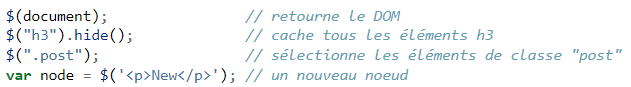

> <span style="font-size: 1.5em">📖</span> <span style="color: orange; font-size: 1.3em;">Présentation [JQuery](https://he-arc.github.io/slides-devweb/07-jQuery.html)</span>


JQuery permet de :
- Manipuler le DOM
- Manipuler le CSS
- Réponse aux événements
- Effets visuel et animations
- Ajax

A été pensé pour fournir une API commune à tous les navigateurs

Système de chainage de méthodes (callback)

# Utilisation
Recommandé d'inclure `CDN` : Content Delivery Network
- pourquoi un network : on prend le serveur ayant le moins de latance
- Permet de facillement changer de version
- 
    ```html
    <script src="https://code.jquery.com/jquery-3.6.0.min.js"></script>
    ```

Une fonction principale : `$(selector)` (=== `jQuery(selector)`)
des actions qui suivents : `$(selector).actionXXX()`


Pourquoi utiliser JQuery en 2022 ?
- Assurer la compatibilité avec les vieux navigateurs