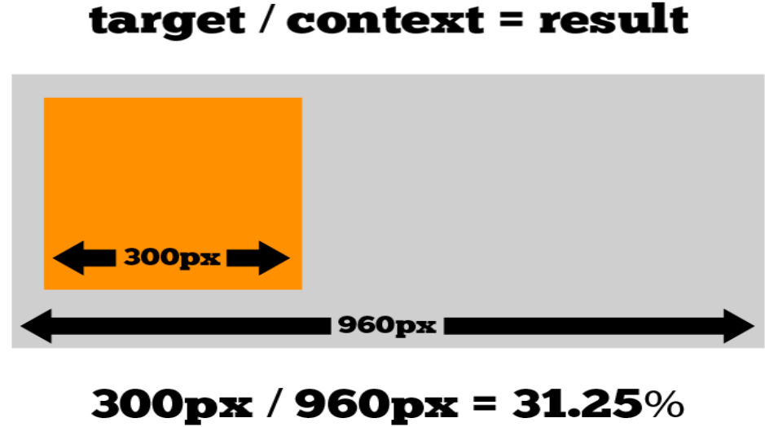

> <span style="font-size: 1.5em">📖</span> <span style="color: orange; font-size: 1.3em;">Présentation [Responsive Web Design](https://he-arc.github.io/slides-devweb/10-rwd.html)</span>

Quantité de pixels
- Taille du texte

Doigts / souris
- Doigts : cible plus grande, pas de hover, etc.

# Techniques 

Pour que ça fonctionne bien **Toujours utiliser des unités relatives** (% ou em)
Ne pas utiliser `px, cm, etc.`

## De absolu à relatif
Le résultat = cible / contexte (sans arrondire)



Les images :
- Soit on stocks les images en plusieurs tailles et on les affiche en fonction de la taille de l'écran (un peu plus lourd à maintenir, mais meilleur choix)
  - `picture` : permet de définir plusieurs images pour un même élément
  - ```html
    <picture>
      <source media="(min-width: 650px)" srcset="img_pink_flowers.jpg">
      <source media="(min-width: 465px)" srcset="img_white_flower.jpg">
      
    </picture>
    ```
- Soit on stock une très grande image et on la redimensionne en fonction de la taille de l'écran (risque de lag)
- [Liste de problèmes pour les images en responsive](https://www.smashingmagazine.com/2014/05/responsive-images-done-right-guide-picture-srcset/)


# MediaQueries
Css, on test la largeur de l'écran

MediaType : détection du type de média
- all, screen, print, tv, braille, etc.
Orientation de l'écran


# Mobile first
Avantage : Force de faire des sites avec que l'essentiel, car on a pas beaucoup de place.