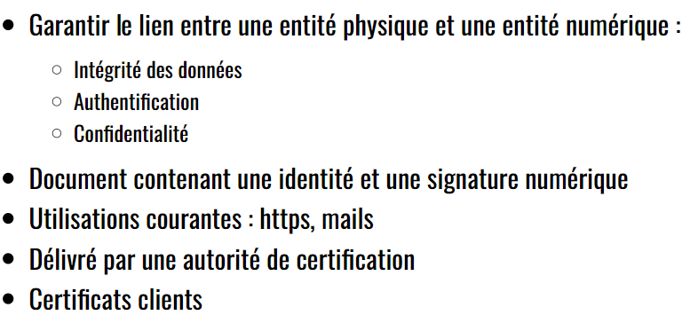
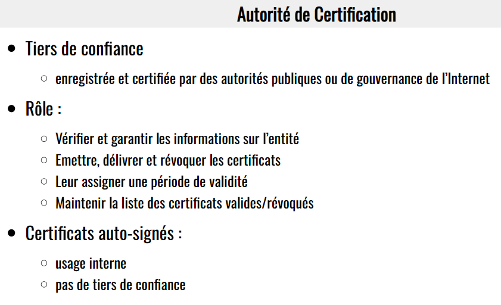
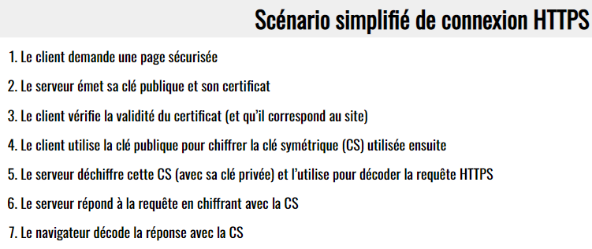

> 📖 Présentation [HTTPS](https://he-arc.github.io/slides-devweb/11-https.html)

HTTPS s'est :
- **chiffré**
- **confidentialité**
- **authenticité** == prouver
  - identifier == affirmer
  - Authentification du serveur
  - Authentification du client (optionel)
- **Intégrité des données**

> Les 4 services sont importants et à connaître

# Certificats

Chaque machine (même sans utilisateurs) ont des certificats `racine`.

Qui vérifie que le certificat est valide ? :

# Etapes connexion HTTPS

Pourquoi le client à aussi une clé de chiffrement ?
- Pour que le client puisse chiffrer les données qu'il envoie au serveur
- Pourquoi le chiffrement symétrique ?
  - Consomme moins de ressources
  - Chaque client doit avoir canal confidentiel, du coup si c'est le client qui génère la clé,  il peut la garder pour lui

----

_SPDY_ : Ancien protocole de transfert de données, remplacé par _HTTP/2_