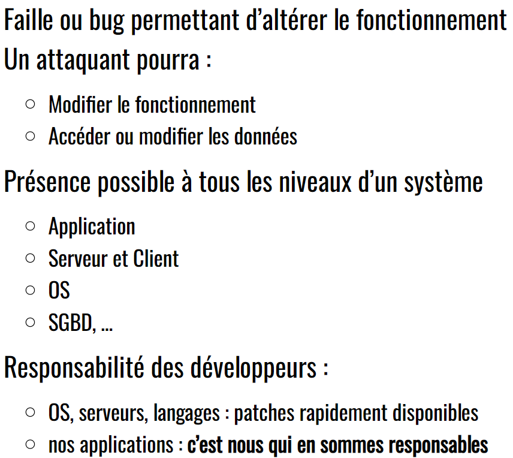
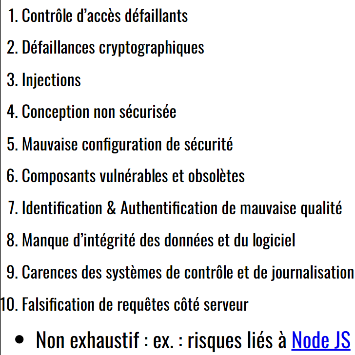

> 📖 Présentation [Risques applicatifs des apps web](https://he-arc.github.io/slides-devweb/12-risques.html)

OWASP : Fondation pour amélioer la sécurité des applications web
OWASP == Open Web Application Security Project

# Cross Site Scripting (XSS)

Forme d'injection, ou on insert du code (exemple JS) dans une page web (par un formulaire par exemple)

# Les 10 risques principaux

## Injection
Les entrées attendent des données, l'injection consiste à intégrer du code dans ces données, et ce code est exécuté par le serveur.

## Conception non sécurisée
Imaginons une salle de cinéma, un application reserve toutes les places, et ainsi les vertiables clients n'ont plus de place. -->> le cinéma perd beaucoup d'argent

## Conception non sécurisé
Typiquement quand on achète un matériel, et qu'on ne change pas le mot de passe par défaut

Ou si on laisse l'environnement de développement actif sur la production (exemple : le mode debug)

## Identification et authentification de mauvaise qualité
Beaucoup de monde utilise les mêmes mots de passe, ou des mots de passe trop simples; il suffit donc de les essayer tous pour voir s'il y en a un qui marche. (attaque par dictionnaire, ou brute force)
--> Ajouter une limite de tentatives (timer, blocage, etc)

## Manque d'inégrité des données et du logiciel
Exemple avec Laravel ou un autre framework, le 90% du code est fait par des tiers, et il est donc possible que des failles de sécurité soient introduites dans le code. Ou qu'il y ait des packets dangereux qui soient installés (exemple l'installation de dépendances en cascades)

## Carrance des systèmes de contrôle et de journalisation

--> loguer les actions des utilisateurs

Comme ça on peut constater si un utilisateur a fait quelque chose de suspect ou essayer de faire des attaques.

C'est pas un humain qui va lire les logs, mais des software comme `Grafana`.

## Falsification de requêtes côté serveur
L'utilisateur peut entrer en paramètre une URL appelé par le serveur, et ainsi faire des requêtes sur le serveur.

Par exemple en envoyant une URL avec le protocole "file://" on peut lire des fichiers sur le serveur.

# Risques non liés à l'application
DDoS : attaque par déni de service (envoie massif de requêtes sur le serveur)
Spoofing : DDoS, mais en se faisant passer par quelqu'un d'autre

Social Engineering : attaque par le biais de l'humain, par exemple en envoyant un mail qui demande de changer le mot de passe, et en demandant le nouveau mot de passe.