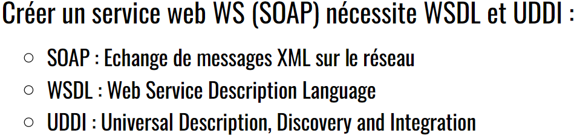
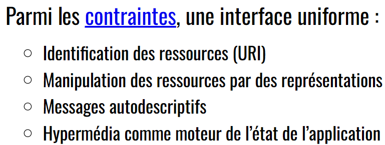
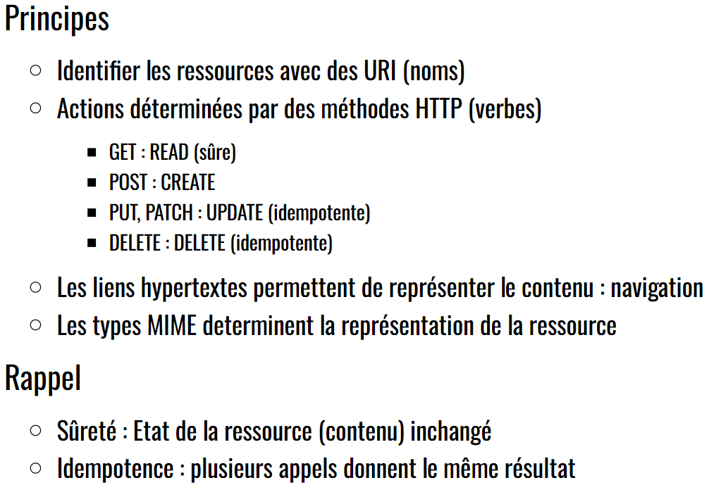
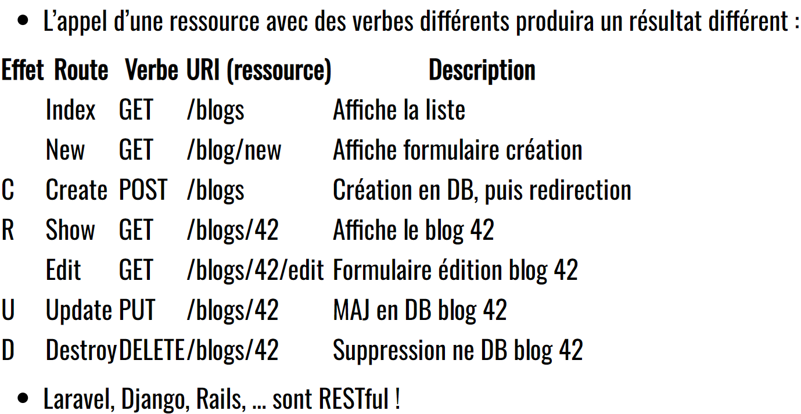

> 📖 Présentation [Web Service](https://he-arc.github.io/slides-devweb/09-webservices.html)

Sites web non destiné à des utilisateurs, mais destiné à d'autres programmes

- REST : **ressources** (données)
  - REpresentational State Transfer
- RPC (SOAP) : **services** (traitement; fonction))
  - Remote Procedure Call
  - Equivalent Java : RMI (Remote Method Invocation)

# SOAP
SOAP n'est plus un acronyme, et son nom est devenu générique pour désigner les services web (`WS-*`)
- `*` : SOAP, WSDL, UDDI (et d'autres)

# REST
Identification unique d'une ressource --> URI

Hypermédia : à partir d'un état donné, on sait les états suivants possibles
Représentation des données : XML, JSON, ETC
- choix de la représentation : `Content-Type` dans l'entête de la requête, avec le type MIME

Rest utilise CRUD

mais également d'autres méthodes : 
