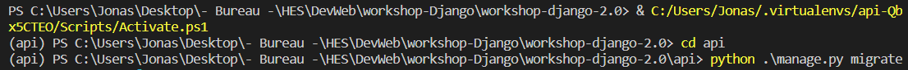

mettre l'env (sélectionner un fichier .py, n'importe l quel)




puis démarrer le serveur :
`python manage.py runserver`


Settings :
```py
INSTALLED_APPS = [
    ...
    "caffeinecalculatorapp",
]
```

# Création de champs
auto_now_add : a la création
auto_now : tout le temps

Valider :
- `python manage.py makemigrations caffeinecalculatorapp`
- `python manage.py migrate`

# Page admin : admin.py
from .models import CaffeineItem

admin.site.register(CaffeineItem)


# TODO 2

Par défaut vue : Option APi
setup -> prend l'autre API (componition API)

Axios : 
ref : variable two-way
onMounted : Dans le cycle de vie


# TODO 3
Generic API View qui définie comment notre classe fonctionne (GET et POST)

## 3-4
```
    def get(self, request, *args, **kwargs):
        return self.list(request, *args, **kwargs)
    
    def post(self, request, *args, **kwargs):
        return self.create(request, *args, **kwargs)
```
        Fait le lien entre notre objet (CaffeineItemList) et le mixins

## 3-5

C'est le generics qui implémente le mixins cette fois, donc on deviens de plus en plus générique

(3-2 est dans 3-3 qui est dans 3-4 qui est dans 3-5, qui est dans 3-6)

## 3-6
ViewSets : 
Ajoute en plus du 3-5 la TOTALITE du CRUD

# 3-7
Le basename fait référence au nom du modèle (singulier + tout coller + case sensitive)
Même si le model est en PascalCase, le base name DOIT être en minuscule

`path("", include(router.urls))` va se compléter automatiquement

visible mtn ici : 


# 4
Pour le frontend, on utilise Qazar, permets de faire les "q-head, q-XXX, ...; appartenant à VueJS

q-route-tab == un lien pour le nav

## 4-2

Variable two-ways (binding) : `maVar = ref([])`
et accède à la valeur avec `maVar.value`

onMounted va executer les fonctions qu'on lui passe

# 4-4

    <q-select
      v-model="currentUser"
      option-value="id"
      option-label="username"
      :options="users"
      label="User"
      outlined
    />

    option-value : demande qqc d'unique
    option-label : va prendre l'attribut du currentUser
    :option : v-binding, il attend une collection; sans le `:` attend du texte


# 5

```
const submit = async() => {
  await axios.post("http://127.0.0.1:8000/api/caffeine-items/", {
    name: name,
    description: description,
    serving_size_in_ml: servingSize,
    caffeine_amount_in_mg: caffeineAmount,
  });
}
```


`<q-banner v-if="success"...></q-banner>` test si non null & vrai

Le nom des variables doit respecter le nom définis dans le Backend (exemple `serving_size_in_ml)


# 6
```
user = models.ForeignKey(User, related_name='consumed_items', on_delete=models.CASCADE)
  caffeine_item = models.ForeignKey(CaffeineItem, related_name='consumed_items', on_delete=models.CASCADE)
```
le related_name correspond à la classe dans la quel on ajoute les FK


@action(detail=True) --> detail signifie que l'on va sur un seul élément (pas sur la liste)

`class UserViewSet(viewsets.ReadOnlyModelViewSet)`: le readonly va empêcher de modifier/créé/supprimer depuis l'API, mais pas depuis le site


# Autre

En principe : 
- JS = camelCase
- Python = snake_case

**Refaire une migration** : dans le terminal :
- `python manage.py makemigrations`
- `python manage.py migrate`


En prod, si on met la variable de développement à false, la page API est désactivée 
!! Si on laisse activé en prod, c'est pas sécurisé !!


on ne peut pas faire `await XXX().data`, il faut faire : `(await XXX()).data`


Vue : 
Créer un objet : `{param : 'value'}`
Afficher un objet : `{{obj.param}}`