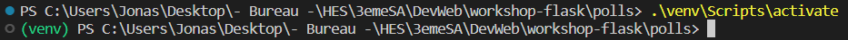

Flask est un **micro-framework** web écrit en **Python**

Slides : https://www.matthieuamiguet.ch/media/misc/flask2023/slides/slides.html#1
Tutoriel : https://www.matthieuamiguet.ch/media/misc/flask2023/tuto/tuto.html#installer-flask

# VEnv

Créer l'environnement virtuel :
`python -m venv venv`

Et l'activer :
`source venv/Sources/activate` (peut varier selon la plateforme, exemple `venv/bin/activate` sous Linux)
> La commande `source` n'active l'environnement que pour le terminal en cours
> Sous Windows, la commande est différente : ".\venv\Scripts\activate"
> 

> Pour vérifier si on a bien l'environnement actif, on peut utilise `pip freeze` qui devrait afficher les paquets installés dans l'environnement et pas tous ceux installés sur la machine

# Hello World
1. Créé le fichier d'exemple (fournis) (`hello.py`)
2. Tester :
```bash
flask --app hello --debug run

# Ancienne syntaxe (flask < 2.2)

export FLASK_APP=hello.py # (Linux)
set FLASK_APP=hello.py` # (Windows)

flask run --debug
```

# Rappel python
f(1,2,3) 

aTab = [1,2,3]
f(aTab) # =  f([1,2,3])
f(*aTab) # = f(1,2,3)

aDict = {"a":1, "b":2, "c":3}
f(**aDict) # = f(a=1, b=2, c=3)

`locals()` : retourne sous forme de dictionnaire les variables locales du scope courant