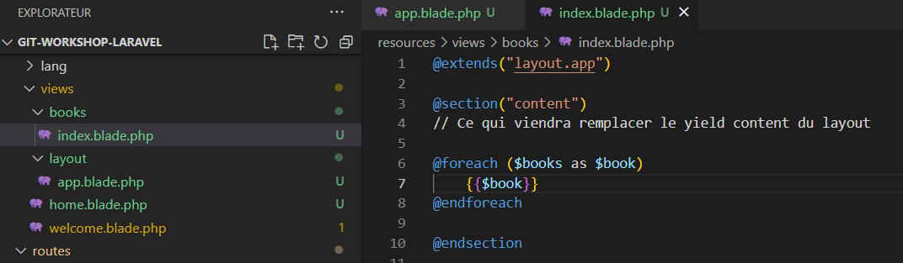

# 0 Créé le projet

Utiliser Laravel 9

Créé l'architecture de base (avec composer)
`composer create-project laravel/laravel NomProjet`

Démarrer le serveur


`web.php` === le routeur

# 1 Creation d'une 1ère page

Création du controlleur via la commande `php artisan`


Ce qui créé automatiquement le fichier au bon endroit


(En cas d'erreur, juste supprimer le fichier))
# 1-1


# 1-2

# 1-3


Les vues ne sont pas crée via la cmd "artisan", il faut les créer manuellement
# 1-fin


# 3 Base de données

# 3-0


Création d'une entrée dans la base de donnée

# 3-1


Création de la migration (les données à mettre dans la BDD)
Convention chez Laravel : objet "Book" aura une table "books" (minuscule avec un "s" à la fin)

ce qui génère le fichier, précéder de la date (pour des question d'ordre d'execution)


# 3-2
Rajouter quelques champs au livre dans la migration, au minimum : title, pages, quantity

Note : l'ordre importe peu, c'est juste une convetion


# 3-3
Envoie des données vers la BDD (phpMyAdmin)


(Il est possible de rollback avec une commande, mais lire la doc pour ;))


> <span style="color:RED">!! NE JAMAIS EDITER DES MIGRATION DEJA PUSH</span>
> Si le projet existe déjà, les migrations sont chainées, et il ne comprendrait pas d'ou vient l'erreur
> Pour faire une modif, on créer une nouvelle migration et on mets les modif dans cette nouvelle (retrait d'une colonne, ajout d'une nouvelle, etc)
> exemple `php artisan make:migration update1_books_table`

# 3-4/5 Seeders
`php artisan make:seeder BookSeeder`

Et ajouter le contenu dans le fichier seeder généré

par convention un seeder permet de mettre les données de base. Donc par convention on les clean avant 

`use App\Models\Book;`


# 3-6
 Envoie des données à la BDD


`php artisan db:seed`

# 4 Affichage

pour commencer, il faut créer des ressources (CRUD) du book controller

`php artisan make:controller BookController --resource`

Dans le fichier créer :
Ajouter le "Use app/model/..." requis

Dans la fonction index, on veut afficher tous les livres : `return view("books.index", ["books" => $books]);`
({VIEWS} dossier "books", vue index, variable `books`)

# 4-2 Routeur
On veut faire un ensemble de route : `resource`

`web.php` : `Route::resource("books", BookController::class);`
- 1er arg : Nom de la ressource
- 2eme arg : Nom de la classe

# 4-5
Création de la vue.

Pour simplifier on créé un layout, qui sera la structure générale

```
<div class="container mt-3">
    @yield('content')
</div>
```

permet de faire que cette partie sera remplacée par la vue appelant cette page



# 6 Validation

Pour rendre un champ obligatoire, min/max, que des entiers, etc
```php
$request->validate([
   'title' => 'required|min:5|max:25',
   'pages' => 'required|integer|gt:0|lt:1000',
   'quantity' => 'required|integer|gte:0|lt:100',
]);
```

# 6-3 Pagination
Ne récupère que les 5 livres correspondant à la pagination actuelle
```php
$books = \App\Models\Book::latest()->paginate(5);
return view('books.index', compact('books'))
    ->with('i', (request()->input('page', 1) - 1) * 5);
```

> `with` permet de créer une variable qui viendra s'ajouter dans la session, et qui sera supprimer après la view
> `with(clé, valeur)` ou `with([clé => valeur, clé2 => valeur2])`	

```html
{!! $books->links() !!}
```
blade s'occupe d'afficher les éléments (bouton suivant/précédent + no page), et bootsrap s'occupe de la mise en forme

pour activer bootstrap, il faut ajouter dans le fichier `AppServiceProvider.php` :

```php
use Illuminate\Pagination\Paginator;

public function boot()
{
    // TODO-6-5 Adapter les liens de pagination pour fonctionner avec Bootstrap
    Paginator::useBootstrap();
}
```

# 8

Création d'un modèle "Auteur"
`make:model Author --migration`
`migration` va permettre de directement créé l'élément pour l'insertion dans la BDD

# 8-1 à 8-4

Lié les livres avec les auteurs (Bdd) :

 `php artisan make:migration add_author_fk_to_books --table=books`

```php
public function up()
{
    Schema::table('books', function (Blueprint $table) {
        $table->foreignId('author_id')->nullable()->constrained()->onDelete('cascade');
    });
}
```

le "author_id" va permettre à Laravel de savoir que l'on parle de la table `authors` et le "_id" permet de savoir que c'est une clé étrangère

Pour supprimer une foreign key, il faut 2 étapes dans le "down" du fichier de migration : 
1. Supprimer la contrainte
2. Supprimer la colonne
   
```php
public function down()
{
    Schema::table('books', function (Blueprint $table) {
        $table->dropForeign(['author_id']);
        $table->dropColumn('author_id');
    });
}
```

Il ne reste qu'a envoyé les modifs dans la BDD : `php artisan migrate`

ou pour annuler la migration : `php artisan migrate:rollback`

<!-- #region NOTE BLOCK --> 
<div style="margin: 20px auto; padding: 10px; background-color: #ffd48a; border-left: 5px solid #8a5700;color: black; font-size: 2em">
<span> 📑 </span>Note<br>
<span style="font-size: 0.75em">
bonne pratique : toujours tester que up et down fonctionne (faire une migration, puis la rollback, puis la remettre)
</span></div>

<!-- #endregion NOTE BLOCK -->


# 8-5
Lié les auteurs et les livres

Dans le modèle de `Author.php`
```php
public function books()
{
    return $this->hasMany(Book::class);
}
```

et dans `Book.php`
```php
function author() {
    return $this->belongsTo(Author::class);
}
```

et ne pas oublié d'ajouter les FK dans les "fillable", (qui évite les "mass assignment")

# 8-9
Avoir une variable author dans les "book"
ajouter le "with" :
```php
$books = \App\Models\Book::with('author')->latest()->paginate(5);
```

# 8-13
validation supplémentaire :
`'author_id' => 'nullable|integer|exists:authors,id'`
on spécifie qu'il peut être vide; et s'il n'est pas vide, il doit être un entier et doit exister dans la table "authors" dans la colonne "id"