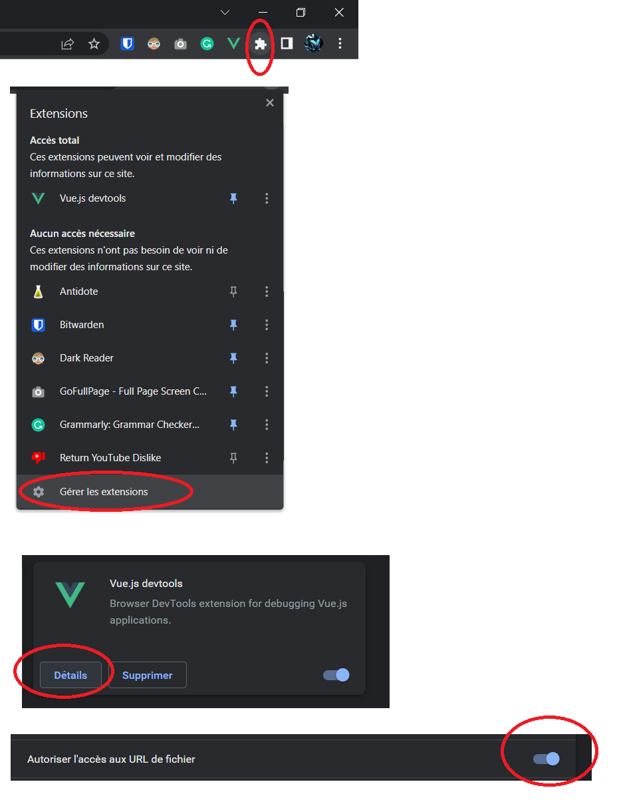
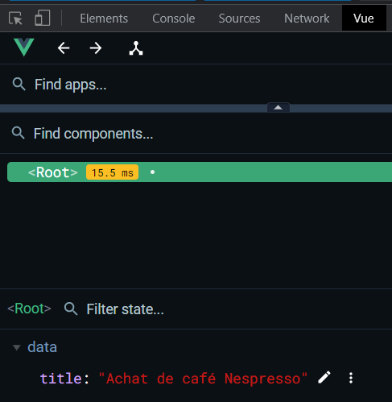

> On regarde que les bases, on est loins d'avoir tout `vue` (*/joke*)
# Setup

# Extension pour le navigateur
https://devtools.vuejs.org/guide/installation.html

et après dans les outils de développement :



## Extensions VSC : 
https://marketplace.visualstudio.com/items?itemName=Tobermory.es6-string-html
Utile pour les balises HTML dans du PHP (colorisation syntaxique)

Colorisation syntaxique pour les éléments `Vue` dans les fichiers `.html`
https://github.com/johnsoncodehk/volar

Intégration de VueJS au projet : `<script src="https://unpkg.com/vue@3.2.37"></script>`


# init

**`Main.js`** :
```js
const app = Vue.createApp({
    data: function () {
        return {
            title: "Achat de café Nespresso",
            description: "Hello world",
            image: "assets/images/colombia.png",
            link: "https://www.nespresso.com/fr/fr/produits/cafe-en-grains/colombia",
        }
    }
});
```

**`index.html`** :
```html
 <div id="app">
    <h1>
      <a :href="link">
        {{ title }} <!-- on récupère la variable title -->
      </a>
    </h1>
    <p>{{ description }}</p>
    
  </div>

  <script src="./main.js"></script>

  <script> // Une nouvelle balise, c'est important ! (ne pas utiliser celle avec le src main.js)
    const mountedApp = app.mount('#app') // Notre objet Vue sera dans cette balise
  </script>
```

## Explication éléments
- `{{ }}` : mention qu'il s'agit d'utiliser une variable
- Dans les attributs, `v-bind:` permet à vue de comprendre que c'est une variable qui est indiqué
  - simplification explicite de`v-bind:` en `:`

# Conditions

- `v-if` sont bien, mais va charger et décharger le HTML.
On utilise le `v-show` qui va juste modifier le CSS (l'élément est toujours présent dans le DOM)

```html
<p v-if="inStock > 5">
    En stock
</p>
<p v-else-if="inStock <= 5 && inStock > 0">
    Plus que {{ inStock }} en stock
<p v-else>
    En rupture de stock
</p>

<p v-show="inStock > 5">
    Test
</p>
```

# Listes

- `v-for` : boucle sur une liste, pas très performant s'il y a beaucoup de données

`:key` est important pour `vue` afin d'optimiser l'affichage en rendant les éléments uniques. Utile quand il y a beaucoup de donnée, ou de l'animation. <span style="color: #46b7ae; font-style: italic; font-size: 0.85rem">// Ce mot clé  ne sert que pour `vue`.</span> 

```html
<ul>
    <li v-for="detail in details">{{ detail }}</li>
</ul>

<div v-for="image in carouselImages" :key="image.id">
    {{image.text}}
</div>
```

# Bouton

`v-on` permet de déclencher une action lors d'un événement (click, mouseover, etc.), peut être simplifié par `@`

```html
<div>
    Panier ({{cart}})
</div>

<button v-on:click="cart += 1">
    Ajouter au panier
</button>
```

On remarque qu'appuyer sur le bouton va automatiquement update la valeur du panier

# Méthodes

**`main.js`** : 
```js
const app = Vue.createApp({
    data: function () {
        return {
            // ... les données au format dict
        }
    },
    methods: {
        //addToCart: function () {      // Ancienne syntaxe
        addToCart() {                   // Nouvelle syntaxe
            this.cart += 1
        }
    }
});
```

et on update le bouton d'avant en lui passant la méthode qu'on vient de créer :

**`index.html`** :
```html
<button v-on:click="addToCart()">
    Ajouter au panier
</button>
```

# Styles

3 manières de modifier le style :

**universelle** : 
```html	
<li v-for="detail in details" :key="detail.id" :style="{color: detail.color}">
    {{detail.text}}
</li>
```

via un **objet `style` dans le `main.js`**
```js
data: function () {
    return {
        // ... les données au format dict
        styles:
        {
            roundButton: {
                borderRadius: "20px",
                padding: "10px",
                backgroundColor: "rgb(0, 114, 180)",
                color: "white",
                cursor: "pointer"
            }
        },
    }
```

avec le **CSS normal** (exemple sur le bouton désactivé prend la classe "disabledButton")

index.html :
```html
<button v-on:click="addToCart" :style="styles.roundButton" :disabled="inStock <= 0" :class="{disabledButton: inStock <= 0}">{{stringCart}}</button>
```

pour la couleur du background, on peut utilisé aussi bien `background-color` que `backgroundColor`


# Computed properties

- Permet de créer des variables qui sont calculées à partir d'autres variables
Exemple pour la concatenation de texte, vue va mettre le résultat en mémoire comme ça il n'y a pas besoin de recalculer à chaque fois

**`main.js`**
```js
const app = Vue.createApp({
    data: function () {
        return {
            // ...
    },
    methods: {
        // ...
    },
    computed:
    {
        title() {
            return this.action + " " + this.brand;
        }
    }

});
```

# Composants

Faire un nouveau dossier "`components`" et créer un fichier `.js` dedans (`ProductDisplay.js`).

> Ne pas oublier de l'importer dans le `.html`
>
> on commence dans `.js`; mais par la suite se sera déplacé dans un fichier `.vue` spécifique

1. on créé la structure de l'objet dans le **`ProductDisplay.js`**
```js
app.component('product-display', {
    template:
    /*html*/
    `
    <h1>Super titre</h1>
    `,
    data() {
      return {
      }
    },
    methods: {
    },
    computed: {
    }
  });
```

1. on l'utilise dans le **`index.html`**
```html
<product-display></product-display>
```

## Props
Il s'agit des entrées (paramètres) pour les composants.

Il faut ajouter au composant dans le `.js` l'entrée "`props`" (avant le template)

```js
app.component('product-display', {
    props: {
        premium: {
            type: Boolean,
            required: true // Entrée obligatoire ?
            default: false // optionel, car le champs est indiqué comme obligatoire
        }
    },
    template:
    ...
}
```

et pour utiliser (`.html`) :
```html
<product-display :premium="true"></product-display>
```

## Emitters
Il s'agit des sorties (paramètres) pour les composants. Il est possible de connecter des events entre les composants.

Il faut ajouter au composant dans le `.js` l'entrée "`emits`" (avant le template)

```js
app.component('product-display', {
    props: {
        uuid: {
            type: String,
            required: true
        }
    }
    emits: ['add-to-cart'], // C'est un tableau ici
    template:
    ...
});
```

déclanché un event dans le composant :
```js
methods: {
    addToCart () {
        this.$emit("add-to-cart") // avec un $
    },
}
```
> La convention est le `kebab-case`

et pour utiliser (`.html`) :
```html
<product-display :props... @add-to-cart="updateCart"></product-display>
```
> updateCart est la méthode spécifiée dans le `main.js`, VueJS sait que c'est dans l'objet `app`, car notre composant est créé dans la div `app`
> ```html 
> <div id="app">
> ...
>   <product-display :uid="0" :premium="true" @add-to-cart="updateCart"></product-display>
> </div>
> ```
>
> Si on met les parenthèses à la méthode `@add-to-cart="updateCart()"`, on spécifie que la méthode doit avoir cette signature.
> Sans, c'est une référence de méthode (vue qui s'occupe de match la bonne méthode)

Et on récupère les données dans `main.js` :
```js
    methods: {
        updateCart(uid) {
            this.cart.push(uid);
        }
    },
```

# V-Models

Permet de liés un champs à une variable, exemple pour créé un formulaire.
> Le lien fonctionne dans les deux sens :
> - modifier la variable modifie le champs
> - modifier le champs modifie la variable

On ajoute un nouveau composant `ReviewForm.js`

et dans le code du template html de ce formulaire, on ajoute les `v-models` :
```html
<form @submit.prevent="onSubmit">
    <input v-model="name" id="name" class="form-control">
    <textarea v-model="review" id="review" class="form-control"></textarea>
</form>
```
> le `@submit.prevent=onSubmit` du form permet d'éviter de rafréchire la page, et d'appeler la méthode `onSubmit`

ici, les v-model pointes vers les variables `name` et `review` du composant.

pour valider le formulaire, on ajoute un event
```js
    emits: ['review-submitted'],
    ...,
    methods: {
        onSubmit() {
            let productReview = {
                name: this.name,
                review: this.review,
                rating: this.rating
            } // On groupe chaque valeur en 1 objet
            this.$emit('review-submitted', productReview)
        }
    },
```


