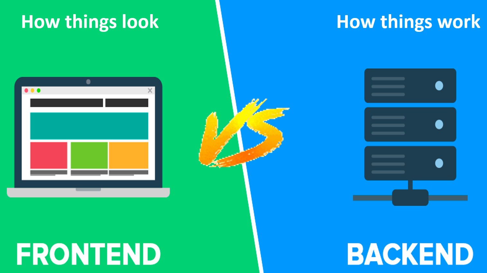
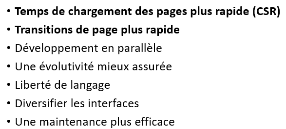

> 📖 Présentation `DevwebVuejsWorkshop2022AWO`

**Vue JS**

Framework évolutif, on ajoute les éléments dont on a besoin

# Rappel Backend / Frontend

Pourquoi séparer :
- 

----

Material Design : règles de design par Google

----

<!-- #region IMPORTANT BLOCK --> 

❗❗Important 

Eviter de générer du HTML directement dans le .JS

<!-- #endregion IMPORTANT BLOCK -->

On perd la facilité de lisibilité et de maintenance du code, la responsabilité de chaque fichier est clairement définie