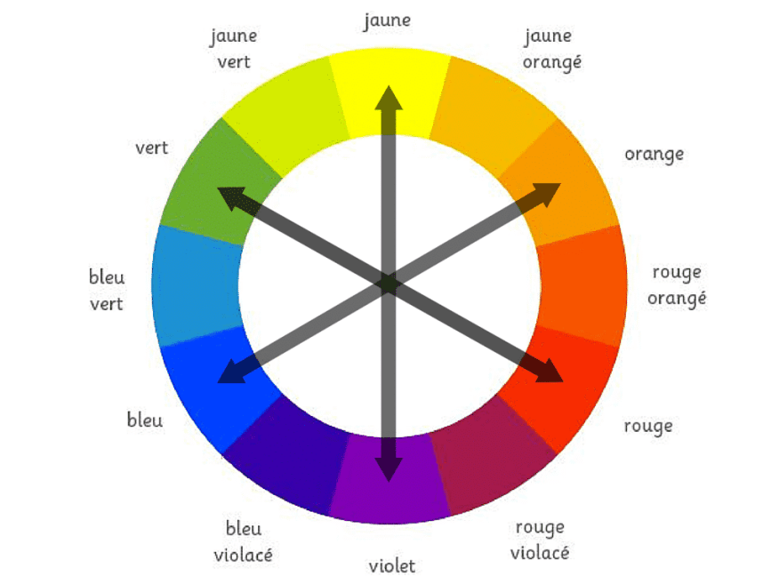

> 📖 Site https://codepen.io/aline_k/live/dyZerYe

Le webdesign :
- au service du **contenu**, des **utilisateurs**, des **fonctionnalités**
- Accessibilité au plus grand nombre

# Tailles

En général, par défaut : 1 rem = 16px
- On prévois 16-18px sur PC
- 14-16px sur mobile

em = taille par rapport au parent * em
rem = taille par rapport au document (la racine) * rem

# Couleurs

C'est la première chose qui attire l'oeil -> c'est donc **important** de bien choisir ses couleurs

Certaines couleurs ont des significations :
- Vert : nature, santé, richesse, éco, fiabilité, etc.
- Couleurs froides (rose, violet, bleu, vert pastel) : calme, tranquillité, professionnalisme, etc.
- Couleurs neutres (noir, blanc, gris, marron, beige) : Se marient facilement avec toutes les couleurs

Couleurs complémentaires : opposées sur le cercle chromatique
- 
- Souvant, si on a un fond exemple violet, on ajouterais un bouton orange pour le contraste
  > La couleur complémentaire du violet est le jaune, mais souvant on décale un petit peu pour avoir un contraste plus marqué mais moins agressif
