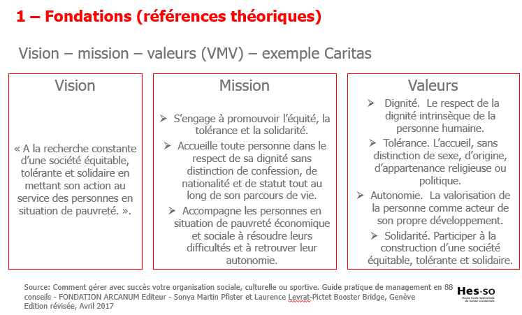
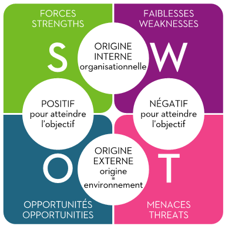

> 📖 Présentation `Cours stratégie`

# Statégie

## Fondations

Vision - Mission - Valeurs (VMV)

Vision :
- C'est le rêve
- **Pourquoi**, quel valeurs nous souhaitons apporté

Mission
- Les actions que l'on va faire
- Le **Quoi**
  
Valeurs
- Philosophie de l'action
- Les **Comment** 

### Exemple Caritas

# SWOT

