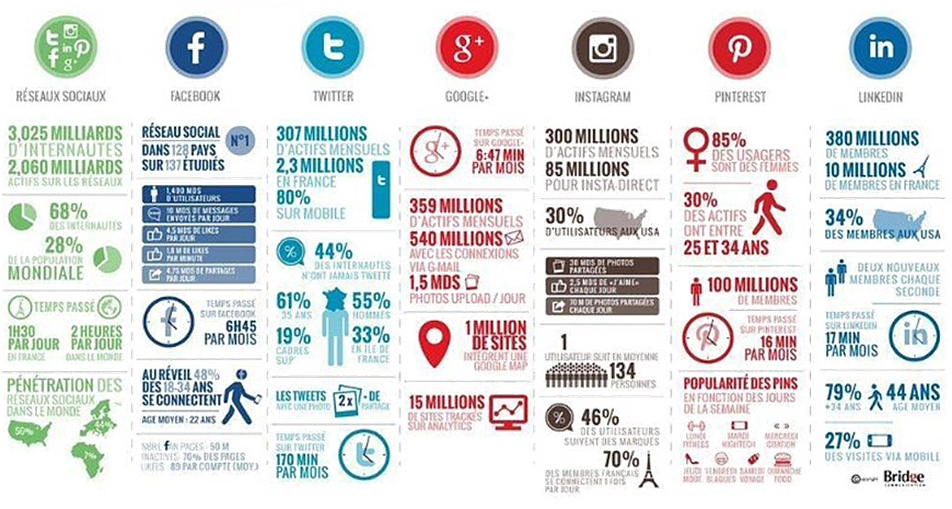

> 📖 Présentation `Cours industrie 4.0`
> Industrie 4.0, digitalisation et son impacte dans l'industrie

# Industrie 4.0
se n'est pas les robots autonomes, les impressions 3D etc // ça en fait partie, mais c'est pas le plus important 

mais c'est les **données** (partages, collectes, analyses, etc)

## Et la suisse ?

# Liste des révolutions industrielles

## enjeux

