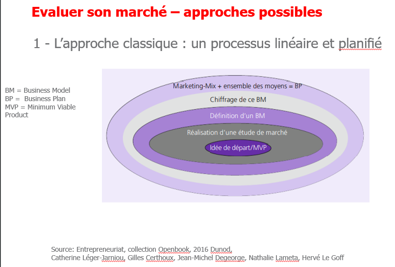
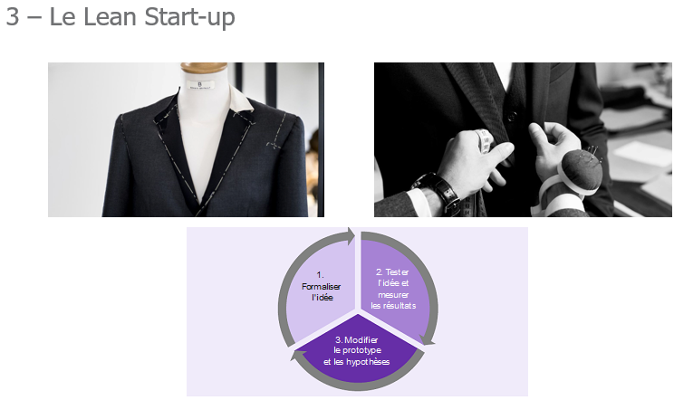
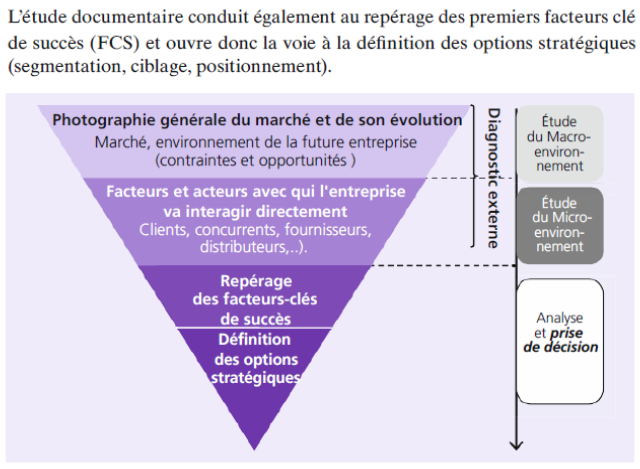
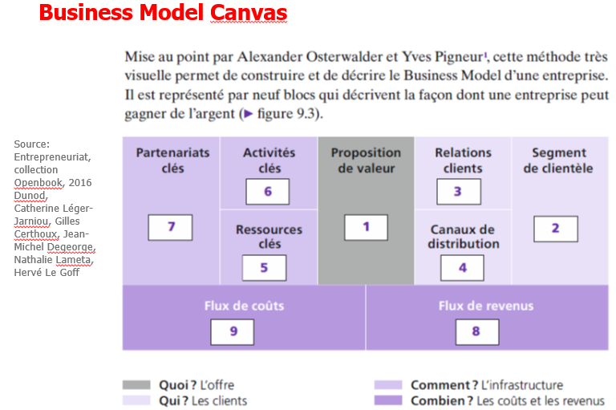

Une entreprise produit des biens et services **pour un marché donnée** = le marché est essentiel 

Lieu de rencontre entre l'**offre** et la **demande**

# Approches 
## Processus linéaire et plannifié

Business plan : plannification dans le temps

## Effectuation

- Bien planifier, on a ce qui faut
- Que faire avec ce que j'ai

## Lean Startup

## Résumé

Les 3 approches sont complémentaires !

Processus linéaire et plannifié :
- Bien pour tout ce qui peut être mesuré
- propose un cadre de travail
- mais il faut rester soupe 

L’effectuation :
- consiste à partir des moyens pour définir le projet ;

L’approche Lean Startup :
- s’appuie sur une démarche itérative avec apprentissage par aller-retour avec le marché pour rendre le projet opérationnel.

# Etude de marché

# Business Model
