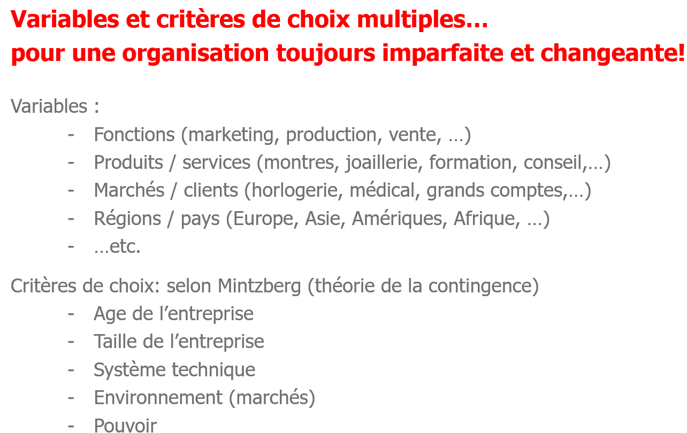

> 📖 Présentation `Cours Organisation`
> Organisation de l'entreprise
> Bases d'intégrations professionnelles pour futures ingénieurs

# Choisir un modèle (chapitre 3)

Mais le point central pour le choix c'est : La stratégie 

# Modèles vs Culture (Chapitre 4)

Si on reçois que des feedbacks négatifs, il est conseillé de démissionner, pour trouver un meilleur environnement.