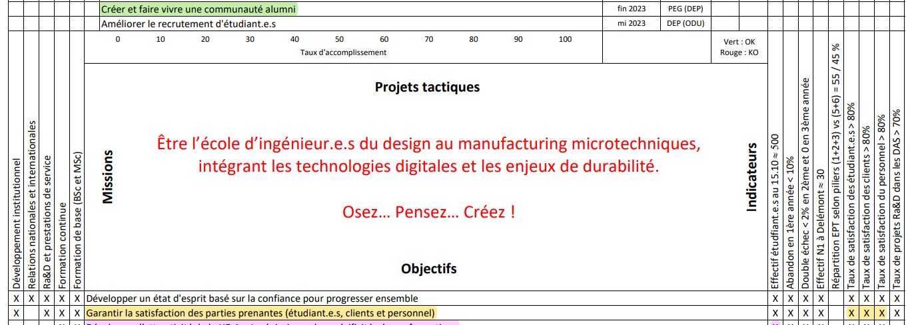

# Matrice d'hoshin

||||
-|-|-
x |Actions pour atteindre les objectifs| x
Qui | Ce qu'on veux faire | Indicateurs
x | Objectifs | x
tifs							Indicateurs

# SMART
Pour les objectifs / indicateurs :
- Spécifique
- Mesurable
- Ambitieux ou atteignable ou acceptable (= ambitieux et atteignable)
- Réaliste
- Temporel

