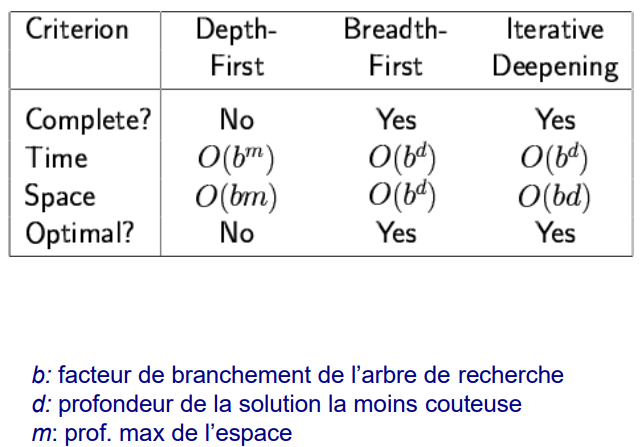
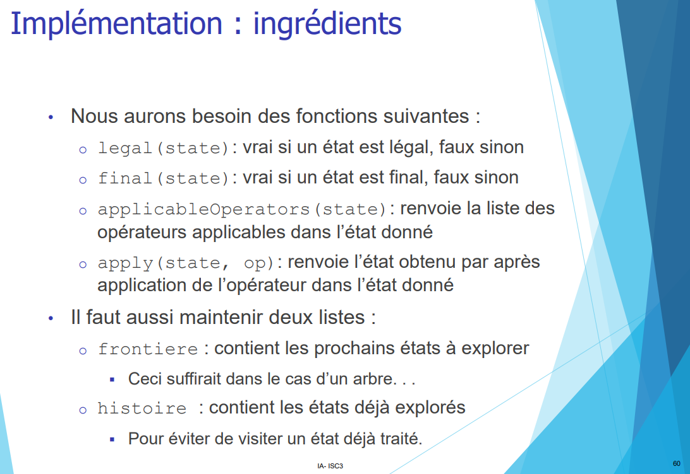

Définition : Qu'est-ce qui faut à une machine pour ce faire passer par un humain.
> Le test de turing est le 1er test le permettant. 
>> principe : Un examinateur pause une question à 2 salles (sans savoir qui est dedans) (1 salle = 1 machine; l'autre un humain)
>>>les 2 répondent par écrits à cette question.
L'examinateur reçois les réponses, et s'il penses que le texte écrit par la machine est humain, alors la machine à passer le test !
>
>>>Ce qu'il faudrait à l'ordi pour le passer :
>>> - Traitement, traiter le langage naturel pour communiquer dans la langue humaine
>>> - Représenter la connaissance : stocker et réutiliser les connaissances acquises
>>> - Raisonner automatiquement : répondre et apprendre des questions
>>> - Machine learning : s'adapter aux nouvelles circonstances et détecter/identifier des récurences

> Def 2 : C'est la construction d'un programmes informatiques qui peuvent faire ce que les humains font de manière automne, en ayant un raisonnement critique, l'apprentissage perceptuel, etc.


Catégories : penser/agir humainement/rationnellement

------

> <span style="font-size: 1.5em">📖</span> <span style="color: yellow; font-size: 1.3em;">Présentation [1.1 Recherche aveugle](https://cyberlearn.hes-so.ch/pluginfile.php/4079850/mod_resource/content/0/01_1_Algos-Recherche_Aveugle.pdf)</span>


Stratégie de recherche  (slide 24)
-   Complétude  :   Permet-elle de trouver une solution s'il en existe une dans tout les cas ?
-   Complexité en temps : Nombre de noeuds générés pour trouver la solution
    -   Combien de temps pour trouver la solution  
    -   Complexité en espace    :   Nombre maximalde noeuds traversé/mémorisé
        -   Combien de mémoire pour effectuer la recherche
    -   Optimalité  :   permet de toujours trouver le chemin le moins couteux (le plus court)

Mesurer la complexité temps/espace (slide 25):
- b (branche) : nombre d'arc (branches) sortant maximal de tout les noeuds de l'arbre
- d (depth) : profondeur du chemin le plus court vers le but
- m (profondeur max) : Longueur max de n'importe quel chemin


# Exercice parcours en profondeur itérative (slide 57)
        Séquence : 
            L=0	A
            L=1	ABC
            L=2	ABCDEFG
            L=3	ABCDEFGHIJ

        --> Nombre de noeuds parcourus : 1 + 3 + 7 + 10 = 21 

(pour le cours on part de la racine)

------

# 27.09.2022 

# Révision - mots clés
recherche aveugle

Diagramme d'état-transition

Type de stratégie :
    parcours en profondeur (**D**epth **F**irst **S**earch)
    Parcours en largeur (**B**readth **F**irst **S**earch)
    Parcours en profondeur itérative (**I**terative **D**eepening)



Complexité avec "m" pour DFS et "d" pour BFS car 
- m : on connais pas la profondeur maximale, il peut donc y avoir un nombre infini de noeuds
- d : on parcours chaque noeud à chaque étage

Remarque : m quand non optimal, d quand optimal

**Arbre vs graphe** :
- Arbre : pas de cycle
- Arbre : possède une racine
- Arbre : forcément orienté (racine vers feuilles)

# Pseudo-code
## DFS
```
dfs(A) : 
    N = Dépiler(N)
    enfants(N)
    Pousser(enfants)
    Visiter(N)
```

# Implémentations de l'état
