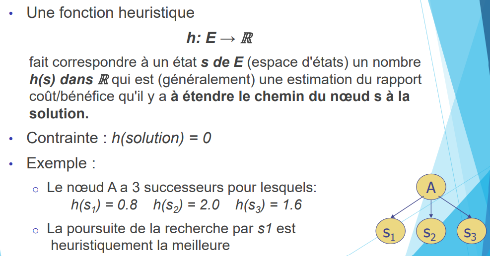
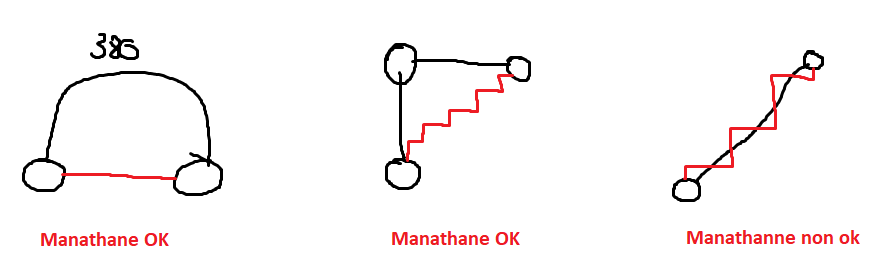
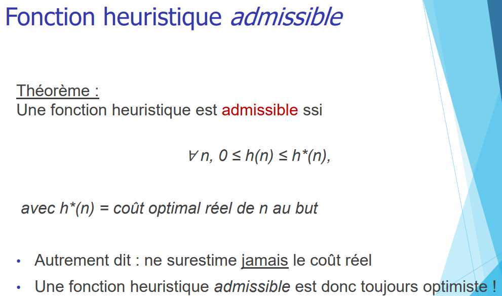
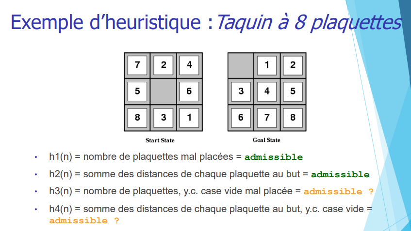
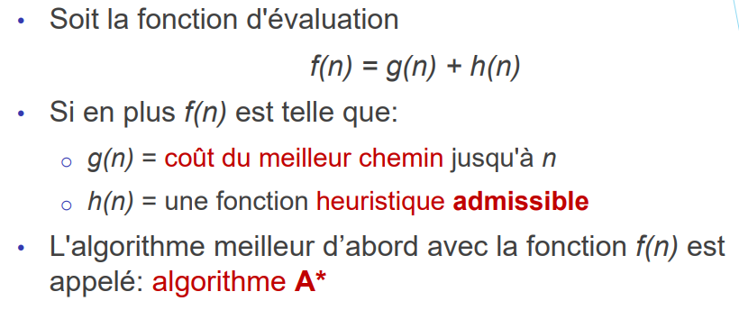
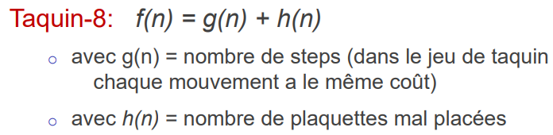

> 📖 Présentation `1.2 Recherche Heuristique`

Stratégie pour trouver une solution.
On a des piste/méthode/technique pour trouver une solution.

Comment : En ayant un score à chaque résultat

# Problème recherche aveugle
Pas d'historique des résultats

Complexité en espace
    - Nombre de nœuds à mémoriser croît de façon exponentielle (dans le cas de largeur d’abord)
    - Envisager l’élagage/taille (pruning) de l’espace de recherche par des heuristiques (recherches informées)

# Définition

Quand `h(s) = 0` la solution est trouvée

# Distance de manahttan
Déplacements horizontaux et verticaux

(en noir le chemin réel, en rouge le chemin de la distance de manhattan)

# Meilleur d'abord
 - Glouton

Caractéristiques :
- Complet : (Oui, sauf si y a des doubles) (pas de boucles car on a l'historique) 
- Temps : O(b^m) : exponentiel, mais possible d'améliorer en O(bm) en fonction de la heuristique choisie.
- Espace : O(b^m) : à cause de l'historique
- Optimal :

# Qu'est-ce qu'une bonne heuristique ?

Admissible si $h(s) \leq h^*(s) \leq h*(n)$ // h*(n) = coût optimal réel de n au but 

h3 est **inadmissible**, car nous aurions **2** (case vide & case 1 sont mal placé), hors nous n'avons besoin que de **1** déplacement

Si l'heuristique est admissible, on aura toujours le résultat optimal.
Si l'heuristique = constante, alors F = G, et c'est djikstra

# A*
C'est un algorithme de recherche basé sur l'historique et en utilisant cette heuristique : 
 
Exemple pour le taquin : 
