> 📖 Présentation [Chapitre 1.3 - Algorithmes génétiques](https://cyberlearn.hes-so.ch/mod/resource/view.php?id=1895081)

# Gain

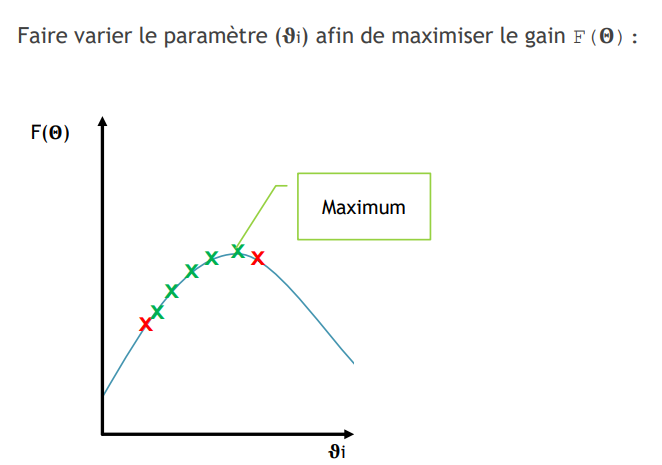

Pour trouver le maximum global, les solutions sont :
- Dérivé (rarement possible en IA)
- Brutforce (impossible, trop de combinaisons et imaginons qu'il faut 1 minute par combinaison...)
- Brutforce avec une logique (ex. dichotomie et un pas défini)
- Solution : **s'insprier de la nature**

# Sélection naturelle
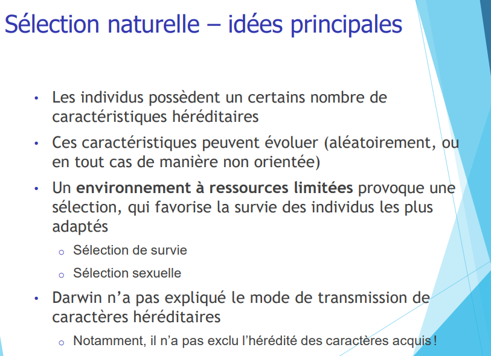
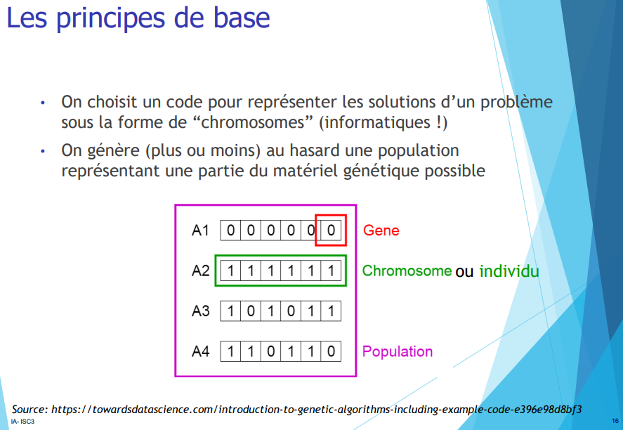
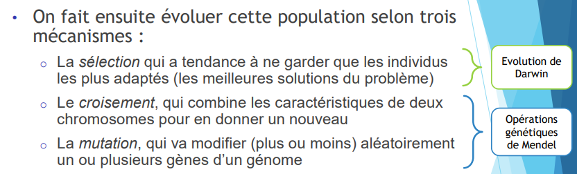

# Codage
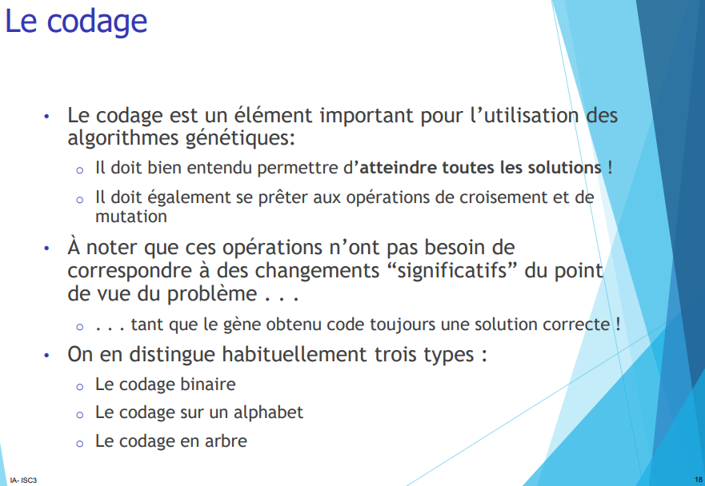

Type de codage :
- binaire
- Alphabete
- Arbre

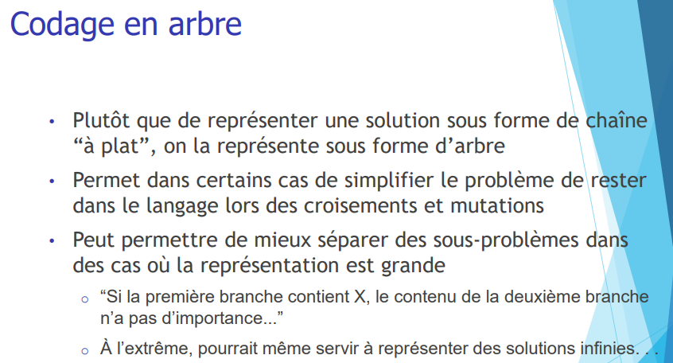
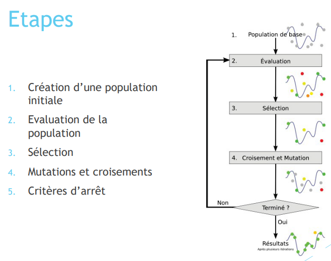

# Sélections

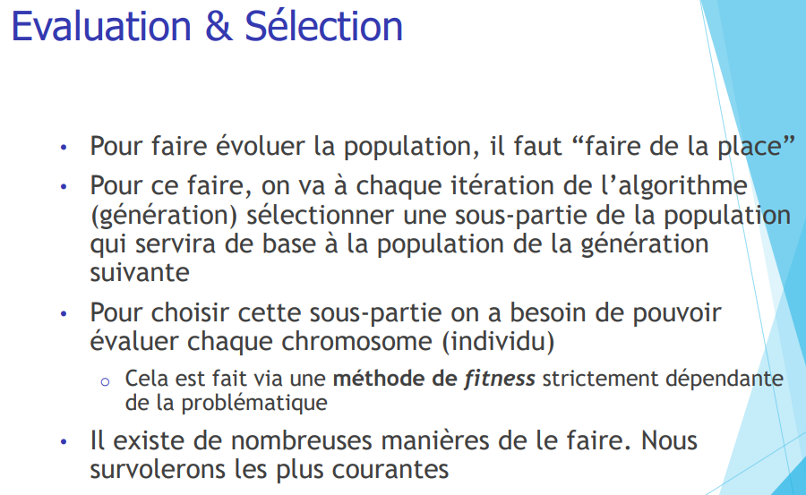

**Fitnesse** : Il s'agit d'une méthode qui attribut un score à un individu. Plus le score est élevé, plus l'individu est adapté à la solution.

Par convention c'est fitnesse max; mais la librairie `DEAP` que nous utiliserons permet d'avoir un fitness min.

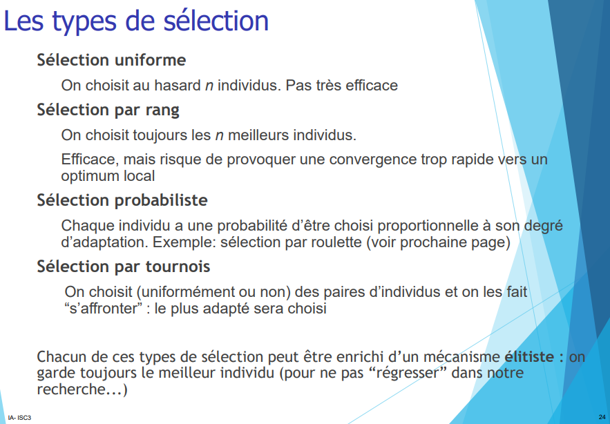

# Mutations
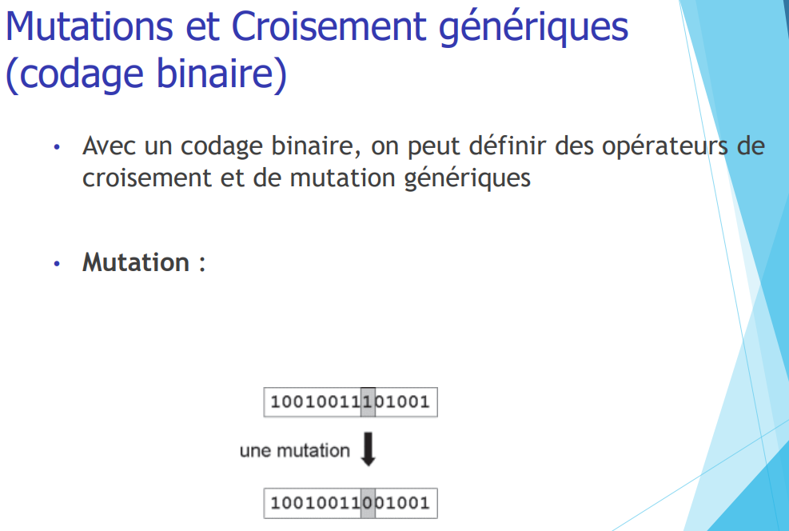
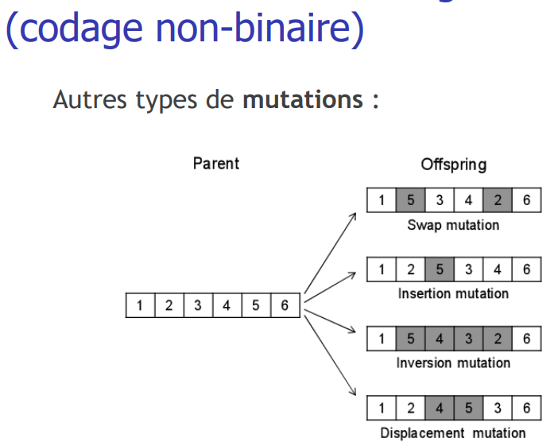

# Croisements
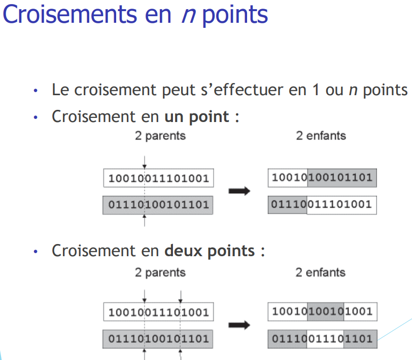
