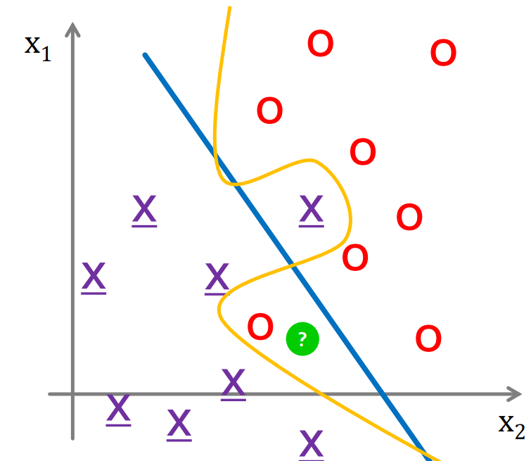
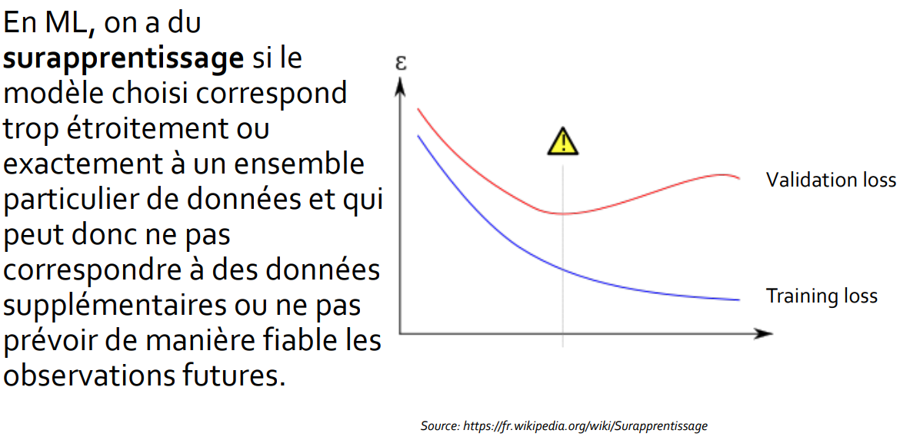
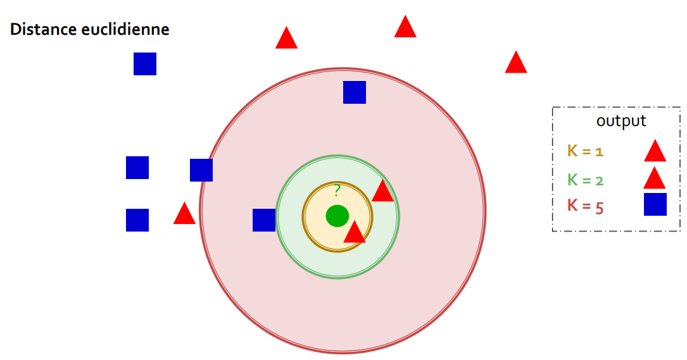
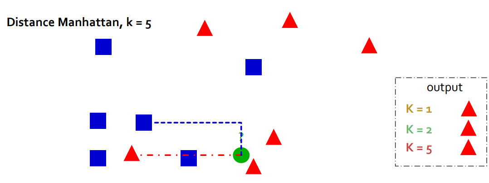

> 📖 Présentation `Apprentissage supervisé et non`

# Apprentissage supervisé
On a des données d'entrées et des données de sortie.
On donne des infos (humain) pour que l'ordinateur puisse apprendre.

Exemple on dit "Sa c'est un chat", "sa non" aux images de bases et l'IA apprend à reconnaitre un chat.

Le fait que dire que c'est un chat c'est "classer" l'image dans la classe (catégorie) "chat".

Les différentes classes sont connues à priori.
- La tâche de l’apprentissage est guidée par un superviseur.
- Exemple : Reconnaissance de forme – Pour chaque forme, c’est le
superviseur qui décide (sait !) à quelle classe elle est attribuée

## Surrapprentissage
Eviter le surapprentissage (overfitting)
- L’algorithme apprend trop bien les données d’entrainement (equivalant à apprendre par coeur)

Exemple d'overfitting : L'IA a su détecter les erreurs sur l'image qui sont dans la séparation jaune (au lieu de bleue)

Comment détecter l'overfitting ?
- En regardant les données d'entrainement et de test, on détecte s'il y a différence entre les deux
- On voit sur l'image qu'il y a overfitting ou il y a le ⚠️ sur l'image
  

# Apprentissage non supervisé
On a des données d'entrées mais pas de données de sortie.

- La tâche de base de l'apprentissage non supervisé est de
trouver une structure cachée dans des données non
étiquetées

# KNN
- K-Nearest Neighbors

(remarque : le carré bleu au dessus du cercle vert est plus éloigné que ceux reliés)
Les formes les plus présentes sont le résultat de la classification

Pour fixer la valeur de K, on cherche quel valeur de K donne le meilleur résultat (plus gros taux de réussite) sur les données de test.

# MSE
- Mean Squared Error

On recherche les valeurs y. On a le $y_prédit$ et le $y_{réel}$

MSE ==> $\displaystyle\sum_{i=N} (\frac{(y_{prédit} - y_{réel})^2}{N})$

Si on fait aucune erreur, on a MSE = 0.

Il s'agit en quelque sorte de la marges d'erreur.

# Bagging

Algorithme servant à calculer la moyenne de plusieurs résultats. Exemple :
- Des données aléatoires sont prises à hauteur de 80% de train, 20% de test
- On répète l'étape précédente plusieurs fois
- On regroupe les résultats de chaque test et on en fait la moyenne