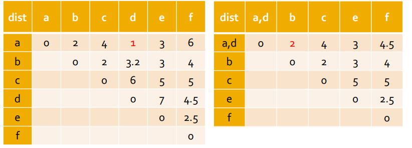
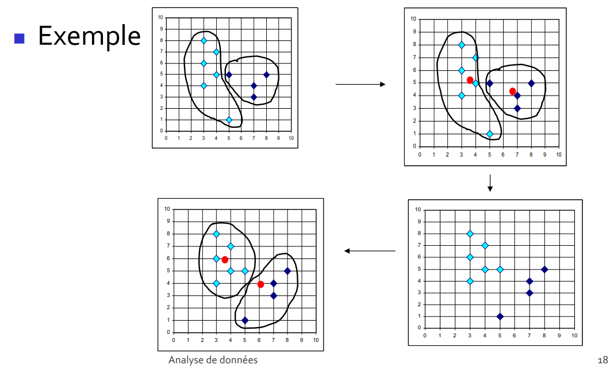
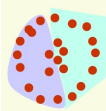
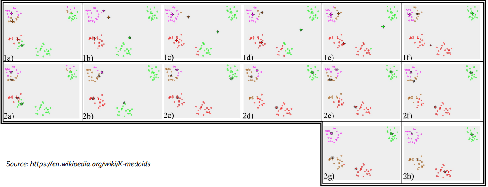

> 📖 Présentation `Clustering`

Algorithmes automatiques pour la classification

Ce n'est pas du machine learning.

# Fonctionnement

On commence avec M classe
`M = nombre de classe`

On agrège les classes les plus proches pour diminuer le nombre de classe

Pour déterminer les classes, on utilise des distances : Exemple de la distance minimale

`a`, `b`, `c`, `d` sont des classes (noms)
- Sur le 2eme tableau, on a fusionner les classes a et d. Quand à la valeur `2` de la classe `B`, elle a été obtenue :
  $dist(b, C_{a,b}) = min(dist_{a,b}, dist_{b,d})$
- Et on répète l'opération jusqu'à ce qu'il n'y ait plus que N classes (N = nombre de classe souhaité, ou un seuil de distance)
- Formule générale :
  $d(C_1, C_2) = min_{i\epsilon C_1 \& j\epsilon C_2}(d_{i,j})$

# Algorithme K-Means
> Explications de l'algo en slide 16-17

Force :
- maximiser les distances inter-classes
- Minimiser les distances intra-classes
Faiblesse :
- Nombre de classe fixé (k; nombre de cluster connu)
- Point de gravité est "arbitraire, non réel"
- Groupes non convexes
  

# Algorithme K-Medoids

On a plus de points de gravité (comparé à avant), mais un représentant par classes

> Image : On défini un délégué pour la classe

Faiblesse :
- Calcul toutes les possibilités pour trouver le meilleur représentant de chaque classe -> Couteux en temps de calcul

# KMeans vs KMedoids
> 1 = KMeans, 2 = KMedoids
> croix = centre de gravité
> étoile = "délégué"

