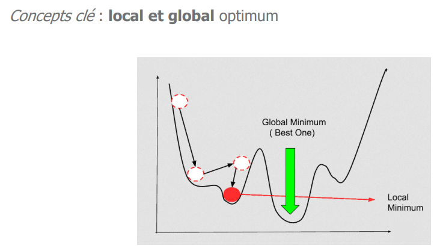
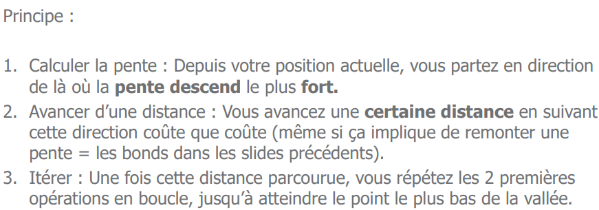
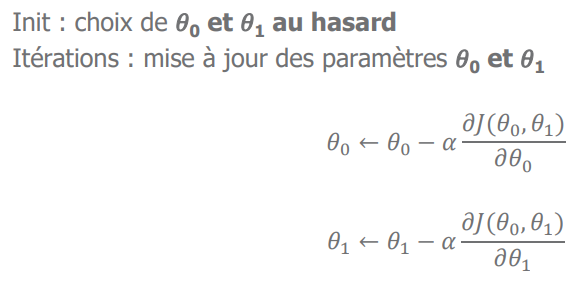

> 📖 Présentation `Cours de régression linéaire`

Classificiation : Y est discret (ensembles fini) (prédire une classe; cluster, ex. la couleur)
Regression : Y est continue (prédire une valeur continue, ex. l'âge)

y = ce qu'on cherche
$\hat{y}$ = ce qu'on a prédit

y - $\hat{y}$ = erreur

# Méthode de la descente de gradient

Le point de départ est arbitraire

On doit définir le pas avec le quel on va avancé
Et calculer le gradient en un point

On risque de tomber dans un minimum local, il peut donc être intéressant de faire plusieurs descentes de gradient avec des points de départ différents.

## Algorithme

!!! info Décrit dans les slides 29-34

$\alpha$ = pas
La fraction = dérivée partielle de la fonction de coût par rapport à $\theta_j$

On peut choisir la valeur de $\alpha$ de manière arbitraire, mais il est préférable de choisir une valeur qui permet de converger rapidement vers le minimum global.
Une petite valeur demande plus de temps de calcul, mais une trop grande pourrait faire que l'on ne converge pas vers le minimum global (ne le trouve pas).