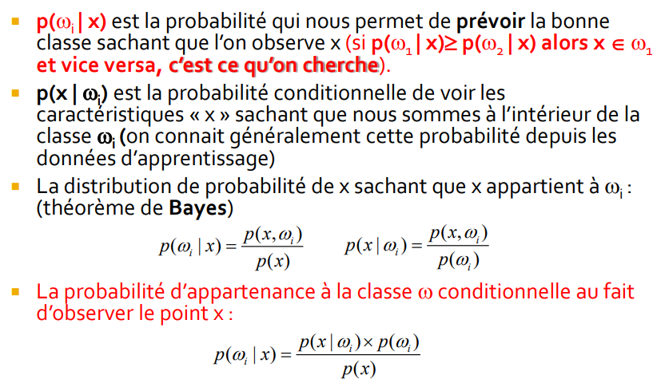
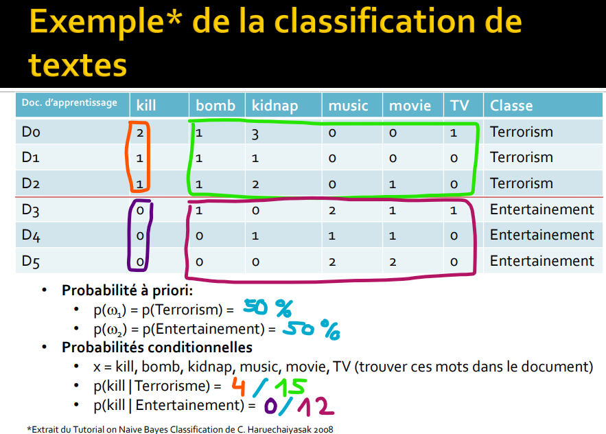
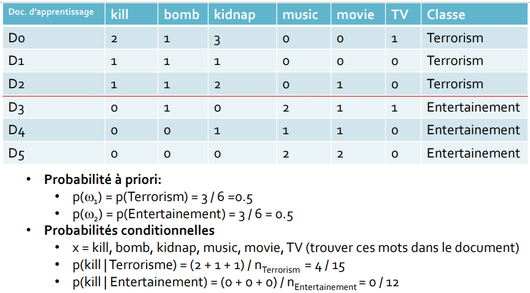
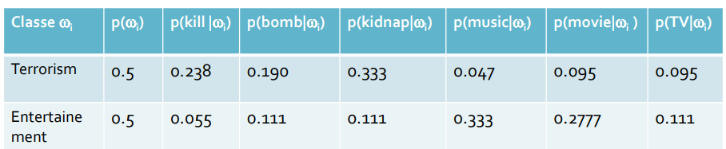
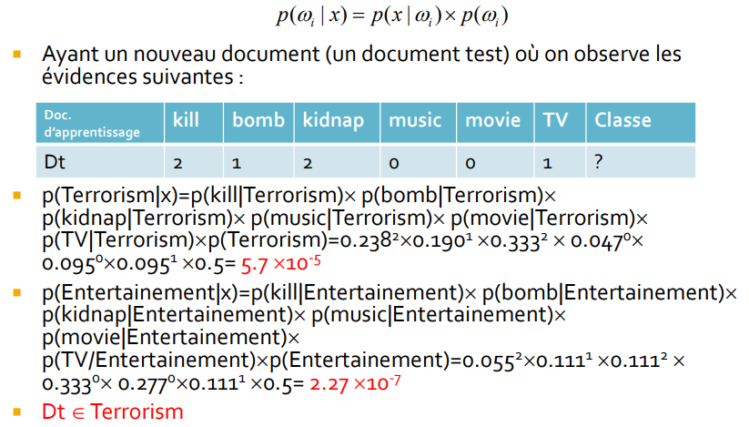
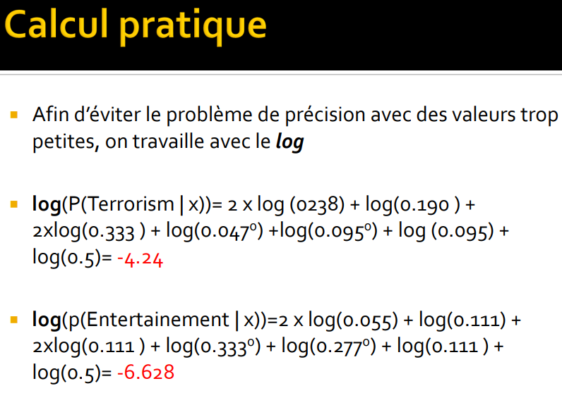

> <span style="font-size: 1.5em">📖</span> <span style="color: orange; font-size: 1.3em;">Présentation ``</span>

p == probabilité
$\omega$ = la classe
x = la caractéristique

p(x) = probabilité de la caractéristique x
p($\omega$) = **probabilité à priori** de la classe $\omega$ (généralement connue)

$p(\omega_i|x)$ = **probabilité à posteriori** de la classe $\omega$ sachant la caractéristique x



!!! note remarque sur la dernière formule
    **postériori = proba conditionelle * proba à priori**

    Et comme on cherche la "vraisamblance", on a pas besoin de calculer le p(x), car il est présent pour chaque "w_i"




Pour éviter les "0", on peut appliquer une estimation de la place :
- `+ 1` au numérateur
- `+ #c` au dénominateur (`#c` = nombre de caractéristiques)


Et on calcul les valeurs pour chaque caractéristique :



Quand on obtient un nouveau document, on va calculer la classe la plus probable pour ce document. La classe est celle qui a la plus grande probabilité à posteriori :




# Naive Bayes
Chaque caractéristique est représentée par un nombre entier

```python
from sklearn import preprocessing

weather = ['Sunny','Sunny','Overcast','Rainy','Rainy','Rainy','Overcast','Sunny','Sunny','Rainy','Sunny','Overcast','Overcast','Rainy']

le = preprocessing.LabelEncoder()
weather_encoded = le.fit_transform(weather)

print(weather_encoded)

# [2 2 0 1 1 1 0 2 2 1 2 0 0 1]
```

# Gaussian Naive Bayes
Chaque caractéristique est représentée par sa probabilité gaussienne

Il faut donc calculer la moyenne et l'écart-type de chaque caractéristique

et après selon l'exercice, on utilise soit la binomial, soit la gaussienne. Avec des valeurs continues, la gaussienne est plus adaptée; mais des valeurs discrètes, la binomial est plus adaptée

```python
# Import Gaussian Naive Bayes model
from sklearn.naive_bayes import GaussianNB

features = np.column_stack((temp_encoded, weather_encoded))
features.shape

# Create a Gaussian Classifier
model = GaussianNB()

# Entrainement : _Fit_ le jeu de données sur le classificateur
model.fit(features, label_encoded)

#Predict Output
predicted= model.predict([[0,2]]) # 0:Overcast, 2:Mild
print("Predicted Value:", predicted)
if predicted == 0:
    print("With this features (Overcast, Mild) the player will not play")
```

`fit` va calculer toutes les probabilités nécessaires pour le classificateur
`predict` va calculer la probabilité de chaque classe et donner la plus probable

## TP 5 (Wine)

### Code
```python

from sklearn.model_selection import train_test_split

x_train, x_test, y_train, y_test = train_test_split(wine.data, wine.target, test_size=0.3, random_state=37, stratify=wine.target) # 70% training and 30% test

from sklearn.naive_bayes import GaussianNB

gnb = GaussianNB()

gnb.fit(x_train, y_train)

y_pred = gnb.predict(x_test)

confusion_matrix = metrics.confusion_matrix(y_test, y_pred)
print("Confusion matrix :")
print(confusion_matrix)
print("Accuracy", metrics.accuracy_score(y_test, y_pred))
```

### A quoi sert stratify
Stratify : permet de garder la même proportion de classes dans les données d'entrainement et de test

Exemple si on a 40% de classe 1, 10% de classe 2 et 50% de classe 3 dans les données d'entrainement

On évite de prendre que des données de la classe 3 et aucune de la classe 2

==> Important quand il y a un gros déséquilibre entre les classes
Si on a des classes style "33% 30% 37%" c'est pas trop important de stratifier


### Matrice de confusion

La matrice de confusion indique le nombre d'erreur de classification

&nbsp; | c1 | c2 | c3
--- | --- | --- | ---
c1 | 17 | 1 | 0
c2 | 0 | 18 | 0
c3 | 1 | 0 | 15

cette matrice indique le nombre de fois où l'élément a été placé dans la classe c1, c2 ou c3

Comment lire la matrice :
- Pour déterminer la classe c1 :
  - 17 éléments placés dans C1
  - 0 dans C2
  - 1 dans C3
- Pour déterminer la classe c2 :
  - 1 élément placé dans C1
  - 18 dans C2
  - 0 dans C3
- etc

accuracy = somme(diago) / somme(tout) = (17 + 18 + 15) / (17 + 1 + 0 + 0 + 18 + 0 + 1 + 0 + 15) = 0.96 = 96%

# Precision, recall, F1 score
**precision** est la capacité du modèle à ne pas prédire de faux positifs

**recall** est la capacité du modèle à ne pas prédire de faux négatifs ?

**F1 score** est la moyenne harmonique de la précision et du rappel
= 2 * (precision * recall) / (precision + recall)
