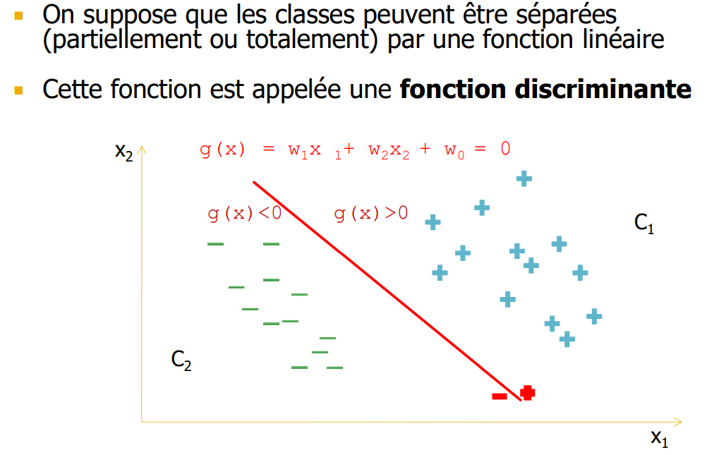
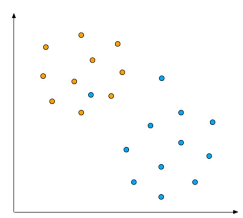
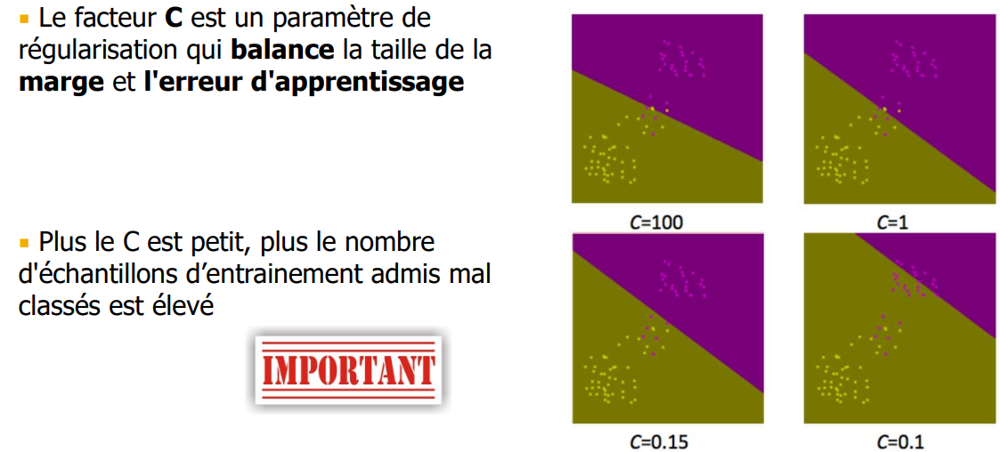
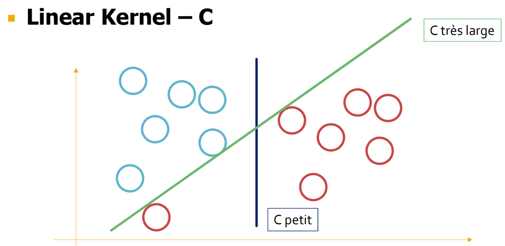
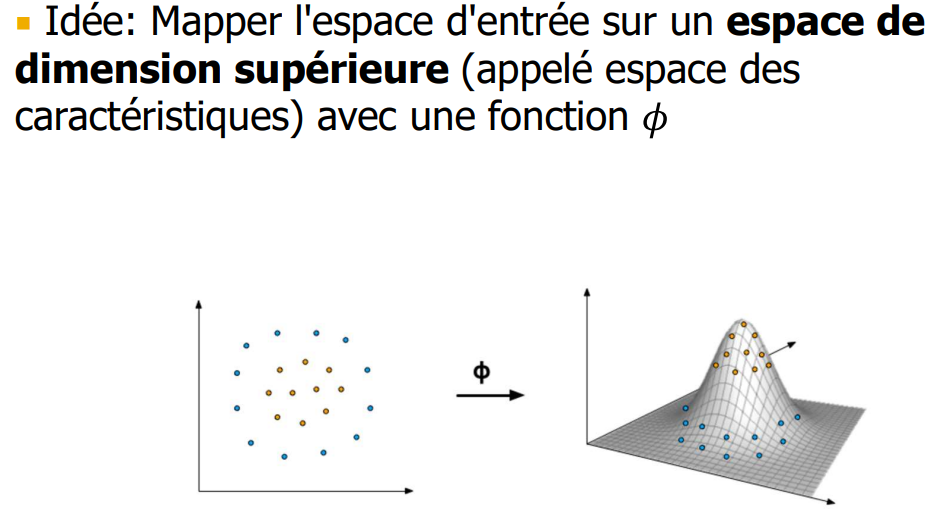
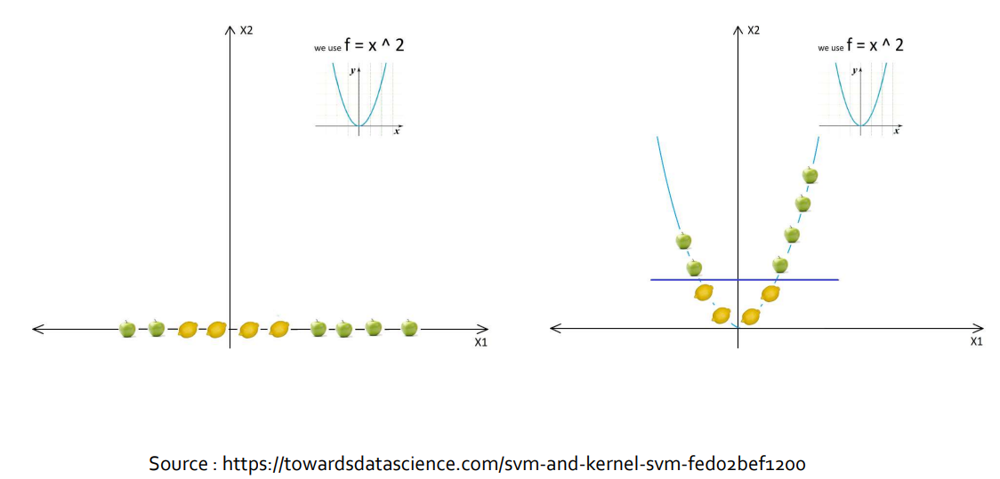
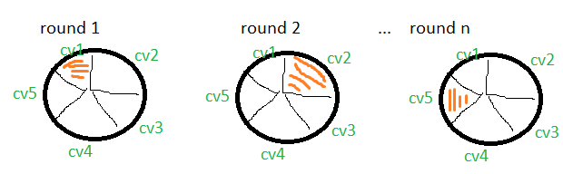
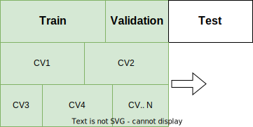

> 📖 Présentation `Classification SVM`
> Support Vector Machine

# Fonction de discrimination linéaire

## Classes multiples

1. 1 fonction = 1 ou 2 classes
2. 2 fonction = 3 ou 4 classes
3. 3 fonction = 5-7 classes
4. 4 fonction = 8-10 classes

# Données non linéaires

## Hyper paramètres
### **C** : contrôle la marge

# CV : Cross Validation
n = valeur du CV
Exemple si on défini CV=5, on va diviser le dataset en 5 parties et on l'execute 5 fois :

# Overfitting
> == Sur-entrainement

cas possible :
- Le modèle est mal paramétré
- Les données de train ne correspondent pas du tout aux données de test

Pendant l'entrainement, il a appris les choses par coeur --> il ne reconnait pas les nouvelles données

-->> Solution : **Cross-Validation**

# Cross-Validation

train > validation > test
(validation fait encore partie du train)

(en général, on utilise CV5 si on a pas bc de donnée, 10 si on en a bc)

Avec les CV, on va chercher à trouver le meilleur modèle possible (avec le meilleur score)

`GridSearchCV` : permet de trouver les meilleurs hyper-paramètres