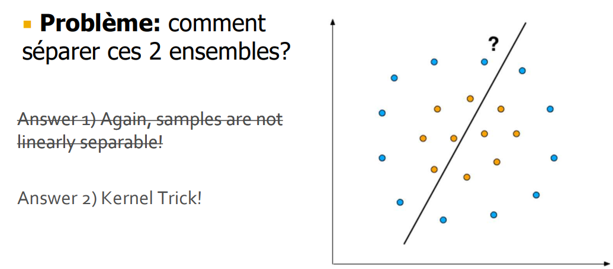
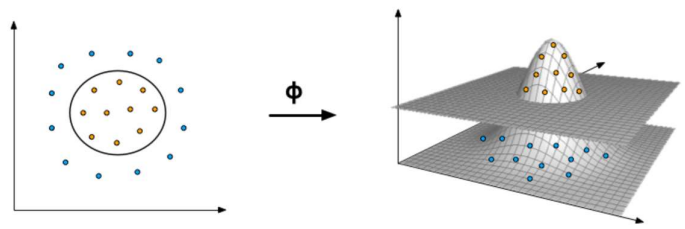

> 📖 Présentation `Classification SVM`
> Support Vector Machine

# Fonction de discrimination linéaire

## Classes multiples

1. 1 fonction = 1 ou 2 classes
2. 2 fonction = 3 ou 4 classes
3. 3 fonction = 5-7 classes
4. 4 fonction = 8-10 classes

# Données non linéaires

## Hyper paramètres
### **C** : contrôle la marge

# CV : Cross Validation
n = valeur du CV
Exemple si on défini CV=5, on va diviser le dataset en 5 parties et on l'execute 5 fois :
