> <span style="font-size: 1.5em">📖</span> <span style="color: orange; font-size: 1.3em;">Présentation `Decision trees`</span>

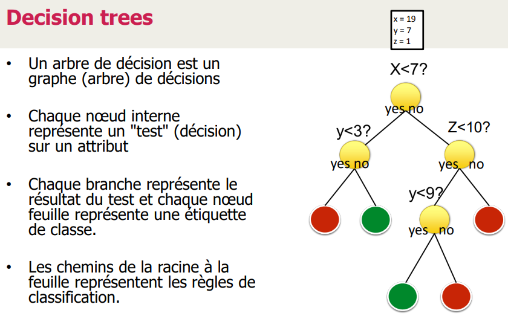


# Construction de l'arbre

Mot clé : **Entropie**

On va l'utiliser pour construire l'arbre de décision

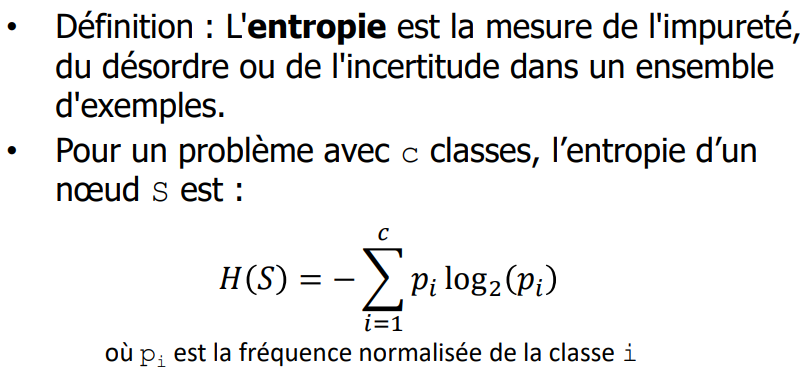

probabilité = 1% ==> entropie = 0.00..1 ==> si on l'obtient c'est une grande "surprise"
probabilité = 50% ==> entropie = 1 ==> si on l'obtient c'est normal (chaque élément à autant de chance d'arriver que les autres)

etape 1 : vérifier de tête si l'entropie est 0 (proba = 0%) ou 1 (proba = 50%). Si c'est le cas, pas besoin de calculer
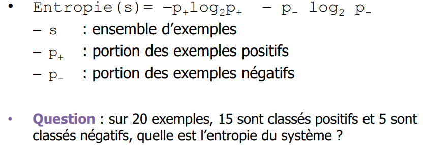
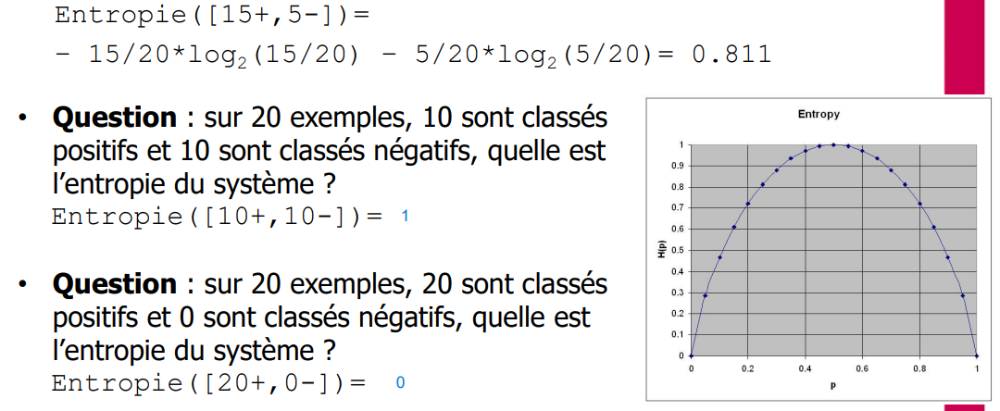

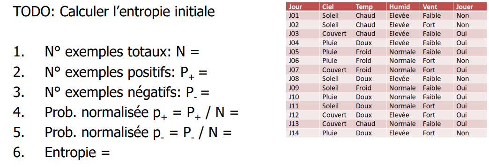

```
total = 14
positif = 9
negatif = 5
proba normalisée P+ = 9/14 = 0.64
proba normalisée P- = 5/14 = 0.36
Entropie = -0.64 * log2(0.64) - 0.36 * log2(0.36) = 0.94
```

Maintenant, on peut commencer à construire l'arbre


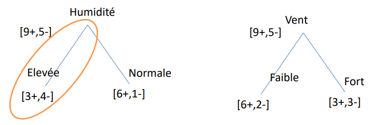
(exemple élevé : 3 on joue, 4 on joue pas)
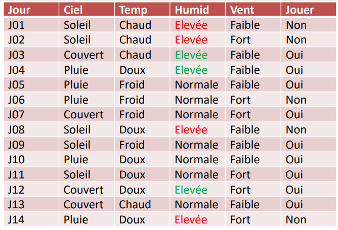

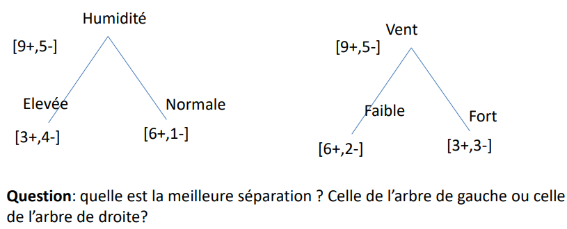

-->> **Gain d'informations**
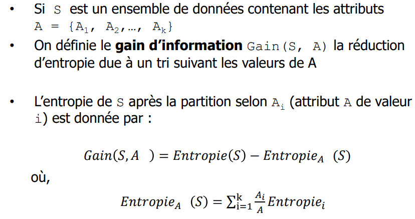
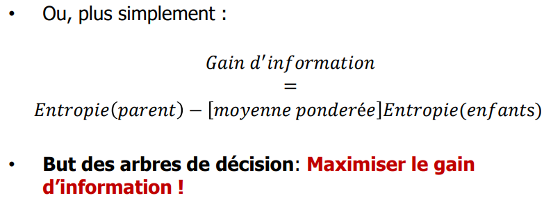

Gain d'information pour l'humidité :
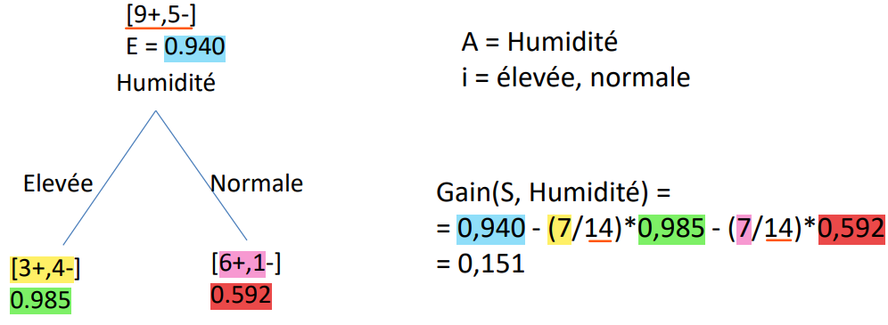

Gain d'information pour le ciel :
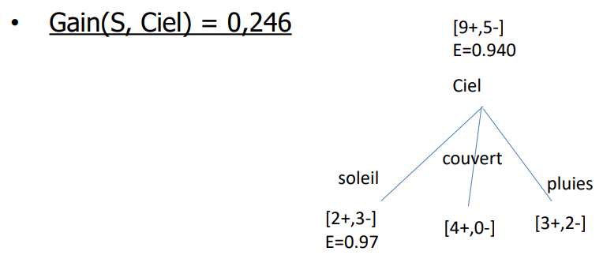

(on répète pour chaque variable)

Ensuite on prend celle avec le plus grand gain d'information. Ici c'est le ciel.

On réitère le calcul du gain pour le niveaux en dessous :
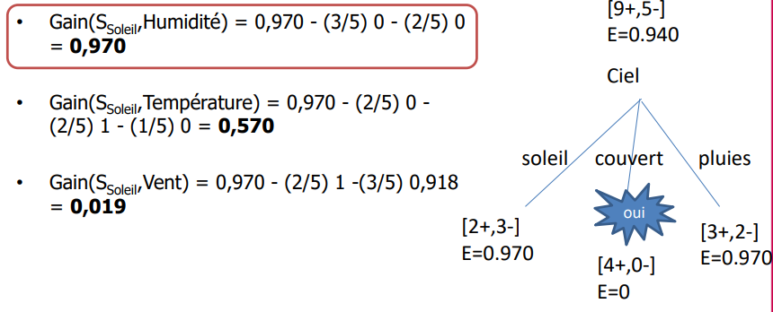
->>
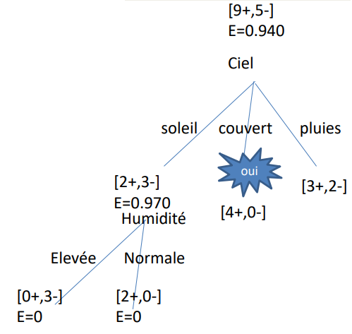

Et ainsi de suite jusqu'à ce qu'on ait un arbre complet

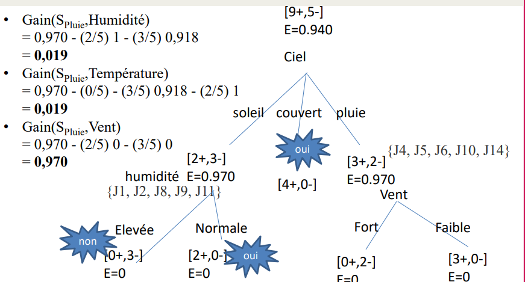

> Fin quand on a des feuilles partout

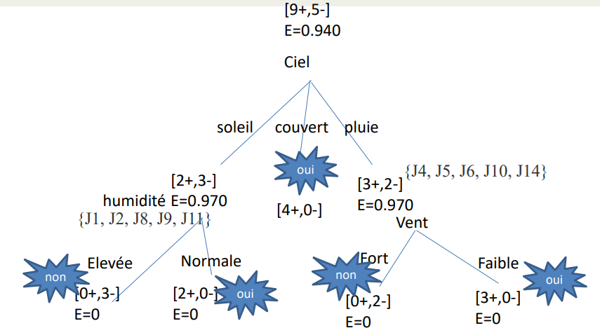

Animation expliquant le fonctionnement : https://www.r2d3.us/visual-intro-to-machine-learning-part-1/

# Hyper paramètres

- `max_depth` : Profondeur de l'arbre (une profondeur de 3-4 suffit, aller plus loins risque de sur-apprentissage)
- `min_sample_leaf`
- `min_sample_split`
- `min_impurty_split`
- Critère de split : 
  - `entropy` (nous avons vu que l'entropie pour l'instant) 
  - `gini` (par défaut : `gini` avec `sklearn`)

# Avantages & Inconvénients

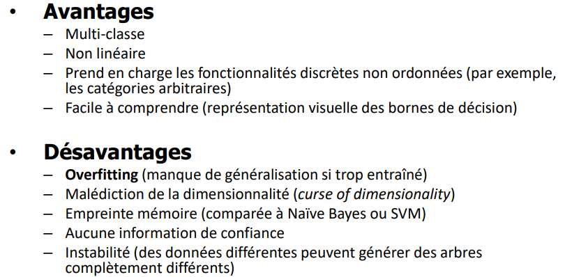

(confiance == être sur que le points fait parti du bon groupe)
Dans SVM, plus on est proche de la frontière, moins on est sur (confiance faible)

`malédiction de la dimensionnalité` : plus on a de dimensions, pour construire un arbre est couteux

# Forêt d'arbres
Permet de palier certains désavantages des arbres de décision

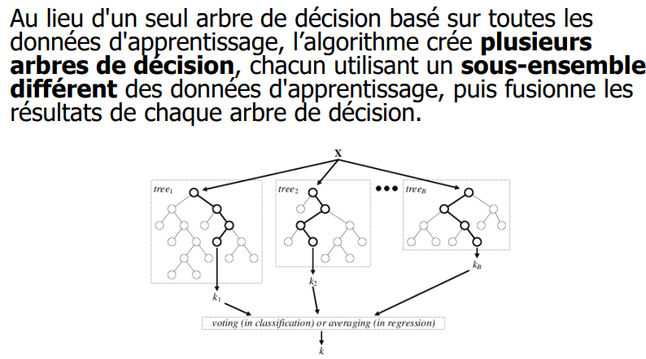

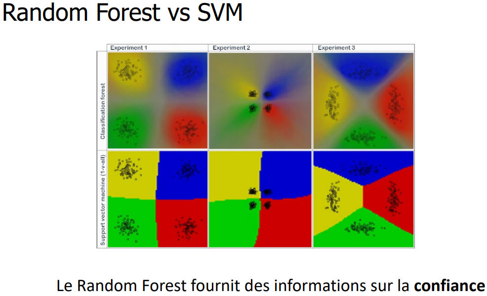


------
------
------

TP SkLearn https://scikit-learn.org/stable/tutorial/text_analytics/working_with_text_data.html#from-occurrences-to-frequencies

tfidf = Tf * log(idf)

Tf = term frequency
idf = inverse document frequency = [nombre de document ou se trouve le terme] / [nombre de document total]