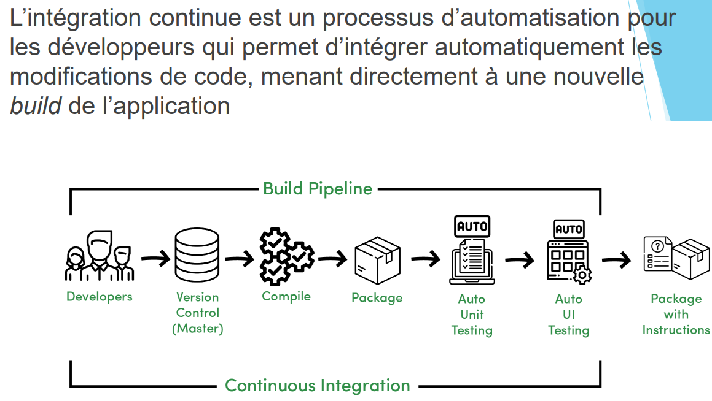
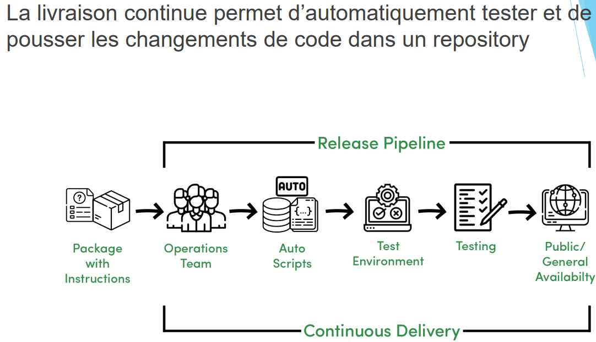
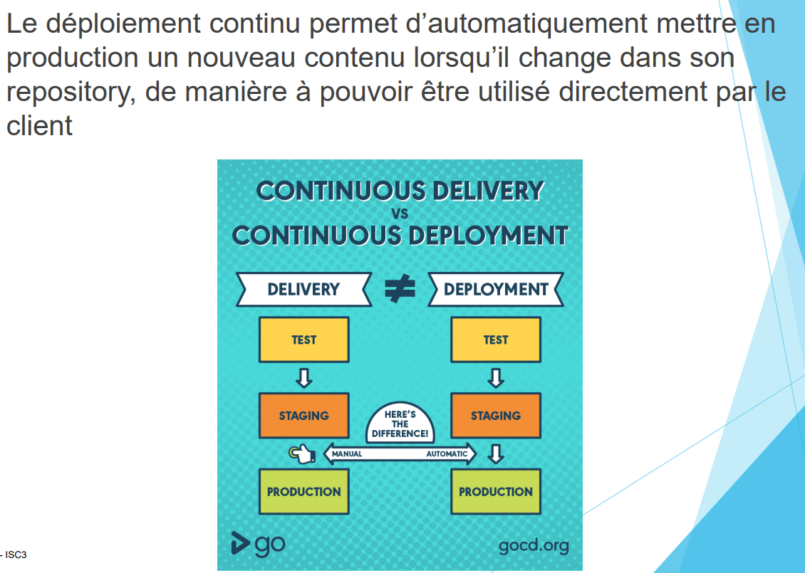
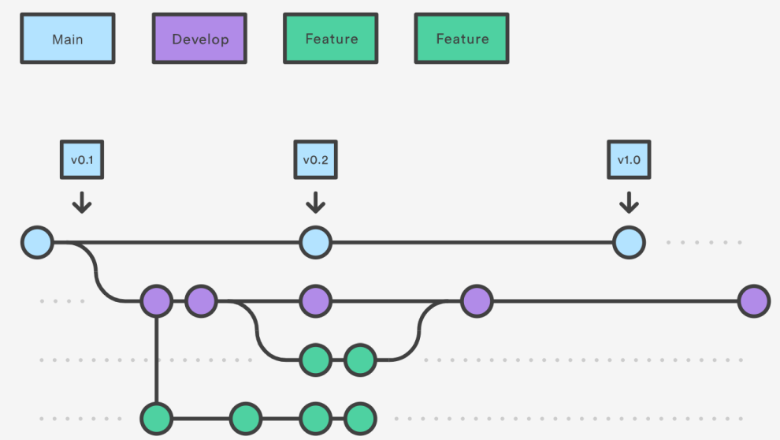

> 📖 Présentation `Concepts
d’Industrialisation`

# Qu'est-ce que c'est :
Automatisation
- Déploiement
- Intégration
- Livraisons

Contribue à une meilleur maturité logiciel

# Enjeux
Coordination et dépendances entre équipes
Efficacité (réussir l'objectif) (tuer une mouche avec un basouka, on est efficace mais pas efficiant)
Efficiance (réussir de manière optimal) (tuer une mouche avec la tapette, on est efficace et efficiant)

Automatisation de processus (permet de se concentrer ailleur)

# CI/CD^2

CI : Continuous Integration (Intégration continue) (**Dev**)
CD : Continuous Delivery (Livraison continue) (**Ops**) (manuel)
CD : Continuous Deployment (Déploiement continue) (**Ops**) (automatique)

**CI**

**CD (delivery)**

**CD (deployment)**

# Workflow

## Gitflow
1 banche `main` ou `master` (on ne travail pas directement dessus) (on tag les versions ici)
1 branche `develop` (on devrais travailer dessus, et quand c'est prêt au déploiement, on mets sur main)
1 branche par fonctionnalité

# Trunkflow (basé sur le tronc)
- Similaire à Gitflow, mais version simplifiée qui privilégie des
branches features de moins longue durée
- Facilite l’intégration de ces branches features
- CI supplémentaire: ajout de tests automatisés et d’indices
de qualité lors de merges