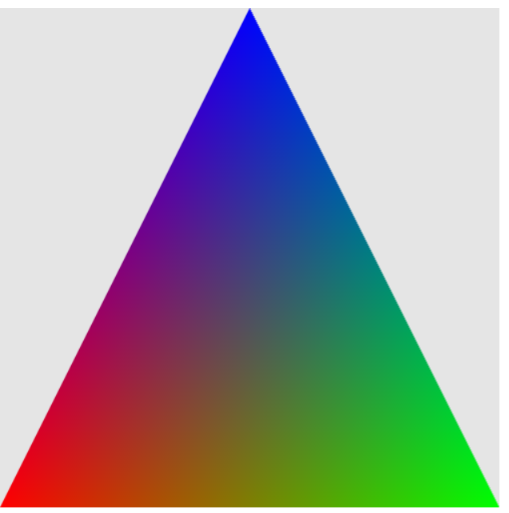

Temps réel : le rendu ce fait en même temps que le film, il ne faut pas 2min de temps de calcul pour obtenir les effets spéciaux sur l'image

WEB GL : 2 type de shaders : Fragment shader; Vertex shader

# OpenGL/WebGL

En JS
Machine état

toutes les données sont en mémoire : ne pas oublier de remettre la configuration dans l'état original ! _(cf le cours de java pour le dessin)_

Utilisation de matrice pour les transformations/rotations.
**Quaterions** : permet de faire des rotations aurait des axes inatégniables

vertex : calcul les emplacement des sommets
Fragment shader : s'occupe de l'aspect chaque pixel (anciennement pixel shader)

-----

<!-- #region drawnote -->
<svg id="svg" xmlns="http://www.w3.org/2000/svg" viewbox="193.8800048828125,42.400001525878906,308.79998779296875,175" style="height:175"><text font-family="inherit" font-size="14" fill="#6190e8" x="223.88" y="85.2">Vertex</text><text font-family="inherit" font-size="14" fill="#6190e8" x="223.88" y="133.2">in</text><text font-family="inherit" font-size="14" fill="#6190e8" x="223.88" y="162.8">uniform</text><text font-family="inherit" font-size="14" fill="#6190e8" x="224.68" y="193.2">out</text><rect x="350.28" y="110" fill="rgba(240, 240,240, 0.4)" stroke="#BBB" stroke-width="1"></rect><text font-family="inherit" font-size="14" fill="#6190e8" x="399.07" y="76.4">Fragment</text><text font-family="inherit" font-size="14" fill="#6190e8" x="395.07" y="126">in</text><text font-family="inherit" font-size="14" fill="#6190e8" x="395.88" y="152.4">uniform</text><text font-family="inherit" font-size="14" fill="#6190e8" x="395.88" y="186">out</text><rect x="203.88" y="62" fill="none" stroke="#6190e8" stroke-width="2" width="97.59000000000003" height="145.4" d="M 203.88 62 h 97.59000000000003 v 145.4 h -97.59000000000003 Z"></rect><rect x="385.47" y="52.4" fill="none" stroke="#6190e8" stroke-width="2" width="105.59999999999997" height="150.2" d="M 385.47 52.4 h 105.59999999999997 v 150.2 h -105.59999999999997 Z"></rect><line x1="206.27" y1="102.8" x2="303.88" y2="102.6" fill="none" stroke="#6190e8" stroke-width="2" d="M 206.27 102.8 L 303.88 102.6"></line><line x1="387.07" y1="98" x2="492.68" y2="97.8" fill="none" stroke="#6190e8" stroke-width="2" d="M 387.07 98 L 492.68 97.8"></line><path d="M 305.47,194 L 306.28,193.8 L 307.07,193.8 L 307.88,193.8 L 308.68,193 L 312.68,190.6 L 315.07,189 L 317.47,186.6 L 319.07,185.8 L 319.88,185 L 321.47,182.6 L 323.07,181 L 323.88,177.8 L 323.88,176.2 L 324.68,174.6 L 325.47,172.2 L 325.47,170.6 L 326.28,168.2 L 327.07,166.6 L 327.07,162.6 L 327.88,156.2 L 327.88,153.8 L 327.88,151.4 L 327.88,149 L 327.88,148.2 L 327.88,146.6 L 328.68,145 L 328.68,143.4 L 329.47,141.8 L 329.47,141 L 330.28,139.4 L 331.07,139.4 L 331.88,138.6 L 332.68,137.8 L 334.28,136.2 L 335.88,134.6 L 336.68,133.8 L 338.28,131.4 L 339.88,131.4 L 340.68,129.8 L 343.07,129.8 L 343.88,128.2 L 347.07,127.4 L 348.68,127.4 L 351.07,126.6 L 353.47,125.8 L 354.28,125.8 L 356.68,125.8 L 358.28,125 L 359.07,125 L 360.68,125 L 362.28,124.2 L 364.68,124.2 L 366.28,124.2 L 368.68,124.2 L 371.07,124.2 L 371.88,123.4 L 373.47,123.4 L 375.07,123.4 L 375.88,123.4 L 376.68,123.4 L 378.28,123.4 L 379.07,123.4 L 379.88,123.4 L 380.68,123.4" fill="none" stroke="#6190e8" stroke-width="2"></path>  <path d="M 375.88,114 L 376.68,113.8 L 376.68,114.6 L 377.47,115.4 L 377.47,117 L 378.28,117.8 L 379.07,119.4 L 379.88,119.4 L 380.68,120.2 L 380.68,121 L 381.47,121.8 L 382.28,122.6 L 382.28,123.4 L 383.07,124.2 L 383.88,125 L 385.47,125.8 L 386.28,125.8 L 386.28,126.6 L 384.68,127.4 L 383.88,127.4 L 383.07,128.2 L 382.28,129 L 381.47,129.8 L 380.68,130.6 L 379.88,131.4 L 379.07,131.4 L 379.07,133 L 378.28,133.8 L 377.47,133.8 L 377.47,134.6 L 376.68,135.4 L 375.88,135.4" fill="none" stroke="#6190e8" stroke-width="2"></path></svg>  
<!-- #endregion -->

Forground out : 1 seul, il s'occupe de la couleur du pixel

# Matrice

## Model Matrix

$$\begin{vmatrix}
1 & 0 & 0 & 0 \\
0 & 1 & 0 & 0 \\
0 & 0 & 1 & 0 \\
0 & 0 & 0 & 1 \\
\end{vmatrix}$$ 

Multiplié les coordonées locales (composition du triangle) avec celle de la matrice pour la positionner dans l'esapce

## View Matrix
En multipliant la matrice inverse permet de placer la camera au centre du monde (les objets bougent en fonction de la caméra)

## Projection Matrix
Le champ de vision de la caméra.
Illusion de profondeur

