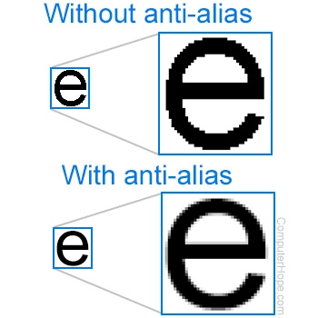
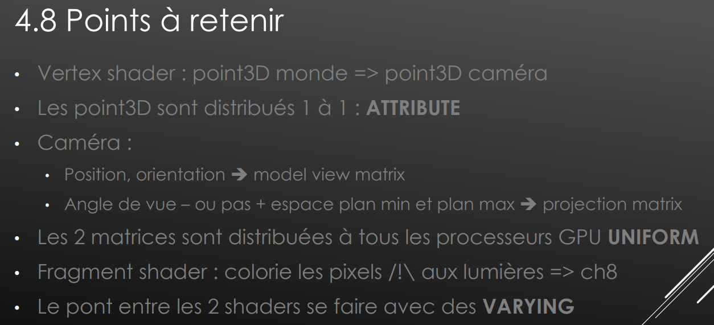

# rappel

**Anti-Aliasing**
- 
- C'est le fait de faire une moyenne avec le background pour éviter les pixels "carrés"

**Clipping**
- 
- Si deux textures sont au même niveau, il peut y avoir des effets de scintillement, car à cause du z-buffer, il peut y avoir des problèmes d'arrondis, et donc soit 1 texture soit l'autre est affichée en fonction de la position de la camera.

Les 6 **repères** :
- Monde
- Camera (Matrice vue (matrice identité))
- Camera (Matrice de modèle)
- Viewport (de -1 à 1, centré, x de gauche à droite, y de bas en haut)
- Le canvas (pixels) (coin du haut, x de gauche à droite, y de haut en bas)
- L'objet

**Rasterisation**
- Passage des triangles en pixels

-----

> 📖 Présentation `Ch #3 et ° : Techniques de dév. 3D`
> Vocabulaire pour faire le ponts entre HTML, JS, WEBGL et les shaders

Ligne 61 : pourquoi clear des buffer de couleur ? pour éviter d'éventuel problème de mauvaises couleurs

Ligne 62, définition du viewport :
- (0,0, canvas_width, canvas_height)
- Si on ne veut pas faire le rendu sur tous le canvas, exemple on utiliserais plusieurs viewport dans le même canvas
- (v1, v2, v3 == viewport 1, 2, 3) (en bleu foncé le canvas)
<!-- region draw -->
- <svg id="svg" xmlns="http://www.w3.org/2000/svg" viewbox="65.19000244140625,-10.600000023841858,307.20001220703125,183.20001220703125" style="height:183.20001220703125"><path d="M 95.39,135.2 L 95.19,134.6 L 95.19,132.2 L 94.39,128.2 L 93.59,118.6 L 91.99,109 L 91.19,97.8 L 90.39,85.8 L 90.39,68.2 L 90.39,57 L 90.39,42.6 L 90.39,25 L 90.39,9 L 90.39,1.8 L 90.39,-0.6 L 92.79,-0.6 L 103.19,3.4 L 113.59,6.6 L 128.79,9.8 L 155.99,11.4 L 171.99,12.2 L 189.59,12.2 L 205.59,12.2 L 225.59,12.2 L 237.59,12.2 L 247.19,12.2 L 256.79,12.2 L 269.59,12.2 L 277.59,11.4 L 283.99,11.4 L 291.99,10.6 L 295.99,10.6 L 299.99,10.6 L 301.59,10.6 L 303.99,10.6 L 304.79,10.6 L 305.59,10.6 L 306.39,10.6 L 307.19,10.6 L 308.79,10.6 L 310.39,10.6 L 317.59,9.8 L 321.59,9 L 324.79,9 L 329.59,8.2 L 333.59,7.4 L 335.99,7.4 L 337.59,7.4 L 339.99,7.4 L 341.59,7.4 L 342.39,7.4 L 342.39,9.8 L 343.19,14.6 L 343.19,24.2 L 343.19,32.2 L 343.99,45.8 L 344.79,63.4 L 346.39,85.8 L 347.19,111.4 L 347.99,129.8 L 349.59,145 L 351.19,155.4 L 351.19,159.4 L 351.19,161 L 351.19,161.8 L 351.19,162.6 L 349.59,161.8 L 348.79,161.8 L 345.59,161 L 339.99,158.6 L 324.79,154.6 L 313.59,153 L 300.79,151.4 L 275.99,148.2 L 261.59,146.6 L 247.99,146.6 L 231.99,146.6 L 207.99,146.6 L 195.99,146.6 L 182.39,146.6 L 170.39,146.6 L 151.99,145 L 140.79,144.2 L 132.79,143.4 L 121.59,142.6 L 114.39,142.6 L 107.19,142.6 L 101.59,142.6 L 92.79,142.6 L 88.79,141.8 L 85.59,141.8 L 81.59,141 L 79.99,141 L 78.39,141 L 77.59,141 L 75.99,141 L 75.19,141 L 75.19,140.2" fill="none" stroke="#6190e8" stroke-width="2"></path><path d="M 94.59,69.6 L 95.99,69.8 L 97.59,69.8 L 99.19,69.8 L 102.39,69.8 L 105.59,69.8 L 111.99,69.8 L 119.19,69.8 L 127.19,69.8 L 131.19,69.8 L 135.99,69.8 L 142.39,69 L 146.39,68.2 L 150.39,68.2 L 155.19,68.2 L 158.39,68.2 L 161.59,68.2 L 163.19,68.2 L 164.79,68.2 L 167.99,68.2 L 168.79,68.2 L 171.19,68.2 L 171.99,68.2 L 172.79,68.2 L 174.39,68.2 L 175.99,67.4 L 177.59,67.4 L 179.19,67.4 L 180.79,66.6 L 182.39,66.6 L 183.19,66.6 L 185.59,66.6 L 186.39,65.8 L 188.79,65.8 L 191.19,65.8 L 193.59,65.8 L 196.79,65.8 L 201.59,65 L 204.79,64.2 L 208.79,64.2 L 214.39,64.2 L 222.39,64.2 L 227.19,64.2 L 231.99,64.2 L 235.19,64.2 L 235.99,64.2 L 236.79,64.2 L 236.79,63.4 L 237.59,63.4 L 239.19,63.4 L 239.99,63.4 L 241.59,63.4 L 243.19,63.4 L 245.59,63.4 L 248.79,63.4 L 251.99,64.2 L 259.99,65 L 264.79,65 L 268.79,65 L 272.79,65 L 277.59,65 L 280.79,65 L 285.59,65.8 L 290.39,65.8 L 296.79,65.8 L 299.19,65.8 L 302.39,65.8 L 305.59,65.8 L 307.99,65.8 L 309.59,65.8 L 311.99,65.8 L 314.39,65.8 L 315.99,65.8 L 318.39,65.8 L 319.99,65.8 L 322.39,65.8 L 324.79,65.8 L 326.39,65.8 L 329.59,65.8 L 331.19,65.8 L 332.79,65.8 L 334.39,65.8 L 337.59,65.8 L 339.19,65.8 L 340.79,65.8 L 342.39,65.8 L 345.59,65.8 L 346.39,65.8 L 348.79,65.8 L 350.39,65.8 L 351.19,65.8 L 352.79,65.8 L 353.59,65.8 L 354.39,65.8 L 355.99,65.8 L 356.79,65.8 L 357.59,65.8 L 358.39,65.8 L 359.19,65.8 L 359.99,65.8 L 360.79,65.8 L 361.59,65.8 L 362.39,65.8" fill="none" stroke="lightblue" stroke-width="2"></path><path d="M 259.39,14.4 L 259.19,15.4 L 259.19,17.8 L 259.19,19.4 L 259.19,21 L 259.19,23.4 L 259.19,25 L 259.19,25.8 L 259.19,27.4 L 259.19,29.8 L 259.19,31.4 L 259.19,33 L 259.19,35.4 L 259.19,39.4 L 259.19,41 L 259.19,43.4 L 259.19,44.2 L 259.19,45.8 L 259.19,47.4 L 259.19,48.2 L 259.19,49 L 259.19,49.8 L 259.19,51.4 L 259.19,52.2 L 259.19,53 L 259.19,53.8 L 259.19,54.6 L 259.19,55.4 L 259.19,56.2 L 259.19,57 L 259.19,57.8 L 259.19,58.6 L 259.19,59.4 L 259.19,61 L 259.19,61.8 L 259.19,62.6 L 259.99,62.6 L 259.99,63.4 L 259.99,64.2 L 259.99,65 L 259.99,65.8 L 259.99,66.6 L 259.99,67.4" fill="none" stroke="lightblue" stroke-width="2"></path><path d="M 140.99,43.2 L 140.79,44.2 L 140.79,45.8 L 141.59,46.6 L 143.19,49 L 143.19,50.6 L 143.99,52.2 L 143.99,53.8 L 145.59,55.4 L 145.59,56.2 L 145.59,57 L 145.59,57.8 L 145.59,58.6 L 146.39,58.6 L 147.19,58.6 L 147.19,57.8 L 147.19,57 L 147.99,55.4 L 147.99,54.6 L 148.79,53.8 L 148.79,53 L 149.59,51.4 L 150.39,50.6 L 151.19,49 L 151.99,46.6 L 152.79,45 L 153.59,44.2 L 153.59,43.4 L 153.59,42.6" fill="none" stroke="lightblue" stroke-width="2"></path><path d="M 158.59,54.4 L 159.19,53.8 L 159.99,53.8 L 159.99,53 L 161.59,51.4 L 161.59,50.6 L 161.59,49.8 L 163.19,49 L 163.99,48.2 L 163.99,46.6 L 164.79,45 L 165.59,44.2 L 165.59,43.4 L 166.39,42.6 L 167.19,41.8 L 167.19,42.6 L 167.19,43.4 L 167.19,44.2 L 167.19,45 L 167.19,45.8 L 167.19,46.6 L 167.19,48.2 L 167.19,49 L 167.19,49.8 L 167.19,51.4 L 167.19,52.2 L 167.99,53 L 167.99,53.8 L 167.99,54.6 L 167.99,55.4 L 167.99,56.2 L 167.99,57" fill="none" stroke="lightblue" stroke-width="2"></path><path d="M 293.79,33.6 L 293.59,34.6 L 293.59,35.4 L 293.59,36.2 L 293.59,37 L 293.59,38.6 L 294.39,39.4 L 295.19,41 L 295.19,42.6 L 295.19,43.4 L 295.99,44.2 L 296.79,45 L 296.79,45.8 L 296.79,46.6 L 296.79,47.4 L 297.59,47.4 L 298.39,47.4 L 299.19,47.4 L 299.19,46.6 L 299.99,45 L 300.79,42.6 L 300.79,41.8 L 300.79,40.2 L 301.59,40.2 L 302.39,39.4 L 303.19,38.6 L 303.19,37.8 L 303.99,37 L 304.79,36.2 L 305.59,35.4 L 305.59,34.6 L 306.39,34.6" fill="none" stroke="lightblue" stroke-width="2"></path><path d="M 316.19,33.6 L 316.79,33.8 L 317.59,33.8 L 318.39,33.8 L 319.19,33 L 319.99,33 L 320.79,33 L 321.59,33 L 322.39,33 L 323.19,33 L 323.99,33 L 323.99,33.8 L 323.99,34.6 L 323.99,35.4 L 323.99,37 L 322.39,37.8 L 320.79,38.6 L 319.99,39.4 L 318.39,41 L 317.59,42.6 L 316.79,43.4 L 315.99,44.2 L 315.19,45.8 L 314.39,46.6 L 313.59,47.4 L 313.59,48.2 L 313.59,49 L 312.79,49.8 L 313.59,49.8 L 314.39,49.8 L 315.19,49.8 L 316.79,49.8 L 316.79,49 L 318.39,49 L 319.19,48.2 L 319.99,48.2 L 320.79,48.2 L 321.59,48.2 L 322.39,48.2 L 323.19,48.2" fill="none" stroke="lightblue" stroke-width="2"></path><path d="M 201.79,84.8 L 201.59,85.8 L 202.39,86.6 L 203.19,88.2 L 203.99,90.6 L 206.39,97 L 207.99,100.2 L 208.79,102.6 L 208.79,105.8 L 209.59,107.4 L 209.59,108.2 L 210.39,108.2 L 211.19,108.2 L 211.19,107.4 L 211.19,106.6 L 211.99,104.2 L 212.79,102.6 L 213.59,101.8 L 213.59,100.2 L 214.39,98.6 L 215.19,97.8 L 215.19,97 L 215.99,96.2 L 215.99,95.4 L 216.79,93.8 L 216.79,92.2 L 216.79,91.4 L 216.79,89.8 L 216.79,89 L 217.59,88.2 L 217.59,87.4 L 217.59,85.8 L 217.59,85 L 217.59,84.2 L 217.59,83.4" fill="none" stroke="lightblue" stroke-width="2"></path><path d="M 223.39,100 L 223.99,100.2 L 224.79,100.2 L 226.39,100.2 L 227.99,100.2 L 229.59,100.2 L 231.19,100.2 L 231.99,100.2 L 232.79,101.8 L 232.79,102.6 L 233.59,103.4 L 234.39,105 L 234.39,105.8 L 234.39,107.4 L 234.39,108.2 L 233.59,109 L 233.59,109.8 L 232.79,110.6 L 232.79,111.4 L 232.79,112.2 L 232.79,113 L 232.79,113.8 L 231.99,114.6 L 231.19,114.6 L 230.39,114.6 L 228.79,114.6 L 227.99,114.6 L 226.39,114.6 L 225.59,114.6 L 224.79,114.6 L 223.99,114.6 L 223.19,114.6" fill="none" stroke="lightblue" stroke-width="2"></path></svg>
<!-- endregion -->
- Le view port va de (-1,-1) (en haut à gauche) à (1,1) (en bas à droite) en x et y

# Points à retenirs

