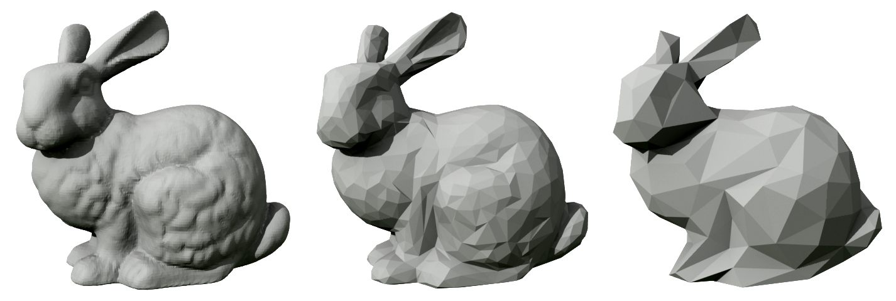
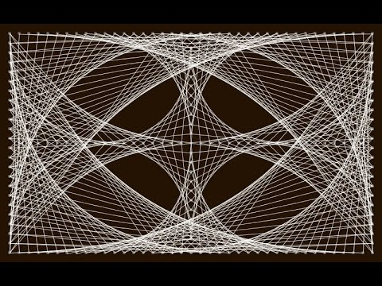
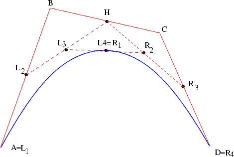
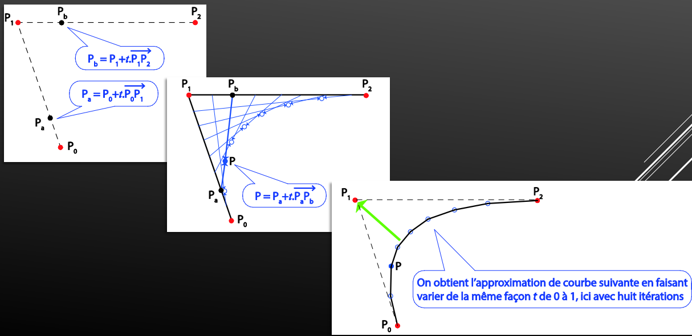
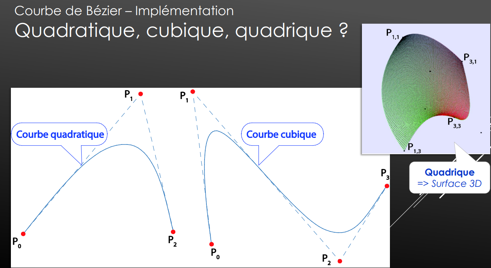

> 📖 Présentation `Ch#5 et #6
interaction & 1er modèle`

# Stanford bunny

<!-- #region IMPORTANT BLOCK --> 

❗❗Important 

Nom à retenir !

<!-- #endregion IMPORTANT BLOCK -->

C'est l'équivalent de Lena pour les images, ou le Hello World pour les programmes.

# Formes parfaites

Pyramides 
- Thétraèdre
- Le cones (qui a une infinité de segments)
Le dé à 20 faces

-----
# Chapitre 6
----

# Les 3 pilliers

Modélisation
rendu graphique
animation, déformation

# Courbe de bezier

Principe des fils à clous 

Exemple : 

Quadratique n'est pas 4 !!! (c'est 3 points)

