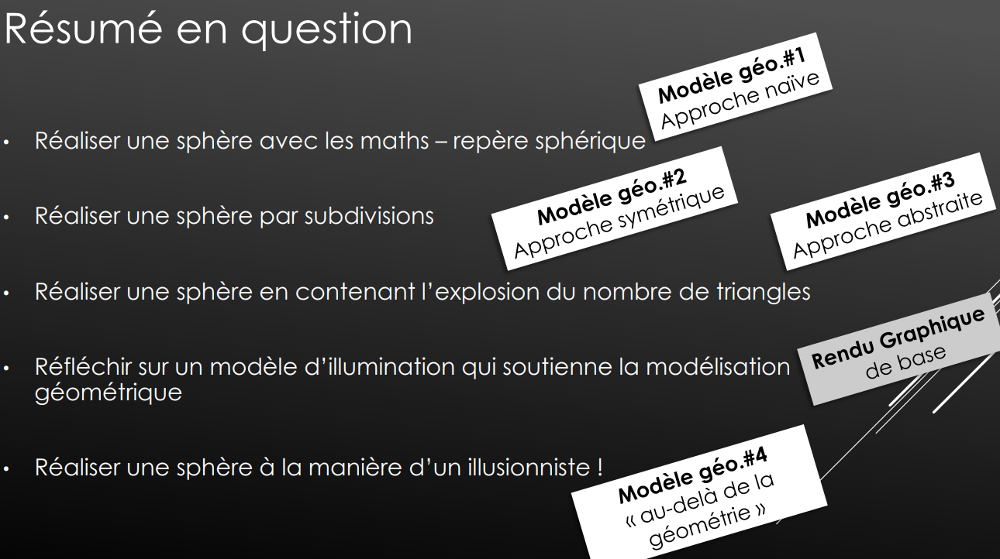
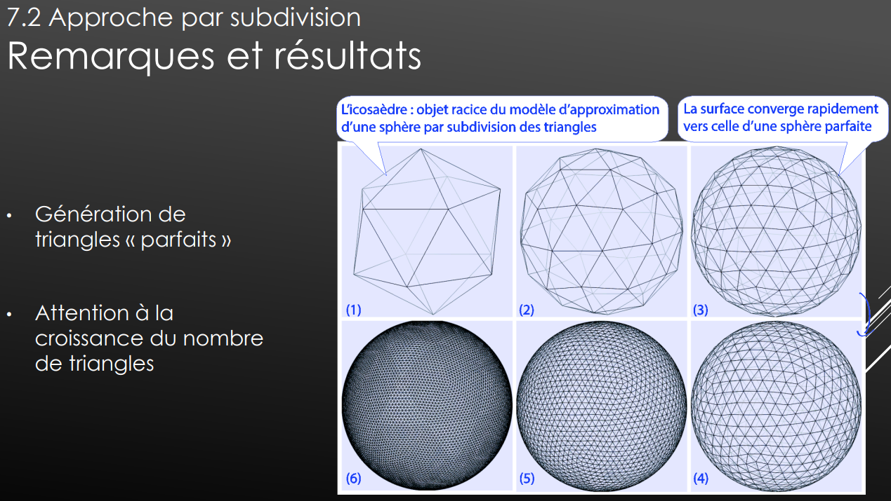
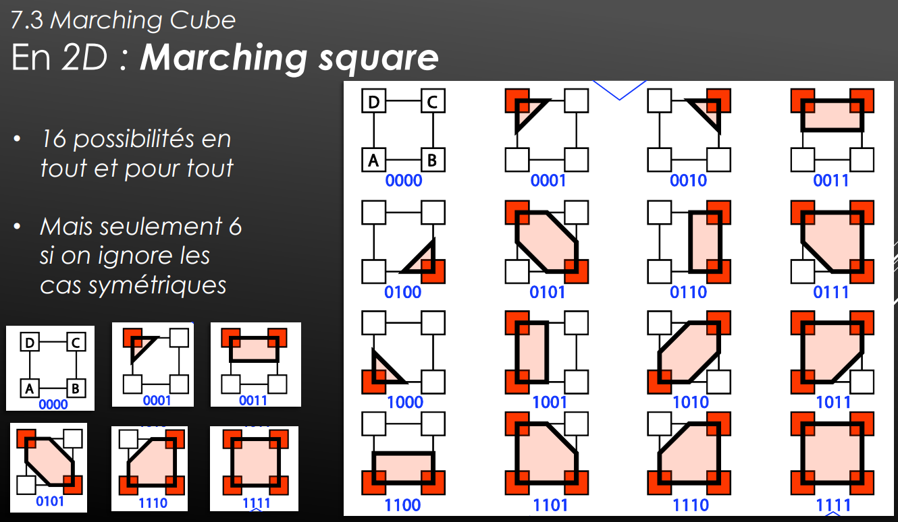
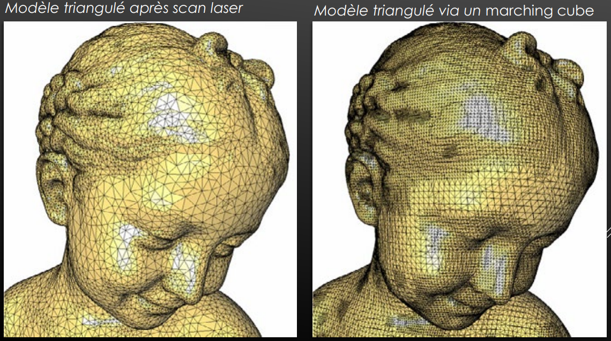
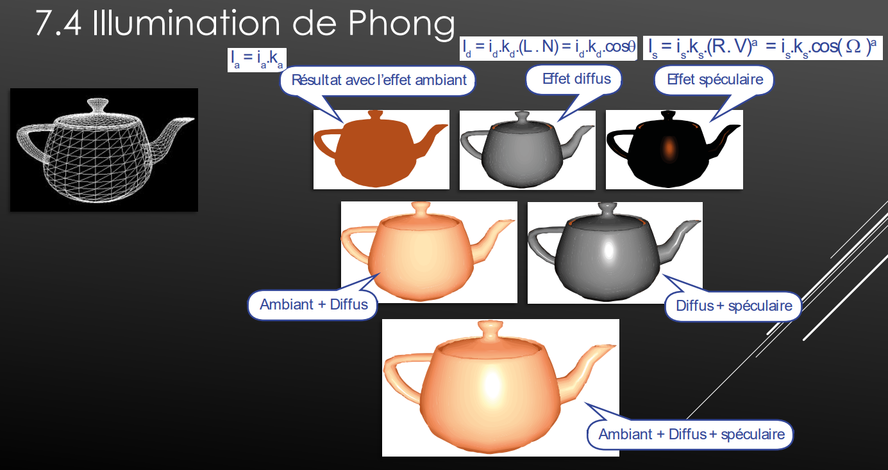
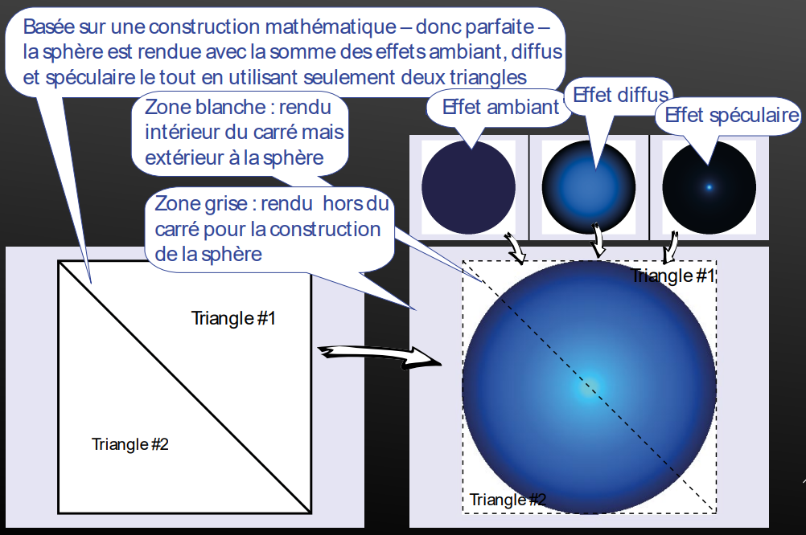
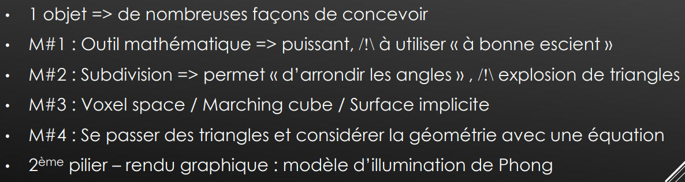
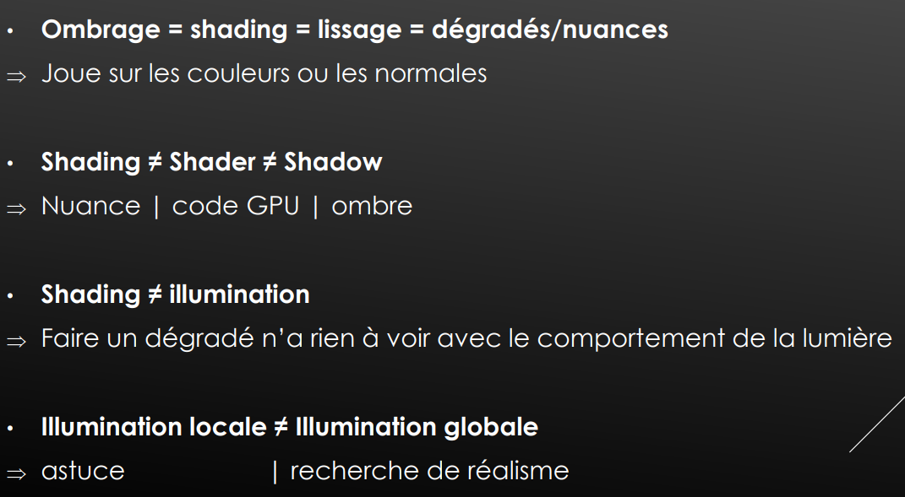

> 📖 Présentation `Ch7 et 8 : Modélisation géométrique, rendu local, objets 3D et textures`

# Faire une sphère

par les maths : un rayon et un point
Par subdivision : on ajoute à chaque fois de nouveaux points

## Approche naive

Se rendu n'est pas fameux, car vers l'équateur les triangles seront gros et large, alors que vers les pôles ils seront petits et fins. Le problème réside dans les textures que l'on va appliquer, si on veut récupéré des informations au niveau des pôles depuis l'équateur, on va manquer grandement de précision.

## Approche par subdivision

Dans cette approche, on arrive vite à quelquechose de bien rond, mais comme on le vois, le nombre de triangles augment drastiquement à chaque subdivision (*4 triangles))
<!-- #region NOTE BLOCK --> 

 📑 Note 

Dans les jeux, il est fortement conseillé de ne pas avoir plus de 100 polygones par modèles

<!-- #endregion NOTE BLOCK -->

## Approche abstraite

### Marching cube

Prendre toutes les possibilités de découpé un carré (8 points)

Certe sa donne bien plus de polygones, mais on à un gros avantage, l'ordre on le connais déjà, on affiche les cube du plus proche au plus loins de la caméra. De ce fait, l'affichage est bien plus rapide.

## Approche sans géométrie

### Illumination de Phong
(type de lumière : illumination locale)

- La lumière ambiante n'a pas d'ombre
- Lumière spéculaire : mirroir

Possibilité de faire une sphère avec seulement 2 triangles :

on fait un cercle, et on y applique l'illumination de Phong
Les 2 triangles servent à faire la zone de l'écran

## Résumé des modèles (approches)

# Types d'illuminations

## Locale
C'est une astuce astuce

## Illumination globale
Les photons bougent constament, ils rebondissent sur toutes les surfaces et sont réfléchis par les objets.

C'est pour ça que les ombres ce formes à notre moindre mouvement, et qui est différents selon la position

problème : coute extrêmement cher en calcul

# Vocabulaires (Pièges)

Shader = programme qui peut être décomposé dans chaque pipline graphique