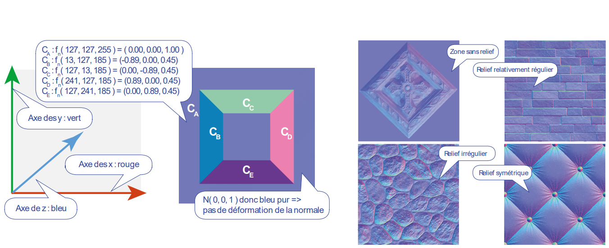

# Lecture des fichiers

- vertices : coordonées X, Y, Z
- indices : triangles utilisant les vertices à l'index spécifié
- Normales : toutes sur `Z`, c'est les points (vertices) qui sont en `X` et `Y`
- Couleurs : 4 valeurs (RGBA) (**A = opacité** : 1 == opaque, 0 == transparent)
- texCoords : coordonées de textures pour chaque points (de 0 à 1)
  - 

Textures : repères "U V", pour éviter de confondre avec les coordonées X Y Z

# Interpolation de Gouraud et de Phong

Sur la sphère, on vois les facettes ... comment rendre "Smooth" : 
- Option 1 : interpoler les couleurs
- Option 2 : interpoler les normales, puis les couleurs

Phong est 2-3x plus couteux en calcul que Gouraud

# Non photorealistic rendering (NPR)

Champs d'application :
- Effets artistiques
  - Exemple le `Cel Shading` : Pour donner un effet de bande déssiner
- Industrie
  - Permet de retirer beaucoup de détails (exemple on film l'avions pour chercher une pièces briante, et quand on passe la caméra dessus, elle ressort bien du reste) (typique l'infrarouge pour détecter les pièces chaudes)

# Textures de normales

- 1 on modifie la forme, 2 on modifie les normales

## Normales maps

Les normal map : on les reconnais par leur couleur bleu, et on les utilise pour donner l'illusion de relief.
(R = axe X, G = axe Y, B = axe Z)
Donc les normales font que si c'est plat, c'est bleu

## Textures spéculaires

- Niveaux de gris
- Si c'est blanc, ça brille, noir c'est mat

# Billboards

Tableaux d'affichages

Sprite : billboards mignature
Imposteur : représentation d'un même sprite, mais avec des angles différents, le tout sur une seule texture