# mnémotechnique 

# couleur des axes
X Y Z -> R G B

# Commandes

Rotation de la caméra | clic moellette de la souris
Déplacement | shift + clic molette de la souris
switch entre mode edit et mode object | tab

## Commandes visuelles

Créé un onglet (se base sur le précédent) 
Cliquer dans l'espace vide entouré, et drag dans le sens voulu
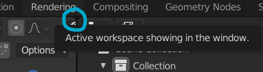

Pour dimensionner/déplacer un objet :
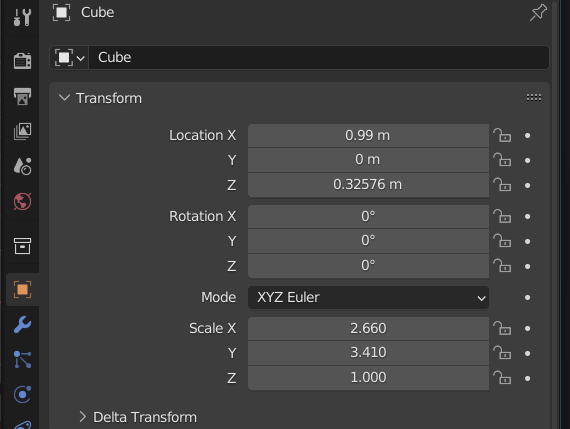

# UV Editor
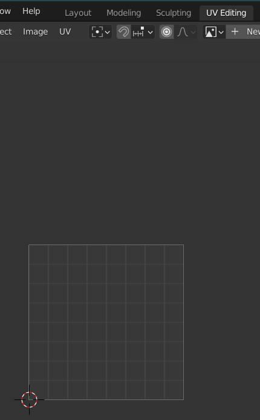

On sélectionne les faces, et elles apparaissent

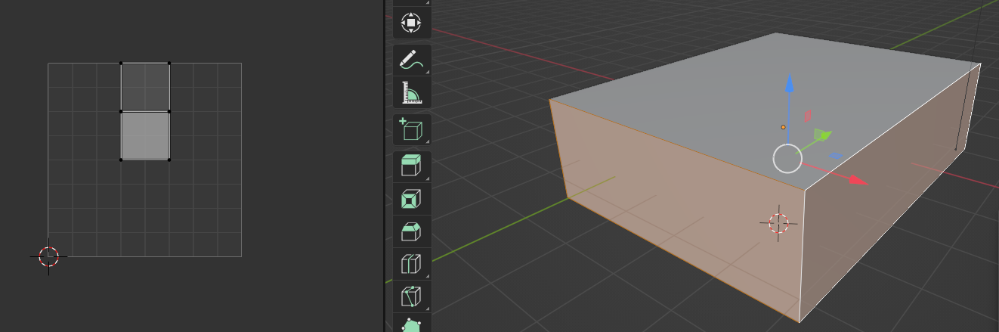

!! les formes sur l'UV ne correspondent pas au réel, dans notre cas nous avons un rectangle -> UV est un carré -> formes comprimées -> il faut se souvenir du ratio pour quand on appliquer une image

Sauvegarder la map : 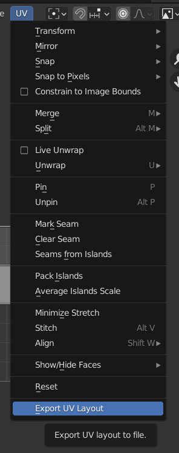

On édite sur gimp la texture

on applique la texture sur blender 

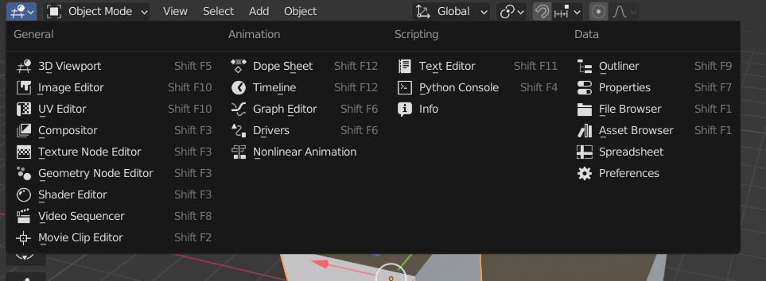

Shader mode :
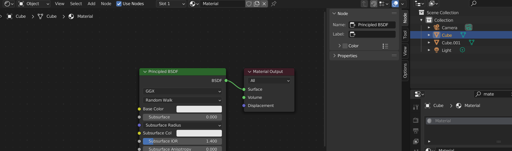
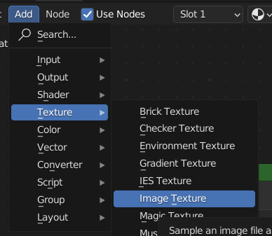
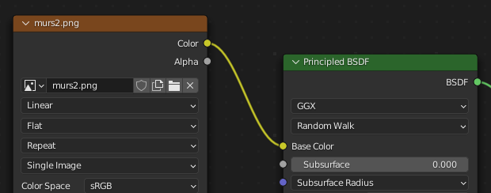

et on visualise dans la vue "layout" en changeant le mode de rendu 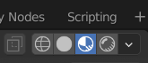

# Ajouter des formes

`Shift A` pour ajouter des formes

# Normalmap

On reprend la texture faite sous gimp, et on génère une normalmap.

Sur gimp, on ajoute la texture, et un vecteur de normal
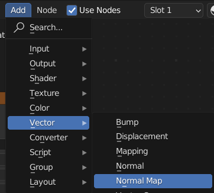
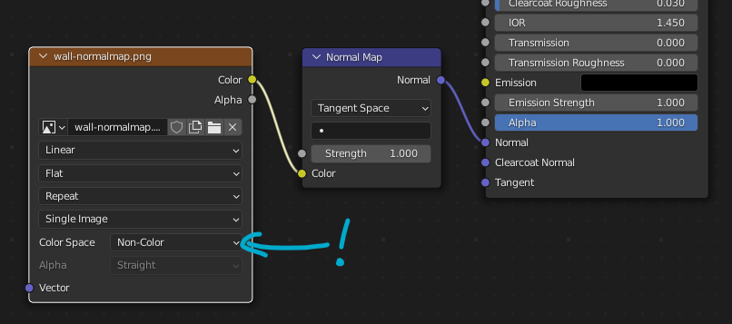
On peut changer la `strength` de la normalmap pour avoir plus ou moins de relief

# Specular map

Pour ajouter un effet de brillance, on ajoute une specular map. Plus c'est blanc, plus sa brillera

Il faut juste la relier au "specular" du shader, pas besoin de composant intérmédiaire
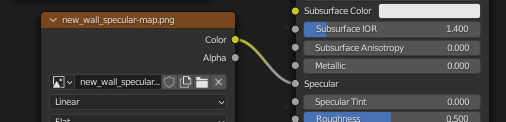

(normalement, il faut spécifié l'espace de couleur à `non color`. Mais comme on a déjà une image en dégradé de gris, c'est pas important si l'espace reste en `sRGB`)

# Amusons nous

Affiner une forme
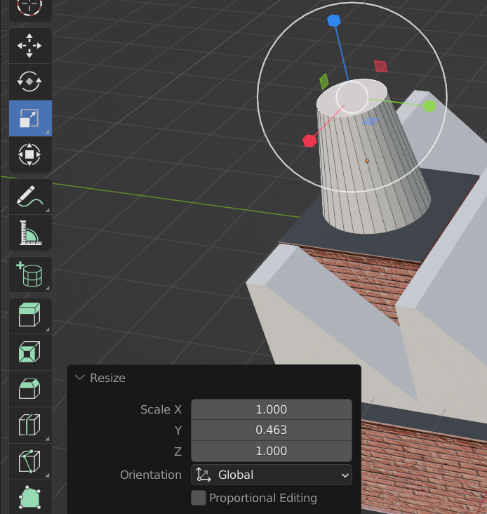

Faire un trou
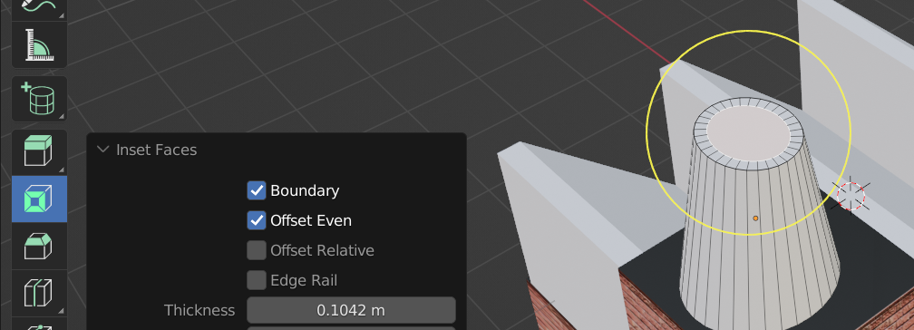

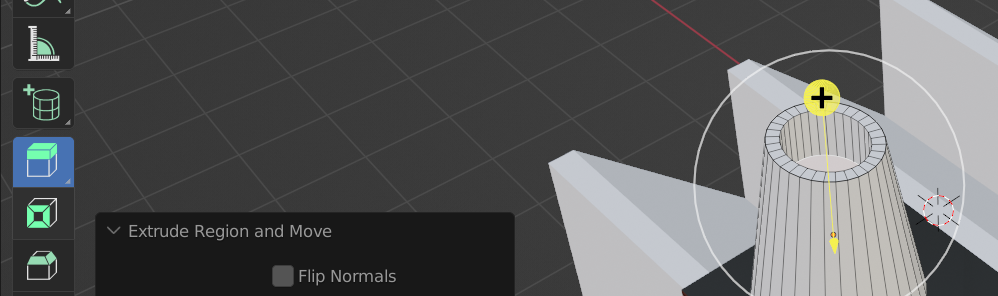

# Remarque

Quand on va importer les formes sous WebGL, sa peut laggué.. enfaite c'est windows qui mets par défaut (en fonction de la config de performances) les navigateurs pour qu'ils utilisent le CPU et non le GPU.

Pour forcer l'utilisation du GPU --> Paramètres Windows :
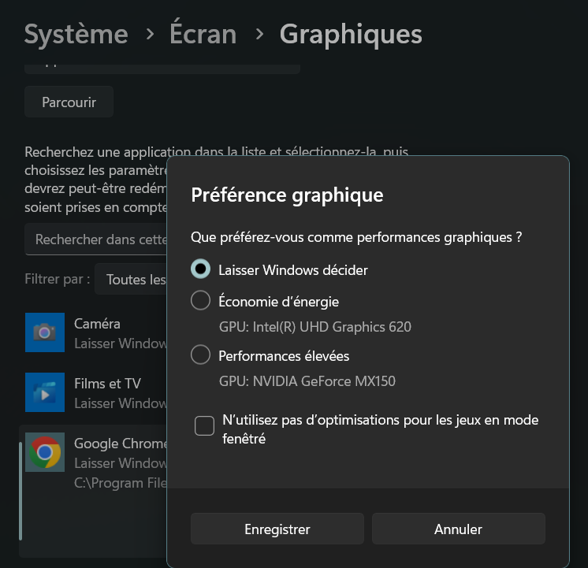