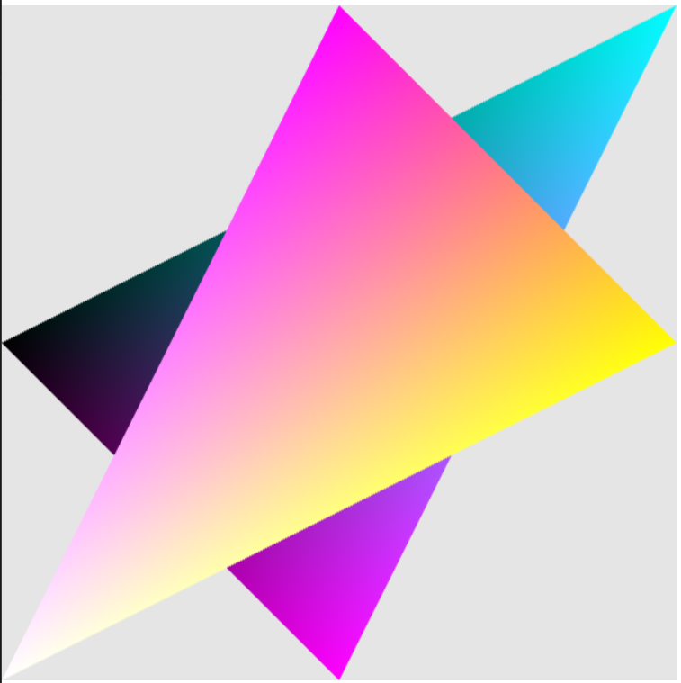

# Initialisation de WebGL

```js
function initWebGL() {
    glContext = WebglTools.getGLContext("webgl-canvas"); // On lie le canvas au contexte graphique
    let shaderProgram = WebglTools.initProgramFromHTML(); // Initialisation du programme depuis le HTML
    program = shaderProgram.program; // Objet "shaderProgram" de l'API WEBGL on le renomme juste pour simplification
}
```

```js
    // Positions des sommets
    vertices.push(0.0, 0.0, 0.0);
    vertices.push(1.0, -1.0, 0.0);
    vertices.push(0.0, 1.0, 0.0);

    // Couleurs des sommets
    colors.push(0.0, 0.0, 0.0, 1.0);
    colors.push(0.0, 1.0, 0.0, 1.0);
    colors.push(0.0, 0.0, 1.0, 1.0);

    // Ajout des sommets dans le buffer (l'ordre importe peu)
    indices.push(0, 1, 2); // == 1,2,0 == 2,0,1
```

Les couleurs sont associées aux sommets, pas à l'ordre de création du triangle
L'ordre permet de définir l'ordre d'affichage des formes

en mode triange :
```js
glContext.drawElements(
    glContext.TRIANGLES,
    ...
)
```

Une forme sera toujours reliée en 3 sommets

exemple d'étoile : 
```js
    // Etoile

    // Triangle 1
    vertices.push(0.0, 1.0, 0.0); // 0
    vertices.push(1.0, 0.0, 0.0); // 1
    vertices.push(-1.0, -1.0, 0.0); // 2

    // Triangle 2
    vertices.push(1, 1, 0.0); // 3
    vertices.push(0, -1, 0.0); // 4
    vertices.push(-1, 0, 0.0); // 5

    // Triangle 1
    colors.push(1.0, 0.0, 1.0, 1.0); // rose
    colors.push(1.0, 1.0, 0.0, 1.0); // jaune
    colors.push(1.0, 1.0, 1.0, 1.0); // blanc

    // Triangle 2
    colors.push(0.0, 1.0, 1.0, 1.0); // cyan
    colors.push(1.0, 0.0, 1.0, 1.0); // rose
    colors.push(0.0, 0.0, 0.0, 1.0); // noir

    //triangle   ---1---, ---2---
    indices.push(0, 1, 2, 3, 4, 5)
```
produira : 


# envoie à la GPU
convertion pour le "CPU" vers le "GPU" :
```js
vertexBuffer = WebglTools.getVertexBufferWithVertices(vertices);
colorBuffer = WebglTools.getVertexBufferWithVertices(colors);
indexBuffer = WebglTools.getIndexBufferWithIndices(indices);
```
